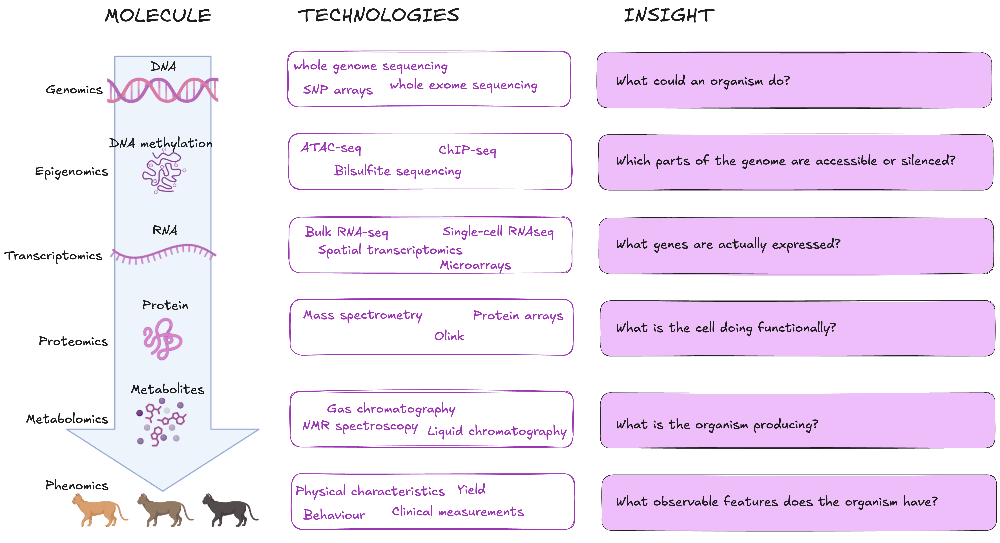
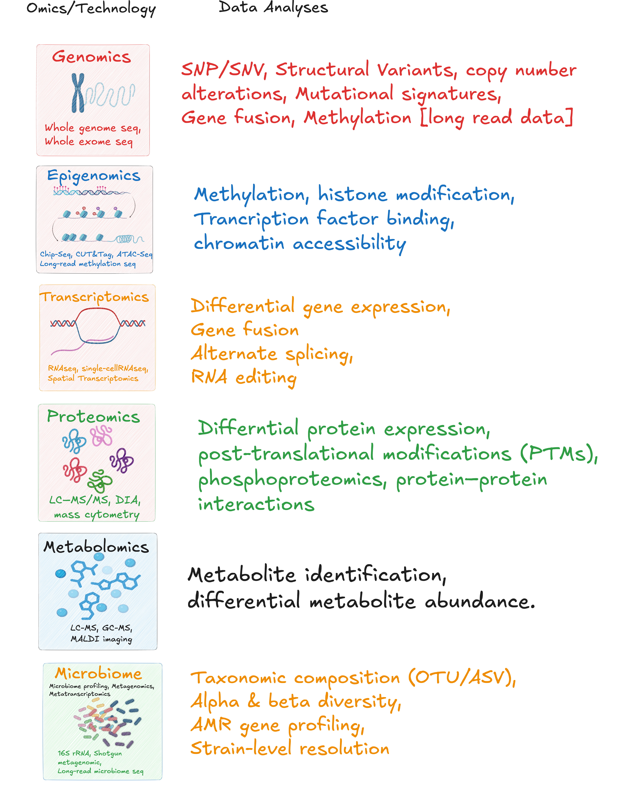

# The omics landscape

!!! info "Learning objectives"
    By the end of this section, participants will be able to:

    - Identify the seven common failure modes in omics study design and classify each by recoverability.
    - Recognise when a platform choice, sample size, or metadata decision creates an unrecoverable flaw.
    - Match a biological question to the most suitable omics platform and justify that choice.

## TIME DURATION NOTE:: TO TO DELETED IN FINAL STAGE [Aimed for 12 mins + 3 mins Menti activities]

Modern biology has undergone a fundamental shift from measuring one molecule at a time to profiling entire classes of biological molecules simultaneously. This collective approach, broadly termed "omics" operates across multiple layers of biological organisation, each revealing a different dimension of how living systems function. Every living system, whether that's a bacterium, a migratory bird, or person, can be interrogated at the molecular level across these multiple layers. 

These layers have different names, each with distinct molecular targets, and a defined scope of what it can and cannot answer:  

| Layer | Function |
|---|--------------------------|
| **Genomics** | Reveals what genes an organism carries and what they could encode | 
| **Epigenomics** | Reveals how gene activity is regulated through chemical modification to DNA and its packaging proteins |
| **Transcriptomics** | Captures which genes are turned on or off under a given condition | 
| **Proteomics** | Measures the proteins actually present in a cell or tissue |
| **Metabolomics** | Captures small molecule metabolites that are downstream readout of biochemical activity | 

Crucially, no single omics layer tells the complete story; each captures a different molecular dimension of biological systems, and the choice of which layer, or combination of layers to investigate is one of the most consequential decisions a researcher will make before an experiment begins.

The figure below shows how each layer sits within the broader molecular hierarchy of a cell. 

{width=100%}

## Choosing the right platform

Each omics domain includes multiple platforms, and no single approach fits every question. Platforms differ not only in what 
they measure, but in how they measure it, which directly shapes what you can and cannot conclude from your data.

At a broad level, omics technologies fall into two methodological families:

- **Sequencing based approaches** (e.g., DNAseq, RNAseq, ATACseq, 16S amplicon sequencing) quantify molecules by converting them into sequence reads. The primary analytical output is typically a **count** matrix obtained by assigning reads to genes, genomic regions, or taxa.
- **Non-sequencing approaches** measure molecular signals directly. This family includes mass spectrometry platforms (proteomics, metabolomics), fluorescence arrays (microarrays, methylation arrays), and spatial imaging technologies. Many of these platforms produce **continuous** intensity measurements. However, some imaging based transcriptomics technologies, such as Xenium, MERFISH, and CosMx, use image processing algorithms to convert fluorescence signals into **counts** of individual transcript molecules. As a result, their final analytical output may **resemble a count matrix** rather than an intensity matrix.

The figure below provides an overview:

{width=100% height=50%}

### What else can 'omics data tell us

Many omics pipelines focus on a single primary output, e.g. differential gene/protein expression from RNASeq/proteomics, variant calling from Whole Genome Sequencing. However, the same raw data often contains additional layers of biological information that aren't routinely explored.

A growing set of secondary analyses can be applied to existing datasets, often without requiring additional sequencing. Take bulk RNA-seq as an example: beyond standard differential expression, the same dataset can be analyzed for alternative splicing, RNA editing events, transcript fusions, and more. These approaches provide complementary insights and can substantially increase the return on investment from a single experiment.

The catch is that many of these analyses depend on decisions made before sequencing begins including: 

- Library preparation strategy
- Sequencing depth 
- Read length 
- Experimental design and metadata collection

Once data generation is complete, some analytical opportunities may no longer be recoverable if the experiment was not designed with them in mind. Understanding the broader capabilities and limitations of a data type during experimental planning helps preserve future analysis options and maximise the return from an omics dataset.

{width=100%}<small>Ref: [Briefings in Bioinformatics(2021).](https://academic.oup.com/bib/article/22/6/bbab259/6330938){target="_blank"}</small>

!!! info "Live Activity"
    **[Click here to join the activity](https://www.menti.com/alocqhrd8oet)**  
    Or go to [mentimeter.com](https://mentimeter.com) and enter code **1234 567**

??? Example "Clincal: colorectal cancer"
    
    Tissue biopsies are collected from 40 patients undergoing surgery for colorectal cancer, one sample from the tumour and one from adjacent normal tissue per patient. Samples are collected across two hospitals over 24 months. The goal is to identify gene expression differences between tumour and normal tissue.

??? Example "Wildlife: koala chlamydia"

    Swabs are collected from 60 wild koalas across a fragmented landscape over 18 months, comparing animals with and without chlamydial infection. Samples are stored in the field before being transported to the lab.

??? Example "Aquaculture: salmon gut microbiome"

    Gut contents are collected from Atlantic salmon at three farms using different feed formulations. Twenty fish per farm are sampled over a single harvest day. The goal is to understand how diet shapes the gut microbial community.

??? Example "Agriculture: wheat heat stress"

    Leaf tissue is harvested from six wheat varieties at two timepoints, before and during a simulated drought, in a glasshouse trial. The aim is to identify genes associated with drought tolerance.
