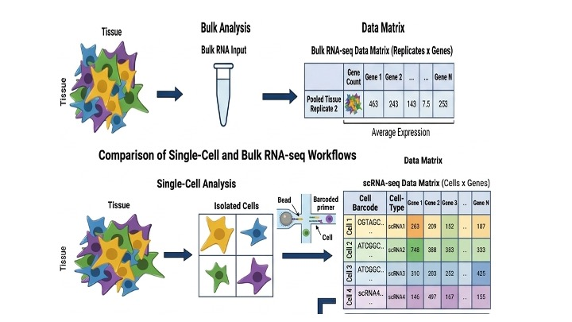
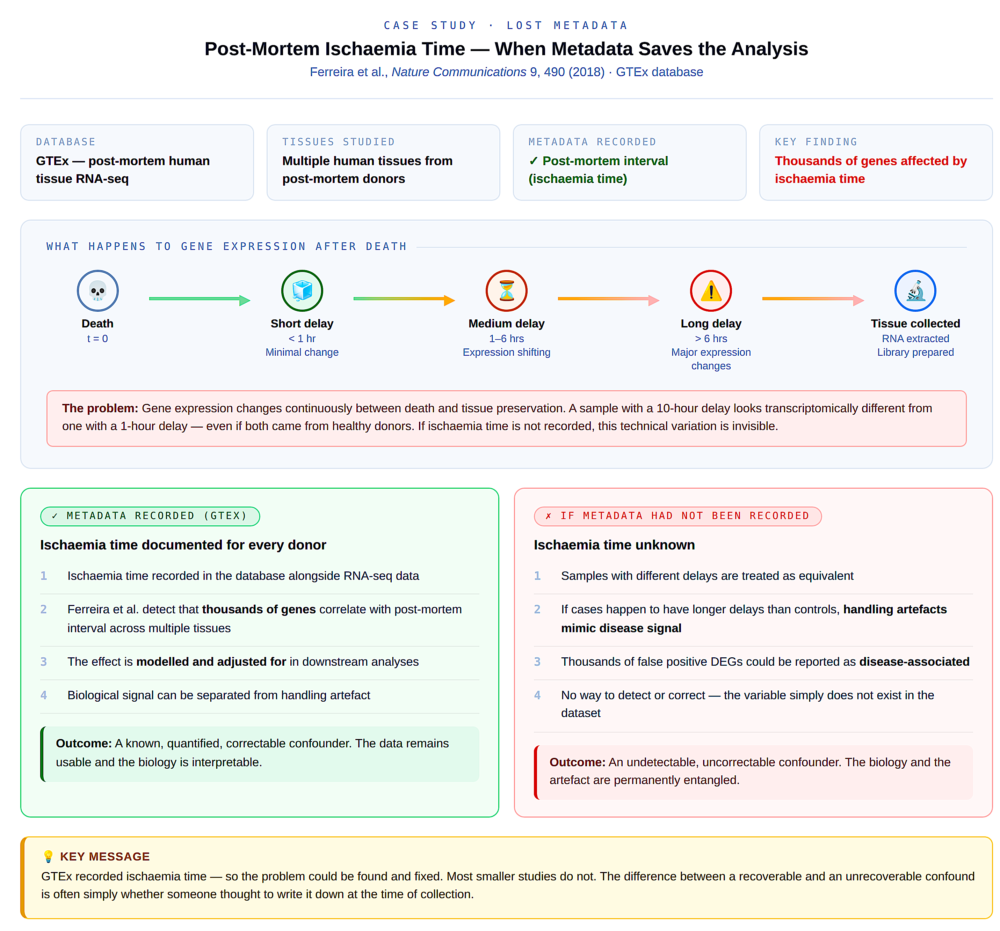

# Module 1 : The Omics Landscape and Why Studies Fail

!!! info "Learning objectives"
    By the end of this module, participants will be able to:

    - Identify the seven common failure modes in omics study design
      and classify each by recoverability.
    - Recognise when a platform choice, sample size, or metadata
      decision creates an unrecoverable flaw.
    - Match a biological question to the most suitable omics
      platform and justify that choice.

## The omics landscape​

Modern biology has entered an era of molecular surveillance, where entire classes of biological molecules can be measured simultaneously rather than one at a time. This collective approach — broadly termed "omics" — operates across multiple layers of biological organisation, each offering a distinct window into how living systems are built and how they behave. 

- **Genomics** interrogates the DNA blueprint, revealing what an organism could do based on its inherited sequence. 
- **Transcriptomics** steps one layer up, capturing the aggregate gene 
  expression activity of a tissue or sample — what genes are actually 
  being switched on or off under a given condition. **Single-cell omics** 
  technologies (including single-cell RNA-seq, ATAC-seq, and proteomics) 
  refine this further, profiling molecular features at the resolution of 
  individual cells rather than averaging across a bulk population — 
  exposing the extraordinary heterogeneity that exists between cells 
  within the same tissue.
- Moving beyond RNA, **proteomics** measures the functional workhorses of the cell — the proteins themselves — accounting for post-translational modifications and abundance that transcriptional data alone cannot predict.
- **Metabolomics** captures the small-molecule metabolites that are the downstream readout of biochemical activity, sitting closest to the organism's actual phenotype. 
- Finally, **metagenomics** extends the genomic lens beyond a single organism to entire microbial communities, cataloguing who is present and what functional potential they collectively carry. 

Crucially, no single omics layer tells the complete story; each captures a different molecular dimension of biological systems, and the choice of which layer — or combination of layers to interrogate is one of the most consequential decisions a researcher will make before an experiment begins.

Each 'omics' layer captures a different molecular dimension of biological systems

{width=90%}

<small> Ref: [Alieh Farshbaf et. al ***Molecular biology reports***2021](https://link.springer.com/article/10.1007/s11033-021-06286-0){target="_blank"} </small>

## From Question to Platform: Navigating Omics Technologies

Each omics domain encompasses a growing ecosystem of platforms and techniques — 
and no single approach fits every question. Platforms differ not only in what 
they measure, but in *how* they measure it, which directly shapes what you can 
and cannot conclude from your data.

At a broad level, omics technologies fall into two methodological families:

- **Sequencing-based approaches** (e.g., DNA-seq, RNA-seq, ATAC-seq) quantify 
  molecules by converting them into readable sequence — offering high throughput 
  and genome-wide coverage.
- **Imaging-based approaches** (e.g., spatial transcriptomics, microscopy-based 
  proteomics) preserve the physical location of molecules within tissue, adding a 
  spatial dimension that sequencing-based methods cannot capture.

The figure below provides an overview of commonly used analysis approaches 
across major omics domains:

{width=90%}

<small> Ref: [Satam, Heena, et al. **Biology** 2023
](https://www.mdpi.com/2079-7737/12/7/997){target="_blank"} </small>

??? abstract "What else can your data tell you?"

    Many omics pipelines focus on a single primary output — differential gene expression from RNA-seq, variant calling from DNA-seq, and so on. However, the same raw data often contains additional layers of biological information beyond the primary analysis.

    A growing set of secondary and emerging analyses can be applied to existing datasets, often without additional sequencing cost. These approaches provide complementary insights and can substantially increase the return on investment from a single experiment.

    However, their applicability depends on study design, data quality, and sequencing characteristics (e.g. depth, read length, library preparation), and results should be interpreted with appropriate caution.

    Take bulk RNA-seq as an example: beyond standard differential expression, the same dataset can be interrogated for  alternative splicing, RNA editing events, transcript fusions, and more.

    {width=90%}

    <small>Ref: [Thind et.al. *Briefings in Bioinformatics* 22.6 
    (2021).](https://academic.oup.com/bib/article/22/6/bbab259/6330938){target="_blank"}</small>

    ---

    > **Key message:** The sequencing run is often not the limiting factor — 
    > the analysis choices are. Knowing what is possible from your data type 
    > before you design the study means you can plan metadata collection and 
    > controls that support these additional analyses from the start.

??? abstract "Further Reading · Emerging Omics Technologies"

    ** Spatial Transcriptomics**
    Entry-level overview, platform comparison, experimental design guidance 
    - [Williams CG et. al *Genome Medicine* 2022](https://link.springer.com/article/10.1186/s13073-022-01075-1){target="_blank"}
     
    spatial + single-cell integration, computational strategies
    - [Vandereyken K et. al *Nature Reviews Genetics* 2023](https://www.nature.com/articles/s41576-023-00580-2){target="_blank"}

    ---

    ** Long-Read Sequencing & Isoform Biology**
    
    Isoform resolution at single-cell level, library prep + bioinformatics
    - [Kumari P et.al 
      *Human Genetics* 2024.](https://link.springer.com/article/10.1007/s00439-024-02678-x){target="_blank"}
    
    Comprehensive guide: tools, applications, challenges
    - [Parker MT et. al *Nature Reviews Genetics* 2025](https://www.nature.com/articles/s41576-025-00828-z){target="_blank"}

    ---
---

## When Omics Studies Fail — and Why It Matters

Despite rapid advances in omics technologies, not all studies succeed. Omics 
studies can fail at multiple stages — from experimental design through to data 
analysis and interpretation. Understanding *how* and *why* they fail is as 
important as understanding the technologies themselves.

### The Cost Reality

Omics experiments carry significant costs across three dimensions:

- **Financial** — sequencing runs, reagents, and platform fees
- **Time** — sample processing, analysis pipelines, and validation
- **Irreplaceability** — clinical biopsies, rare cohorts, and longitudinal 
  samples cannot simply be recollected

Failures are therefore not just technical inconveniences — they represent lost 
scientific opportunities that often cannot be recovered.

 
### Where Failures Are Introduced

| Stage | What Goes Wrong | Root Cause |
|---|---|---|
| **Design** | Wrong platform chosen | Question not defined before technology selection |
| **Design** | No power calculation | Statistical planning done post-hoc or skipped |
| **Design** | Bulk chosen, resolution insufficient | Cellular heterogeneity not anticipated |
| **Wet Lab** | Batch confounded with biology | No sample randomisation across processing runs |
| **Wet Lab** | Poor sample quality | Preservation method mismatched to protocol |
| **Wet Lab** | Samples pooled incorrectly | Pooling done despite individual-level inference needed |
| **Analysis** | Batch effects mistaken for biology | Batch structure not recorded or ignored at QC |
| **Analysis** | Inappropriate normalisation | Method not matched to data distribution or platform |
| **Reporting** | Cannot be reproduced | Code and pipeline undocumented |
| **Reporting** | Cannot be shared or published | Metadata incomplete or missing |
 

!!! info "The central lesson"
    Most failures are introduced at the **design stage** but only become 
    visible at the **wet lab or analysis stage** — by which point they 
    are often unrecoverable. This is why study design deserves as much 
    rigour as the experiment itself.

--- 
### Pitfall 1: Batch effect fully confounded with Biology     
**What happens when batch tracks with biology?**
Cases and controls processed in different batches — it becomes impossible to 
disentangle biological signal from technical variation after the fact.

{width=90%}

??? example "Case Study: When Batch Effects Reach the Clinic"

    Between 2006 and 2011, Anil Potti and colleagues at Duke published a 
    series of high-profile papers claiming to have developed genomic 
    predictors of chemotherapy response in cancer patients using gene 
    expression microarrays. Three clinical trials were opened using these 
    predictors to assign patients to treatment arms.

    Keith Baggerly and Kevin Coombes at MD Anderson had been trying and 
    failing to replicate the research methods, finding systematic errors 
    in how the data had been processed — including off-by-one errors in 
    the assignment of drug sensitivity labels to cell lines and undisclosed 
    batch effects in the training data.

    {width=90%}

    **Outcome:** The trials were halted. Potti later resigned. The case 
    became a landmark example of how undetected batch effects, combined 
    with lack of reproducibility, can cause direct patient harm.

    <small>Ref: [Baggerly & Coombes, *Ann. Appl. Stat.* 2009](https://doi.org/10.1214/09-AOAS291){target="_blank"}</small>

---

### Pitfall 2: Pseudoreplication

 ***What happens when replicates aren't truly independent?***

Pseudoreplication occurs when non-independent measurements are treated as 
independent replicates, artificially inflating the effective sample size and 
overstating statistical confidence.

***Pseudoreplication in Single-Cell RNA-seq***

Unlike bulk RNA-seq — which measures the **average gene expression** 
across thousands of cells in a sample — single-cell RNA-seq profiles 
each cell **individually**, capturing the variation that bulk methods 
average away. A single experiment can generate profiles for tens of 
thousands of cells.

{width=95%}

This resolution comes with a statistical trap that is easy to miss. 
Cells from the same individual share a common genetic and environmental 
background — they are subsamples of that individual, not independent 
observations. Analysing them as independent replicates inflates the 
degrees of freedom, leading to elevated type I error rates (false 
positives) and unreproducible findings. Despite this, many single-cell 
pipelines do not account for this dependency by default.

??? example "Case study: Pseudoreplication in single cell omics" 
    A re-analysis of a high-profile Alzheimer's disease scRNA-seq study 
    illustrates how severe the consequences can be. The original analysis 
    treated each cell as an independent observation — inflating the 
    effective sample size from 60 donors to ~80,000 cells. When corrected 
    using a pseudobulk approach, the number of reported differentially 
    expressed genes dropped from 1,031 to just 26 at FDR < 0.01 — a 
    549-fold inflation. Critically, the corrected analysis also pointed 
    to a different, biologically correct cell type.  
    {width=100%}  

    <small>Original study:  [Mathyset al. "Single-cell transcriptomic analysis of Alzheimer’s disease." Nature 570.7761 (2019)](https://www.nature.com/articles/s41586-019-1195-2){target="_blank"}</small> 
    <small> Re-analysis:[Murphy et. al "Avoiding false discoveries in single-cell RNA-seq by revisiting the first Alzheimer’s disease dataset." Elife 12 (2023)](https://elifesciences.org/articles/90214){target="_blank"}</small>  

> **This pitfall is not unique to single-cell studies**
> The examples/activity in module 1 use single-cell RNA-seq and microbiome transfer 
> studies — but pseudoreplication applies equally to bulk RNA-seq, 
> proteomics, and any omics platform where multiple measurements are 
> taken from the same biological unit.

---

### Pitfall 3: Underpowered Studies

In many omics studies, sample size is determined by budget or sample
availability rather than by statistical need. This is particularly
costly in omics, where thousands of molecular features are tested
simultaneously — multiple testing correction reduces the effective
power per feature dramatically, meaning that the n required to detect
true signal is far higher than most researchers expect.

The consequences are consistent across platforms:

- **Transcriptomics (RNA-seq):** studies with n = 3 per condition —
  the field norm — typically detect only 20–40% of truly differentially
  expressed genes, with high rates of false positives among those reported. <small>[Schurch et al. *Rna* 2016](https://pmc.ncbi.nlm.nih.gov/articles/PMC4878611/){target="_blank"}</small>

- **Proteomics:** low sample size exacerbates the effects of missing values and technical variability, reducing statistical power and introducing bias, which can compromise reliable quantification across samples.<small>[Kong et al., *Proteomics* 2022](https://doi.org/10.1002/pmic.202200092){target="_blank"}</small>

- **Genomics (GWAS, variant calling):** underpowered cohorts produce
  associations that fail to replicate in independent datasets —
  driven by inflated effect size estimates in small discovery samples.<small>
    Zou et al. *G3 Genes|Genomes|Genetics* 2022.
    [doi:10.1093/g3journal/jkac261](https://doi.org/10.1093/g3journal/jkac261){target="_blank"}

    Wray et al. *Nature Communications* 2018
    [doi:10.1038/s41467-018-07348-x](https://www.nature.com/articles/s41467-018-07348-x){target="_blank"}
    </small>

- **Metabolomics:** Reproducibility crisis in metabolomics biomarker studies
A 2024 meta analysis study of 244 clinical metabolomics studies illustrates
  the scale of this problem:of 2,206 unique metabolites reported as
  statistically significant across these studies, 72% were identified by
  only a single study — with contradictory directions of change even
  for metabolites detected by more than one group. Small sample sizes
  were identified as a primary driver of this reproducibility failure. <small>[Cochran, Darcy, et al. *TrAC Trends in Analytical Chemistry* 2024](https://www.sciencedirect.com/science/article/pii/S0165993624004011){target="_blank"}</small>

- **Single-cell omics:** pseudoreplication compounds the underpowering 
  problem — the true n is the number of donors, not cells.
  <small>[Murphy et al., *eLife* 2023](https://elifesciences.org/articles/90214){target="_blank"}</small>

In all cases, the result is the same: findings that look statistically
significant but do not replicate. This is one of the common
root causes of the omics reproducibility crisis.
---

### Pitfall 4: Lost or Incomplete Metadata

High-quality sequencing data is only as useful as the information
recorded alongside it. Missing or incomplete metadata — sample
processing dates, batch numbers, storage conditions, clinical
variables, tissue handling times — can render an otherwise technically
sound dataset uninterpretable.

Critically, **metadata that is not recorded cannot be recovered**.
Unlike batch effects that are documented, an unknown source of
variation cannot be tested, modelled, or corrected for in analysis.
Its only trace may be an unexplained axis in a PCA plot or a
pattern of QC outliers — suggestive of a problem, but impossible
to resolve without the original records.

!!! danger "The unrecoverable rule"
    Every metadata field not recorded at the time of sample collection
    is a potential confounder you can never remove.

**Real consequences of missing metadata:**

**No fasting status recorded (metabolomics)**
If fasting vs fed state is not documented, differences in circulating
metabolites between groups may simply reflect recent food intake
rather than disease biology — and there is no way to distinguish
the two after the fact.

**No ischaemia time recorded (tissue studies)**
If the delay between tissue collection and processing is unknown,
gene expression or protein abundance changes caused by sample
degradation can be mistaken for true disease effects. This is
particularly acute in surgical and post-mortem tissue studies.

**No batch or processing date recorded (any omics)**
Without knowing which samples were processed together, batch
effects cannot be identified or corrected — even with the most
sophisticated normalisation methods. The variation is present
in the data but invisible to the analyst.

??? example "Case study: When Metadata Saves the Analysis — GTEx & Ischaemia Time" 
    {width=100%}  

!!! info "Coming up in Module 3"
    Designing a metadata collection plan — including a minimal
    metadata checklist for omics studies — is covered in
    **Module 3: Experimental Design Fundamentals**.

---
#### Pitfall 5: Wrong Platform for the Biological Question

Platform choice is a design decision — not a technical afterthought.
Selecting the wrong platform upstream cannot be compensated for by
better analysis downstream. The data simply does not contain the
information required to answer the question.

**Resolution mismatch — bulk where single-cell was needed**
Bulk RNA-seq permanently averages signal across all cell types.
Rare populations and cell-type-specific responses cannot be
recovered by deconvolution alone.

*Example:* Studying tumour-infiltrating immune cells with bulk
RNA-seq produces a single averaged signal across cancer cells,
T cells, and macrophages — with no ability to identify which
population is driving the difference.

**Sequencing technology mismatch — short-read where long-read is needed**
Short-read sequencing cannot resolve structural variants, full-length
isoforms, or repetitive regions — regardless of depth. This is a
read-length limitation, not a coverage problem.

*Example:* Short-read WES applied to structural variant detection
in repeat-rich regions will produce false negatives that deeper
sequencing cannot recover.

**Proteomics acquisition mismatch**
In mass spectrometry proteomics, the instrument acquisition mode
determines which proteins get measured at all. Some modes
systematically miss low-abundance proteins by design — meaning
key targets may be absent from the data entirely, not just
under-quantified.

**Technology adopted for novelty rather than fit**
Single-cell omics adopted primarily because it is current, then
analysed as bulk, represents a significant waste of cost and
sample with no scientific gain over a cheaper bulk approach.

!!! danger "The unrecoverable rule"
    If the platform cannot capture the biological signal of interest,
    no analysis method can recover it. The choice must be made
    before data collection — not revisited after.

!!! info "Coming up in Module 3"
    A structured decision framework for matching biological questions
    to omics platforms is covered in **Module 3**.

---
### Pitfall 6: Lack of control in experimental design
Controls operate at two levels in omics studies — and both
are required:

**Experimental controls** (wet lab stage)
Negative extraction controls, positive controls, spike-ins,
and process blanks. These detect contamination, assay failure,
and handling variation *before* data is generated. If missing,
the problem cannot be identified computationally.

**Computational controls** (analysis stage)
In silico negative controls, permutation-based null distributions,
decoy databases (proteomics), and spike-in normalisation. These
detect and quantify technical noise *within* the data. They
depend on experimental controls being in place upstream —
a computational control cannot replace a missing wet lab control.

| Platform | Key control often missing |
|---|---|
| 16S / metagenomics | Negative extraction control |
| RNA-seq (bulk) | ERCC spike-ins, no-template control |
| Single-cell RNA-seq | Empty droplet controls, ambient RNA |
| Proteomics (MS) | Blank injections, negative digestion control |
| Metabolomics | Pooled QC samples, solvent blanks |
| DNA methylation | Unmethylated/fully methylated conversion controls |

??? example "Case Study: The Placental Microbiome"

    Multiple high-profile studies reported the existence of a
    placental microbiome using 16S amplicon sequencing — a
    clinically significant claim with implications for preterm
    birth and neonatal health.

    All of these studies lacked negative extraction controls —
    samples processed through the full extraction workflow but
    containing no input material. When later studies included
    proper controls, the bacterial signal was traced to reagent
    and laboratory contamination, not placental tissue.

    Subsequent studies with appropriate controls found no
    evidence of a true placental microbiome. The earlier
    conclusions were entirely artefactual — and the clinical
    follow-up work they generated was misdirected.

    **Why controls would have caught this:**
    A negative extraction control processed alongside placental
    samples would have shown the same bacterial signal in the
    no-input control as in the tissue samples — immediately
    flagging contamination before any biological conclusions
    were drawn.

    <small>
    Wagner & Kleiner. How thoughtful experimental design can
    empower biologists in the omics era.
    *Nature Communications* 16, 7263 (2025).
    [doi:10.1038/s41467-025-62616-x](https://www.nature.com/articles/s41467-025-62616-x){target="_blank"}

    Salter et al. Reagent and laboratory contamination can critically
    impact sequence-based microbiome analyses.
    *BMC Biology* 12, 87 (2014).
    [doi:10.1186/s12915-014-0087-z](https://doi.org/10.1186/s12915-014-0087-z){target="_blank"}
    ← **primary reference — first systematic demonstration of kit contamination**
    </small>

!!! danger "The unrecoverable rule"
    If controls were not included at the time of experiment,
    contamination and technical artefacts cannot be distinguished
    from biology retrospectively. The only fix is to repeat
    the experiment with proper controls.

!!! info "Coming up in Module 3"
    Designing a control strategy for your specific omics platform —
    including which controls are mandatory vs recommended — is
    covered in **Module 3: Experimental Design Fundamentals**.

---
#### Pitfall 7: Discovery Without Validation

Finding a statistically significant result in omics is not the
same as finding a generalisable biological truth. When thousands
of features are tested simultaneously, some will reach significance
by chance — and results derived from a single dataset may reflect
dataset-specific effects (technical, cohort, or sampling variation) rather than true biology.

Not every omics study requires external validation — but the
requirement scales with the strength of the claim being made:

| Study type | Example claim | Validation required? |
|---|---|---|
| Exploratory / hypothesis-generating | "We identify candidate DEGs associated with condition X" | Not strictly — if clearly labelled as exploratory |
| Confirmatory / mechanistic | "Gene X drives this pathway in disease Y" | Strongly recommended |
| Translational / clinical | "This 10-gene signature predicts patient outcome" | Essential |

!!! info "The key principle"
    Any claim intended to generalise beyond the original dataset
    requires independent validation. Without it, results should
    be treated as exploratory candidates — not confirmed biology.

**Why omics is particularly vulnerable**

The combination of high feature counts, small sample sizes, and
biological variability between cohorts means that omics findings
are especially susceptible to dataset-specific noise. This is not
unique to machine learning — it applies equally to:

- Differential expression analysis — gene signatures derived from small or heterogeneous cohorts often show limited reproducibility across independent datasets of the same disease
- Metabolomics biomarkers — as shown in Pitfall 3, 72% of
  reported significant metabolites were found in only one study
- **Proteomics:** a striking gap exists between biomarker discovery and clinical translation. Rifai et al. 
  described this validation gap in 2006 — and nearly two decades 
  later, translating proteomics to clinical applications 
  has remained challenging despite significant technical progress,  
  with standardisation, regulatory compliance, and 
  the need for robust validation  continuing to be cited as 
  unresolved barriers at major proteomics symposia as recently as 2024.
  The problem Rifai described has not been solved — it has persisted 
  for two decades. <small>
    [Rifai et al. *Nature Biotechnology* 2006](https://doi.org/10.1038/nbt1235){target="_blank"} [Proceedings of the 68th Benzon Foundation Symposium.
    *Journal of Proteome Research* 2024](https://pmc.ncbi.nlm.nih.gov/articles/PMC11652764/){target="_blank"}</small>
 
***The consequences are most severe when studies move from
discovery to claims of generalisable biomarkers, clinical
signatures, or mechanisms — without independent validation.***

??? example "Case Study: Two Decades of Unreplicable Genetics — The Candidate Gene Era"

    From the 1990s through the mid-2000s, hundreds of candidate gene
    association studies were published linking specific genetic variants
    to psychiatric and complex diseases — depression, schizophrenia,
    addiction, personality traits. Most studies had n = 100–500.
    Results were statistically significant within each dataset.

    When adequately powered GWAS arrived (n > 10,000), the vast
    majority of these associations vanished. A landmark 2019 reanalysis
    of 18 candidate genes that had been studied for decades in
    relation to depression found that none replicated in a sample
    of over 620,000 individuals.

    The candidate gene literature was not fraudulent — it was
    underpowered discovery presented as confirmed biology, without
    independent validation in adequately sized cohorts.

    **The fix that was missing:**
    Independent replication in a larger cohort before claiming
    a generalisable genetic association. Modern GWAS pre-register
    replication cohorts before publication precisely because of
    this history. <small> [Border et al. *American Journal of Psychiatry* 2019](https://psychiatryonline.org/doi/10.1176/appi.ajp.2018.18070881){target="_blank"} [Ioannidis et al. *Nature Genetics* 2009](https://doi.org/10.1038/ng.295){target="_blank"}
    </small>
---
!!! info "Coming up in Module 3"
    Strategies for building validation into omics study design —
    including cohort splitting, use of external datasets, and
    when cross-validation is appropriate — are covered in
    **Module 3: Experimental Design Fundamentals**.
---
### Can It Be Fixed?

!!! success "Recoverable — fixable at analysis stage"
    - Normalisation method choice
    - Some batch effects (if not confounded with biology)
    - Outlier handling

!!! warning "Limitable — partially addressable with caveats"
    - Underpowered sample sizes
    - Platform mismatch
    - Suboptimal QC thresholds

!!! danger "Fatal — unrecoverable after data generation"
    - Batch fully confounded with biological groups
    - Missing or unrecorded metadata
    - Wrong omics platform chosen
    - Samples pooled where individual inference was needed

??? question "Part 1: Activity — Analyse this study design"

    A 2012 gut microbiome study collected microbiota from five pregnant women 
    per condition, pooled them into a single inoculum, and inoculated 
    six germ-free mice per condition. Statistics were performed on n = 6 mice.

    {width=90%}

    <small>Ref: Koren et al., *Cell* 150, 470–480 (2012)</small>

    Discuss in your group:

    1. What is the true experimental unit — the mouse or the human donor?
    2. What is the actual n per condition?
    3. Are the six mice independent biological replicates? Why or why not?
    4. What does this mean for the p-values reported?
    5. What information would you need to determine if this is recoverable?
    6. Is this error recoverable after data collection?

<!--
??? success "Answers — reveal after group discussion"

    **Q1. True experimental unit?**  
    The human donor — not the mouse.

    **Q2. Actual n per condition?**  
    n = 1. There was only one pooled inoculum per condition.

    **Q3. Are the six mice independent biological replicates?**  
    No — all six received the same inoculum. They are technical 
    replicates, not biological replicates.

    **Q4. What does this mean for the p-values?**  
    They are uninterpretable. Degrees of freedom are artificially 
    inflated, producing false precision and invalid inference.

**Q5. What information would you need to determine if this
    is recoverable?**
    You would need to know whether individual donor samples were
    kept separate before pooling. Specifically:

    - Were aliquots from each donor preserved individually
      before pooling into the shared inoculum?
    - Is DNA or 16S sequence data available per donor that
      could distinguish their microbial contributions?
    - Were any mice inoculated with single-donor material
      rather than the pool?

        If all donor material was irreversibly pooled and no
        individual aliquots were retained — this is **unrecoverable**.
        The biological contributions of individual donors cannot
        be separated from a mixed inoculum after the fact.
        The experiment would need to be repeated with one
        inoculum per donor.

    **Q6. Is this recoverable?**  
    No — unrecoverable. Pooling happened at sample collection. 
    Donor contributions cannot be separated retrospectively.

    <small>Ref: Wagner & Kleiner, *Nat Commun* 16, 7263 (2025)</small>

    {width=100%}

-->

??? question "Part 2 — Apply to Your Own Study"

    Briefly describe a study you are planning or have
    been involved in. In small groups:

    1. Identify which of the 7 pitfalls your study
       is most vulnerable to
    2. Classify the risk — fatal, limitable,
       or recoverable?
    3. What one change at the design stage would
       reduce that risk?
