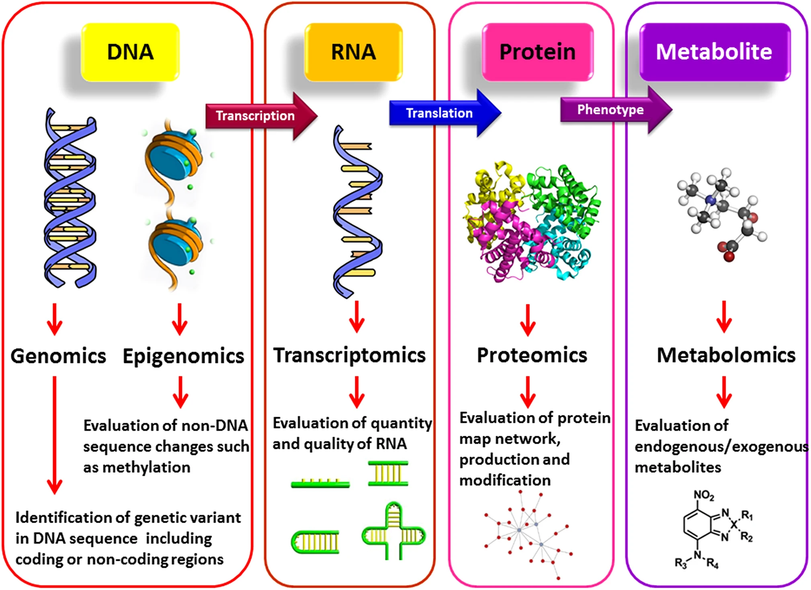
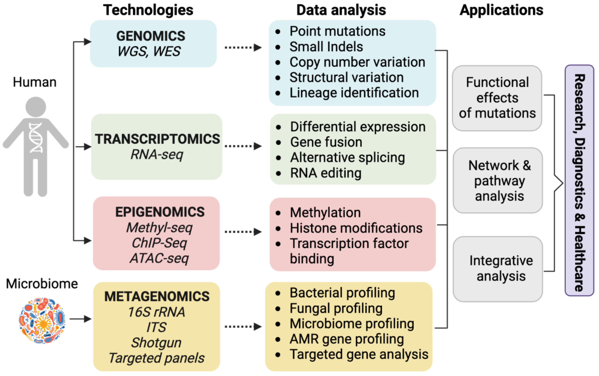
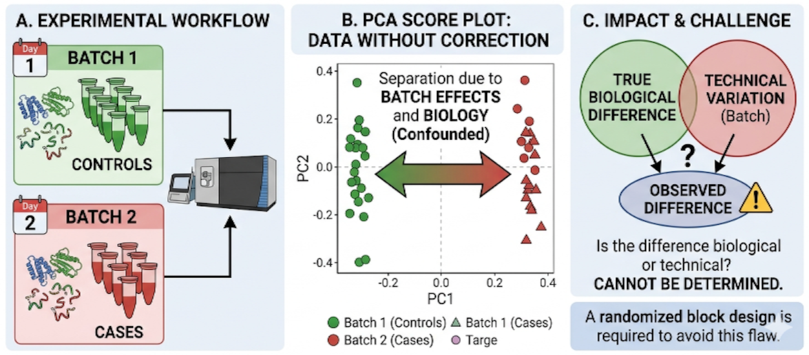
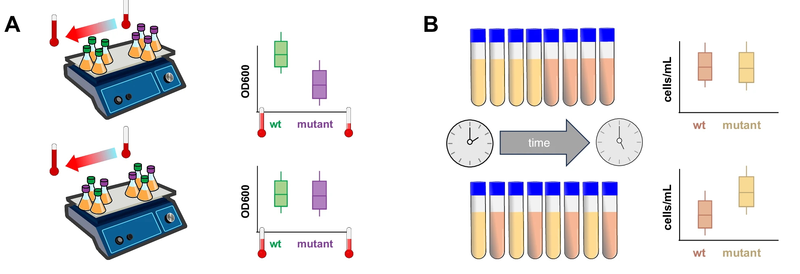
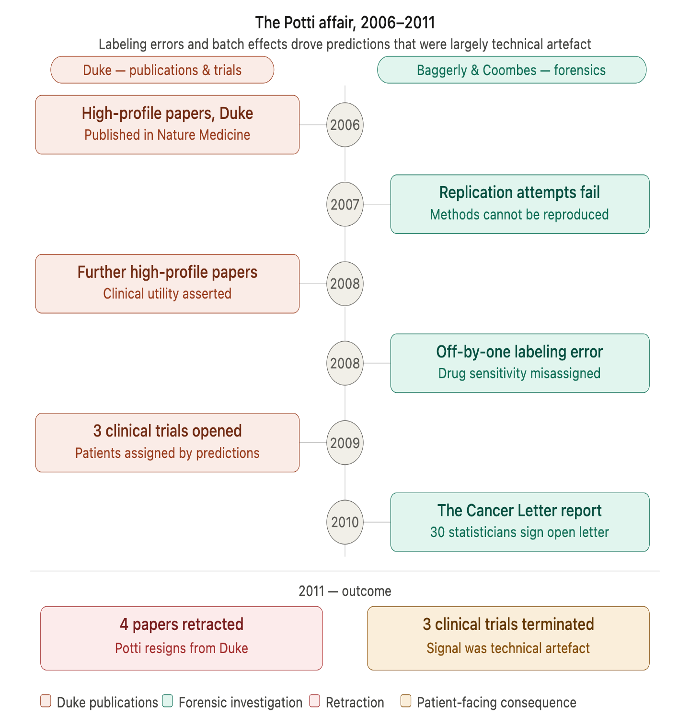
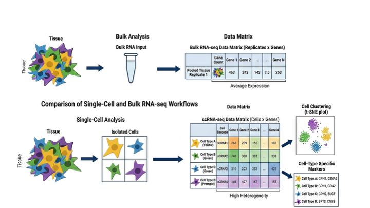
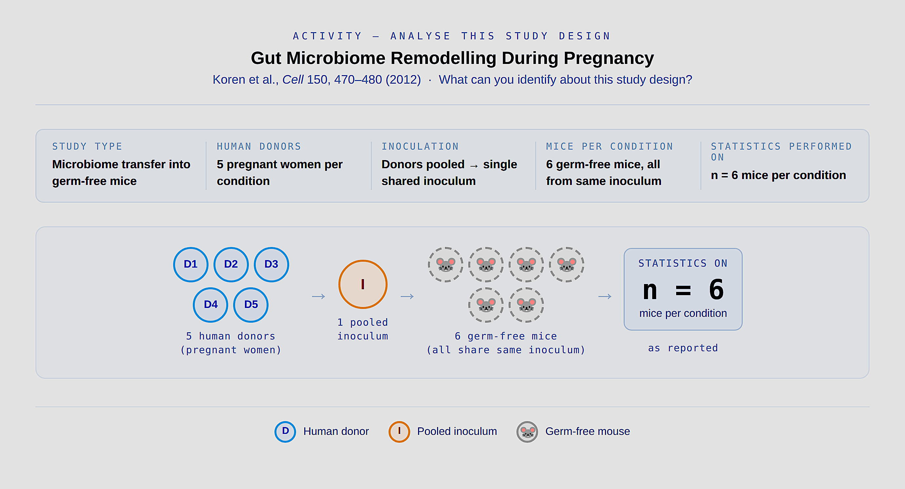
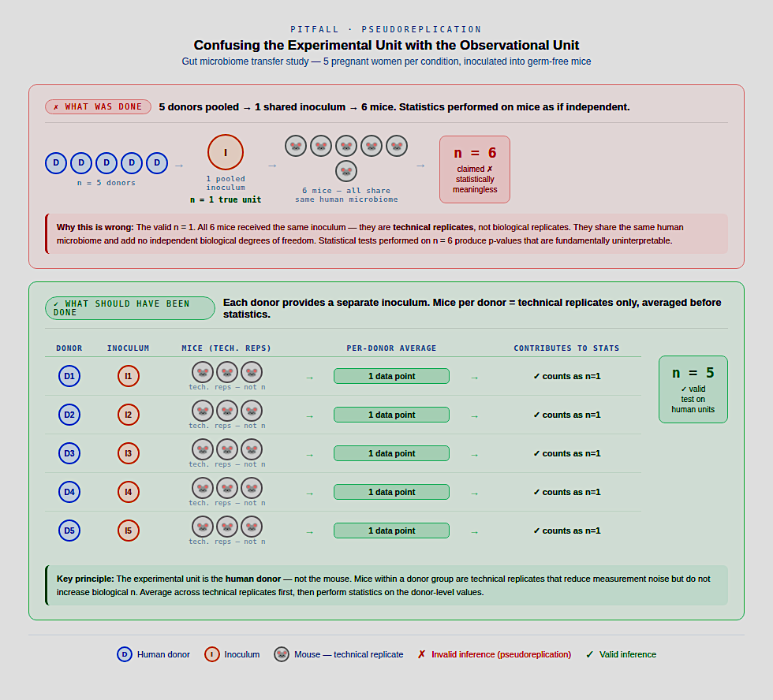

# Module 1 : The Omics Landscape and Why Studies Fail

!!! info "Learning objectives" 
    - By the end of this module, participants will be able to:
        - Match a biological question to the most suitable omics platform and justify that choice.
        - Get to know poor experiment design and what they may miss
        - What kind of experiemental issues are hard to overcome later on. 

## The omics landscape​

Modern biology has entered an era of molecular surveillance, where entire classes of biological molecules can be measured simultaneously rather than one at a time. This collective approach — broadly termed "omics" — operates across multiple layers of biological organisation, each offering a distinct window into how living systems are built and how they behave. 

- **Genomics** interrogates the DNA blueprint, revealing what an organism could do based on its inherited sequence. 
- **Transcriptomics** steps one layer up, capturing the aggregate gene 
  expression activity of a tissue or sample — what genes are actually 
  being switched on or off under a given condition. **Single-cell omics** 
  technologies (including single-cell RNA-seq, ATAC-seq, and proteomics) 
  refine this further, profiling molecular features at the resolution of 
  individual cells rather than averaging across a bulk population — 
  exposing the extraordinary heterogeneity that exists between cells 
  within the same tissue.
- Moving beyond RNA, **proteomics** measures the functional workhorses of the cell — the proteins themselves — accounting for post-translational modifications and abundance that transcriptional data alone cannot predict.
- **Metabolomics** captures the small-molecule metabolites that are the downstream readout of biochemical activity, sitting closest to the organism's actual phenotype. 
- Finally, **metagenomics** extends the genomic lens beyond a single organism to entire microbial communities, cataloguing who is present and what functional potential they collectively carry. 

Crucially, no single omics layer tells the complete story; each captures a different molecular dimension of biological systems, and the choice of which layer — or combination of layers to interrogate is one of the most consequential decisions a researcher will make before an experiment begins.

Each 'omics' layer captures a different molecular dimension of biological systems

{width=90%}

<small> Ref: [New diagnostic molecular markers and biomarkers in odontogenic tumors." Molecular biology reports 48.4 (2021): 3617-3628.](https://link.springer.com/article/10.1007/s11033-021-06286-0) </small>

## From Question to Platform: Navigating Omics Technologies

Each omics domain encompasses a growing ecosystem of platforms and techniques — 
and no single approach fits every question. Platforms differ not only in what 
they measure, but in *how* they measure it, which directly shapes what you can 
and cannot conclude from your data.

At a broad level, omics technologies fall into two methodological families:

- **Sequencing-based approaches** (e.g., DNA-seq, RNA-seq, ATAC-seq) quantify 
  molecules by converting them into readable sequence — offering high throughput 
  and genome-wide coverage.
- **Imaging-based approaches** (e.g., spatial transcriptomics, microscopy-based 
  proteomics) preserve the physical location of molecules within tissue, adding a 
  spatial dimension that sequencing-based methods cannot capture.


The figure below provides an overview of commonly used analysis approaches 
across major omics domains:


{width=90%}

<small> Ref: [Next-generation sequencing technology: current trends and advancements." Biology 12.7 (2023): 997.
](https://www.mdpi.com/2079-7737/12/7/997) </small>


``` 
Choosing the wrong omics platform, or designing a study without thinking through its constraints, is one of the most common — and most costly — mistakes in modern biology. This module builds the foundation to avoid it. 
```

### Getting More From Data You Already Have

Standard omics pipelines typically focus on a primary output — differential gene 
expression from RNA-seq, variant calling from DNA-seq, and so on. However, the 
same raw data often contains far more biological signal than a single analysis 
extracts.

A growing set of **secondary and emerging analyses** can be applied to existing 
datasets at little or no additional sequencing cost. These approaches offer 
complementary biological insights and can substantially increase the return on 
investment from a single experiment — without requiring new samples or additional 
library preparation.

Take bulk RNA-seq as an example: beyond standard differential expression, the 
same dataset can be interrogated for immune cell composition, RNA editing events, 
alternative splicing, transcript fusion events, and more.

{width=90%}

<small>Ref: [Demystifying emerging bulk RNA-Seq applications. *Briefings in Bioinformatics* 22.6 
(2021).](https://academic.oup.com/bib/article/22/6/bbab259/6330938)</small>

!!! tip "Key message"
    The sequencing run is often not the limiting factor — the **analysis choices** 
    are. Knowing what is possible from your data type before you design the study 
    means you can plan metadata collection and controls that support these 
    additional analyses from the start.
​
??? quote "References & Further Reading for Growing omics techniques and methods"
    - Spatial omics (xenium)? 
    - [Long read based single cell  RNA-Seq](https://link.springer.com/article/10.1007/s00439-024-02678-x)
    - Spatial Proteomics/epigenomics etc
    - other exampless???

## When Omics Studies Fail — and Why It Matters

Despite rapid advances in omics technologies, not all studies succeed. Omics 
studies can fail at multiple stages — from experimental design through to data 
analysis and interpretation. Understanding *how* and *why* they fail is as 
important as understanding the technologies themselves.

### The Cost Reality

Omics experiments carry significant costs across three dimensions:

- **Financial** — sequencing runs, reagents, and platform fees
- **Time** — sample processing, analysis pipelines, and validation
- **Irreplaceability** — clinical biopsies, rare cohorts, and longitudinal 
  samples cannot simply be recollected

Failures are therefore not just technical inconveniences — they represent lost 
scientific opportunities that often cannot be recovered.

 
### Where Failures Are Introduced

| Stage | What Goes Wrong | Root Cause |
|---|---|---|
| <span style="color:#4a9eff">**Design**</span> | Wrong platform chosen | Question not defined before technology selection |
| <span style="color:#4a9eff">**Design**</span> | No power calculation | Statistical planning done post-hoc or skipped |
| <span style="color:#4a9eff">**Design**</span> | Bulk chosen, resolution insufficient | Cellular heterogeneity not anticipated |
| <span style="color:#60c689">**Wet Lab**</span> | Batch confounded with biology | No sample randomisation across processing runs |
| <span style="color:#60c689">**Wet Lab**</span> | Poor sample quality | Preservation method mismatched to protocol |
| <span style="color:#60c689">**Wet Lab**</span> | Samples pooled incorrectly | Pooling done despite individual-level inference needed |
| <span style="color:#f59e42">**Analysis**</span> | Batch effects mistaken for biology | Batch structure not recorded or ignored at QC |
| <span style="color:#f59e42">**Analysis**</span> | Inappropriate normalisation | Method not matched to data distribution or platform |
| <span style="color:#e05c7a">**Reporting**</span> | Cannot be reproduced | Code and pipeline undocumented |
| <span style="color:#e05c7a">**Reporting**</span> | Cannot be shared or published | Metadata incomplete or missing |
 

!!! info "The central lesson"
    Most failures are introduced at the **design stage** but only become 
    visible at the **wet lab or analysis stage** — by which point they 
    are often unrecoverable. This is why study design deserves as much 
    rigour as the experiment itself.

### Can It Be Fixed?

!!! success "Recoverable — fixable at analysis stage"
    - Normalisation method choice
    - Some batch effects (if not confounded with biology)
    - Outlier handling

!!! warning "Limitable — partially addressable with caveats"
    - Underpowered sample sizes
    - Platform mismatch
    - Suboptimal QC thresholds

!!! danger "Fatal — unrecoverable after data generation"
    - Batch fully confounded with biological groups
    - Missing or unrecorded metadata
    - Wrong omics platform chosen
    - Samples pooled where individual inference was needed


--- 
**Pitfall 1: Batch effect fully confounded with Biology**     
##### What happens when batch tracks with biology?
Cases and controls processed in different batches — it becomes impossible to 
disentangle biological signal from technical variation after the fact.

{width=90%}

OPTIONAL (CAN BE MOVED TO MODULE 3) :Following figure shows randomization of biological replicates across space, time, and batches can reduce experimental bias.

{width=90%}

<small>Ref: [ How thoughtful experimental design can empower biologists in the omics era](https://www.nature.com/articles/s41467-025-62616-x)</small>

??? example "Case Study: When Batch Effects Reach the Clinic"

    Between 2006 and 2011, Anil Potti and colleagues at Duke published a 
    series of high-profile papers claiming to have developed genomic 
    predictors of chemotherapy response in cancer patients using gene 
    expression microarrays. Three clinical trials were opened using these 
    predictors to assign patients to treatment arms.

    Keith Baggerly and Kevin Coombes at MD Anderson had been trying and 
    failing to replicate the research methods, finding systematic errors 
    in how the data had been processed — including off-by-one errors in 
    the assignment of drug sensitivity labels to cell lines and undisclosed 
    batch effects in the training data.

    {width=90%}

    **Outcome:** The trials were halted. Potti later resigned. The case 
    became a landmark example of how undetected batch effects, combined 
    with lack of reproducibility, can cause direct patient harm.

    <small>Ref: [Baggerly & Coombes, *Ann. Appl. Stat.* 2009](https://doi.org/10.1214/09-AOAS291)</small>


**Pitfall 2: Pseudoreplication**

##### What happens when replicates aren't truly independent?

Pseudoreplication occurs when non-independent measurements are treated as 
independent replicates, artificially inflating the effective sample size and 
overstating statistical confidence.

!!! info "This pitfall is not unique to single-cell studies"
    The examples below use single-cell RNA-seq and microbiome transfer 
    studies — but pseudoreplication applies equally to bulk RNA-seq, 
    proteomics, and any omics platform where multiple measurements are 
    taken from the same biological unit.

---

#### Pseudoreplication in Single-Cell RNA-seq

Unlike bulk RNA-seq — which measures the **average gene expression** 
across thousands of cells in a sample — single-cell RNA-seq profiles 
each cell **individually**, capturing the variation that bulk methods 
average away. A single experiment can generate profiles for tens of 
thousands of cells.

This resolution comes with a statistical trap that is easy to miss. 
Cells from the same individual share a common genetic and environmental 
background — they are subsamples of that individual, not independent 
observations. Analysing them as independent replicates inflates the 
degrees of freedom, leading to elevated type I error rates (false 
positives) and unreproducible findings. Despite this, many single-cell 
pipelines do not account for this dependency by default.

{width=90%}
```

---


??? question "Activity — Analyse this study design"

    A 2012 gut microbiome study collected microbiota from five pregnant women 
    per condition, pooled them into a single inoculum, and inoculated 
    six germ-free mice per condition. Statistics were performed on n = 6 mice.

    {width=90%}

    <small>Ref: Koren et al., *Cell* 150, 470–480 (2012)</small>

    Discuss in your group:

    1. What is the true experimental unit — the mouse or the human donor?
    2. What is the actual n per condition?
    3. Are the six mice independent biological replicates? Why or why not?
    4. What does this mean for the p-values reported?
    5. How would you redesign this experiment?
    6. Is this error recoverable after data collection?

<!--
??? success "Answers — reveal after group discussion"

    **Q1. True experimental unit?**  
    The human donor — not the mouse.

    **Q2. Actual n per condition?**  
    n = 1. There was only one pooled inoculum per condition.

    **Q3. Are the six mice independent biological replicates?**  
    No — all six received the same inoculum. They are technical 
    replicates, not biological replicates.

    **Q4. What does this mean for the p-values?**  
    They are uninterpretable. Degrees of freedom are artificially 
    inflated, producing false precision and invalid inference.

    **Q5. How would you redesign?**  
    Each donor provides a separate inoculum → 5 independent inocula 
    → mice per donor treated as technical replicates and averaged 
    before statistics → valid n = 5 per condition.

    **Q6. Is this recoverable?**  
    No — unrecoverable. Pooling happened at sample collection. 
    Donor contributions cannot be separated retrospectively.

    <small>Ref: Wagner & Kleiner, *Nat Commun* 16, 7263 (2025)</small>

    {width=100%}

-->


**Lost or incomplete metadata**  
Missing sample annotations render datasets unusable despite high-quality 
sequencing data.

**Technology mismatch**  
Short-read sequencing applied to questions requiring long-read resolution 
(e.g., structural variants, full-length isoforms).

!!! tip "Further reading"
    - Sample size considerations for omics: 
    [Power and Sample Size for Omics (OHSU)](https://www.ohsu.edu/sites/default/files/2024-02/pss4omics.pdf)
    - Reproducibility considerations in ageing research *(add reference)*

---
## Key Considerations When Choosing a Platform

- What biological question are you addressing?

        - Variant detection (e.g., SNPs, indels)

        - Differential expression (DEG analysis)

        - DNA methylation or other epigenetic modifications

        - Structural variation or copy number alterations

- What level of coverage is required?

        - Whole transcriptome vs gene panels

        - Whole exome sequencing (WES) vs whole genome sequencing (WGS)

- What is the expected accuracy and resolution?

        - For example, copy number alteration (CNA) detection is generally more robust using WGS than WES, and RNA-seq–based CNA inference is indirect and less reliable.

        - Similarly, variant calling accuracy differs across platforms and depths.

- What are the sample constraints?

        - Tissue preservation method (e.g., FFPE vs fresh frozen)

        - RNA/DNA quality and quantity

        - Compatibility of protocols with specific sample types

- Are short-read technologies sufficient?

        - Short-read sequencing (e.g., Illumina) is effective for many applications

        - Long-read technologies (e.g., PacBio, Oxford Nanopore) are preferable for:

            - Structural variant detection

            - Isoform resolution

            - Complex genomic regions

- Is spatial or single-cell resolution required?

    - Bulk omics may mask cellular heterogeneity

    - Single-cell or spatial methods may be necessary for certain biological questions

## Study Context Matters

- Clinical studies typically require:

    - High accuracy, reproducibility, and validation

    - Standardised and regulatory-compliant methods

- Exploratory research studies may prioritise:

    - Broader coverage

    - Novel discovery potential

    - Cost-effectiveness, even if some methods are less precise

## Example: of what can be often be missed
- Consideration of reproducibility in aging research :
- Sample size considerations: https://www.ohsu.edu/sites/default/files/2024-02/pss4omics.pdf 

 ## Activity : 
 - Briefly describe a study you are planning or have been involved in.
 - In small groups, identify one design risk. 
 - We will records risks on a whiteboard — revisit at the end of the day to check which modules addressed each one.