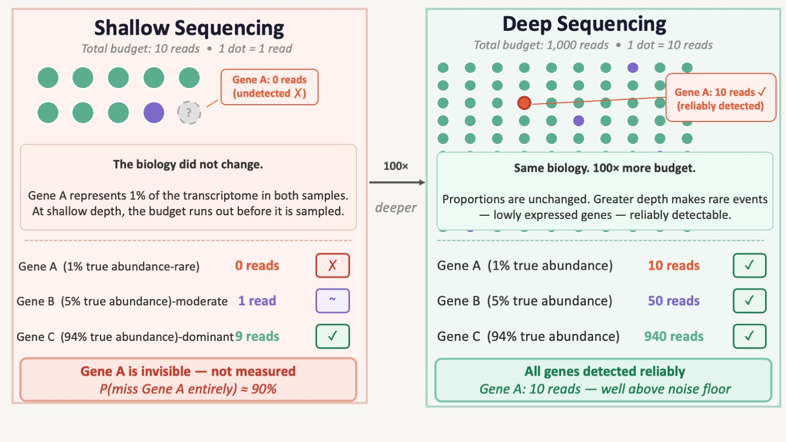

# Module 2 : Data Types and Core Statistical Properties

!!! info "Learning objectives"
    By the end of this module, participants will be able to:

    - Explain what a sequencing count represents — and why raw counts
      cannot be compared directly across samples without accounting for
      sequencing depth.
    - Distinguish between a biological zero (a feature genuinely absent)
      and a technical zero (a feature below detection), and explain why
      treating both identically leads to incorrect biological conclusions.
    - Explain compositionality and relative abundance in intuitive terms
      and describe why naive fold-change and correlation analyses can be
      misleading in compositional data.
    - Recognise that omics count data violates the core assumptions of
      classical statistical tests, and understand why this necessitates
      platform-specific approaches such as DESeq2 and edgeR.

---

## Section 1 — What a Count Actually Is

Before asking what the data means biologically, we need to ask something
more fundamental: **what does the number in your count matrix actually
represent?**

In everyday measurement, a larger number means more of something. A
patient weighing 80 kg weighs more than one weighing 60 kg. The number
is absolute — it does not depend on who else was weighed that day, or
how long the scale ran.

Sequencing counts do not work this way.

### Counts are shares of a fixed budget, not absolute measurements

When you sequence an RNA-seq library, the sequencer does not count every
RNA molecule in the sample. It reads a fixed number of fragments — 20
million, 40 million, 80 million — determined by the depth of the run.
Every count a gene receives is a share of that total.

This has an immediate, unavoidable consequence: **a gene's count depends
not only on how much RNA it produced, but on how many reads were
generated in total.**

Consider a minimal example:

| | Sample A | Sample B |
|---|---|---|
| **Total reads sequenced** | 20 million | 40 million |
| **Gene X raw count** | 100 | 200 |
| **Naïve interpretation** | — | Gene X doubled |
| **Reality** | 0.0005% of library | 0.0005% of library |

Sample B has twice as many reads as Sample A. Gene X received 200 counts
in Sample B and 100 in Sample A — not because it was more active, but
because there were twice as many reads to share. The underlying proportion
is identical: both samples show Gene X at 0.0005% of the library. Without
accounting for depth, a real difference that does not exist appears in
the data.

!!! warning "The naïve interpretation fails in both directions"
    - Comparing raw counts **inflates apparent differences** when one
      sample is deeper than another.
    - Normalising by an inappropriate reference can **introduce
      artificial differences** that are not biological.

    Both errors produce false results. Raw counts from different samples
    are not directly comparable until sequencing depth has been
    accounted for.

### Not all genes benefit equally from greater depth

Depth does not affect all genes the same way. Highly expressed genes —
those that represent a large fraction of the library — accumulate enough
counts even at low depth to be measured reliably. Lowly expressed genes,
by contrast, are at the mercy of the sequencing budget: at shallow depth,
they may receive zero reads in some samples and a handful in others, not
because their expression changed, but because the sampling was too sparse
to detect them consistently.

{width=90%}

The figure above illustrates this directly. At 10 reads, Gene A — present
at 1% true abundance — receives zero reads and is invisible to the
analysis. Gene B at 5% receives just one read — detectable by chance, but statistically unreliable. A single read cannot be distinguished from noise: in a replicate experiment, Gene B might receive zero reads entirely, producing a technical zero despite genuine expression. At this depth, a single-read detection is one step away from a false negative — and one comparison away from a false positive. At 1,000 reads, the same proportions produce reliable counts
for all three genes: Gene A is now well above the noise floor. **The
biology did not change between the two panels. The budget did.**

This has a direct implication for study design: the sequencing depth
required for an experiment is not arbitrary. It is determined by the
abundance of the least expressed feature you need to detect reliably.
Underpowered depth does not just add noise — it actively converts
lowly expressed genes into zeros, creating a specific class of missing
data that we will examine in detail in Section 2.

### Where the problem starts: before sequencing even begins

There is a further complication that makes depth alone an incomplete
explanation for why zeros appear. **The proportions of cDNA molecules
entering the sequencer are not the same as the proportions of RNA
molecules in the original sample.** PCR amplification — a required step
in library preparation — is non-linear: different cDNA molecules amplify
with different efficiency across cycles. Molecules that happen to amplify
well in early cycles dominate the final library; those that amplify
poorly are underrepresented.

{width=90%}. 
<small>. 
Ref: [Jiang et al. *Genome Biology* 2022](https://link.springer.com/article/10.1186/s13059-022-02601-5){target="_blank"}</small>

The figure above (Jiang et al. 2022, Fig 3) shows this concretely. Five
genes start at equal cDNA concentrations. After PCR amplification, their
relative proportions have shifted — not because of biology, but because
of stochastic amplification differences. When sequencing is then limited
to a fixed depth, Gene 1 receives zero reads in three out of five
hypothetical experiments. It was present. It was amplified. It was simply
unlucky enough to be underrepresented at the moment the reads were
sampled.

This is the origin of **sampling zeros** — one of the two major classes
of technical zeros covered in Section 2. The key point here is that the
path from biology to count data involves two compounding sources of
noise: non-linear amplification and stochastic sampling. Both operate
before any analysis begins.

!!! info "The PCR lottery analogy"
    Think of PCR amplification as a lottery where early winners keep
    winning: a molecule that gets copied in round 1 produces two copies
    that each get copied in round 2, producing four — and so on
    exponentially. A molecule that misses round 1 never catches up.
    By the time the library is sequenced, the winners dominate and the
    losers are invisible — even if they started in equal numbers.

### Depth variation is systematic, not random — and it correlates with biology more than you think

In practice, samples within the same experiment routinely vary in
library size by **2-fold or more**, even with identical input material
and careful handling. Sources include:  
  
- variation in RNA quality and extraction yield.  
- differences in library preparation efficiency between batches.  
- multiplexing imbalances across sequencing lanes.  
- stochastic variation inherent to sequencing itself.     

This variation is technical, not biological. But critically, it ***does not
always distribute randomly across the groups in a study***.   
    - when one tissue type yields consistently lower RNA quality,
    - when a sequencing run fails partially for one batch  

At that point, depth variation is no longer just noise: it
becomes a systematic confounder that mimics or masks biological signal.

??? example "Case study: when depth confounds differential expression"

    A researcher compares gene expression between five cases and five
    controls. Due to library preparation differences across two
    processing batches, the five controls generated around 40M reads each,
    while the five cases generated around 20M reads each.

    No normalisation is applied before differential expression testing.

    **What the analysis finds:** hundreds of genes significantly
    downregulated in cases compared to controls.

    **What actually happened:** genes in case libraries received fewer
    counts because they were sequenced to half the depth — not because
    they were less expressed. The apparent differential expression is
    entirely a depth artefact.

    **The QC check that catches this:** a simple boxplot of library sizes
    grouped by biological condition. If the distributions don't overlap,
    depth is confounded with biology and must be investigated before
    any downstream analysis proceeds.

    **Why normalisation alone is not sufficient here:** standard
    normalisation methods correct for depth differences between samples.
    But when depth is systematically correlated with the biological
    variable — cases consistently shallower than controls — the
    technical signal cannot be cleanly separated from the biological
    signal. This is a design problem, not an analysis problem. It is
    discussed in detail in **Module 4: Bias Identification and Data
    Quality Assessment**.

### The same logic applies across omics platforms — the terminology differs, not the principle

The fixed-budget constraint is not unique to RNA-seq. It appears in
different forms across all major omics platforms:

| Platform | Equivalent of "sequencing depth" | Typical sample-to-sample variation |
|---|---|---|
| **Bulk RNA-seq** | Total read count per sample | 2–5× common within an experiment |
| **Single-cell RNA-seq** | UMI count per cell | 10–100× variation across cells |
| **16S / metagenomics** | Total reads per sample | High; low-biomass samples especially affected |
| **Proteomics (MS)** | Total ion signal / injection volume | Run-to-run intensity drift; DDA vs DIA acquisition differ |
| **Metabolomics (MS)** | Total ion signal / sample concentration | Ionisation variability, sample dilution differences |

In mass spectrometry-based platforms, the equivalent concept is
**total ion signal** rather than read count. A sample with lower overall
signal will appear to have lower abundance across all detected features —
not because concentrations changed, but because less material entered
the instrument or ionisation efficiency varied. The normalisation
challenge is structurally identical to the sequencing depth problem,
even if the methods used to address it differ by platform.

!!! info "One principle across all platforms"
    Whether the currency is reads, UMIs, or ion counts — the number you
    observe depends on how much of the total signal was captured from
    that sample. Comparing raw numbers across samples is comparing
    different fractions of different totals. The fraction, not the
    number, is what carries biological information.

### What this means before you touch the analysis

Raw counts must be normalised before any cross-sample comparison is
valid. The appropriate normalisation strategy depends on the platform,
the experimental design, and the biological question being asked.
Choosing the wrong approach introduces new artefacts. This is covered
in full in **Module 5: Normalisation and Scaling**.

For now, the single most important principle to carry through every
subsequent section of this workshop is:

> **A count is not a measurement. It is a proportion of a budget.**
> **The budget changes between samples, between cells, and between runs.**
> **Every analysis that treats raw counts as absolute quantities will
> produce unreliable results.**

!!! info "Coming up in Section 2"
    Once we understand that counts are budget-constrained proportions,
    a second problem emerges: many of those counts are zero. And not
    all zeros mean the same thing. The PCR lottery and depth limit we
    saw here produce a specific kind of zero — one that reflects a
    measurement failure, not a biological reality. **Section 2** builds
    on this to draw the critical distinction between biological zeros
    and technical zeros, and explains why conflating them is one of the
    most consequential mistakes in omics analysis.

## Section 2 — Sparsity and Zero-Inflation: Not All Zeros Mean the Same Thing

The previous section established that counts are proportions of a fixed
sequencing budget. Section 2 confronts what happens as a direct consequence
of that constraint: **most entries in an omics count matrix are zero**.

This is not a sign of poor experimental quality. It is the expected
mathematical outcome of measuring a large number of features with a finite
budget. But the zeros themselves are not all the same — and treating them as
if they were is one of the most consequential mistakes in omics analysis.

### Sparsity is the rule, not the exception

Before distinguishing zero types, it is worth establishing just how sparse
omics data actually is across platforms — because the scale surprises most
researchers encountering it for the first time.

| Platform | Typical zero rate | Primary driver of zeros |
|---|---|---|
| **Bulk RNA-seq** | 10–40% | Genuinely unexpressed genes |
| **10x Chromium scRNA-seq** | >90% | Shallow per-cell depth + capture inefficiency |
| **SMART-seq2 scRNA-seq** | 60–80% | Lower throughput but deeper per-cell coverage |
| **Drop-seq** | >90% | Similar to 10x Chromium |
| **16S amplicon / metagenomics** | 50–90% | Biological absence + undersampling of rare taxa |
| **Proteomics (label-free DDA)** | 10–50% missing values | Below instrument detection limit |
| **Metabolomics (untargeted)** | 20–50% missing values | Below limit of detection; ionisation variability |

The most striking number in that table is the >90% zero rate for droplet-based
single-cell RNA-seq. In a typical 10x Chromium experiment, fewer than 1 in 10
gene-cell combinations produces a non-zero count. For most researchers trained
on bulk RNA-seq, this feels like catastrophic data loss. It is not — it is the
expected output of a technology that captures only 10–15% of transcripts per
cell by design.

!!! info "Sparsity is a measurement property, not a quality failure"
    High zero rates are **intrinsic to the technology**, not a sign that
    something went wrong. The question is not how to eliminate zeros — it is
    how to correctly interpret what they mean in each platform and context.

---

### Two fundamentally different kinds of zero

The central distinction of this section is between two types of zero that look
identical in the count matrix but arise from completely different biological
and technical processes.
 

{width=90%}

<small>Adapted from: [Jiang et al. *Genome Biology* 2022](https://link.springer.com/article/10.1186/s13059-022-02601-5){target="_blank"} (CC BY 4.0)</small>

The figure above maps each step of the scRNA-seq workflow — transcription,
mRNA degradation, cDNA synthesis, PCR amplification, sequencing — to the
type of zero it produces. Three distinct categories emerge:

**Biological zeros** arise from the biology itself. A gene may not be
transcribed in a particular cell type (gene 1 in the figure), or its mRNA
may be degraded faster than it is produced (gene 2). These zeros reflect
genuine biological absence — the gene truly is not expressed in that cell at
that moment. They carry biological information and should be preserved.

**Technical zeros** arise when a gene's mRNA is present in the cell but
fails to be captured during cDNA synthesis (gene 3). Capture efficiency in
UMI-based protocols is typically around 10–15% — meaning most transcripts
are simply not converted to cDNA and are lost before sequencing begins.
These zeros reflect a measurement failure, not biology.

**Sampling zeros** arise when a gene's cDNA is present in the library but
is not sampled by the sequencer — either because amplification was
stochastic and left too few copies (gene 4, covered in Section 1), or
because the gene's mRNA copy number was so low that even amplification
could not produce sufficient copies to guarantee detection (gene 5).

!!! warning "The matrix cannot tell you which type of zero you are looking at"
    In your count matrix, all three zero types look identical: the cell
    contains a zero. The only way to reason about which type a zero is
    likely to be requires knowing the platform, the gene's expression level
    in other cells, the sequencing depth, and the biology of the system.
    This is why zero-handling decisions cannot be automated away — they
    require biological judgement.

---

### A worked example: reading zeros in practice

Consider a single gene measured across four cells in a 10x Chromium
experiment:

| Cell 1 | Cell 2 | Cell 3 | Cell 4 |
|---|---|---|---|
| 0 | 0 | 3 | 0 |

**The naïve interpretation:** this gene is off in most cells.

**The reality:** with a capture rate of 10–15% and typical 10x library
depths, a gene expressed at low levels in all four cells might easily
produce this pattern. Cell 3 happened to have enough transcripts — or
enough amplification luck — to register 3 counts. Cells 1, 2, and 4
produced zeros, but not necessarily because the gene was absent.

This ambiguity is not resolvable from the count alone. Additional
evidence — expression of the same gene in bulk data from the same
tissue, co-expression with known pathway partners, or comparison
across cell types — is needed to reason about whether a zero is
biological or technical.

??? example "Case study: the same zero, two different meanings"

    **Scenario A — biological zero**

    A T-cell specific transcription factor shows zero counts in all B
    cells in a PBMC dataset. This zero is almost certainly biological:
    the gene is genuinely not expressed in B cells. Imputing a value
    here would fabricate expression for a gene that is not active in
    that lineage.

    **Scenario B — technical zero**

    The same transcription factor shows zero counts in 70% of T cells,
    with counts of 1–5 in the remaining 30%. The gene is expected to be
    expressed across all T cells based on prior literature.

    This pattern is consistent with sampling zeros caused by low
    expression + limited depth. The zeros are not biological absence;
    they reflect the stochastic nature of transcript capture at low
    abundance.

    **The consequence of confusion:**
    Treating Scenario B zeros as biological absence would lead to the
    incorrect conclusion that the transcription factor is only active
    in a minority of T cells — potentially mischaracterising the
    biology of the entire population.

---

### Platform determines what a zero most likely means

The platform choice is the single most important factor in interpreting
zeros — and the interpretation shifts substantially across technologies.

**Bulk RNA-seq** averages expression across millions of cells, so most
zeros represent genes that are genuinely not expressed in the tissue.
The sparsity is modest (10–40%) and predominantly biological. Standard
count models handle this well.

**10x Chromium and Drop-seq** operate at the opposite extreme. The
>90% zero rate reflects a combination of technical capture failure and
genuine biological heterogeneity across cells. The key finding from
Svensson (2020) is important here: by sequencing negative control
samples with no biological variation, he demonstrated that zeros in
droplet-based UMI data are statistically consistent with a negative
binomial model — they are not "excess" technical dropouts beyond what
the count distribution predicts. The zeros are predominantly sampling
zeros consistent with low transcript abundance and shallow per-cell
depth, not a separate population of failed measurements.

**SMART-seq2** uses full-length sequencing without UMIs, giving it
higher sensitivity per cell but lower throughput. It detects roughly
twice as many genes per cell as 10x on matched samples. Because it
lacks UMIs, amplification noise is not collapsed — and statistical
models show that SMART-seq2 data *does* exhibit genuine zero inflation
in approximately 50% of genes, unlike UMI-based data. This is a
platform-specific property, not a universal feature of single-cell data.

**16S amplicon and metagenomics** present the most complex zero
landscape. Many zeros here are genuinely biological — a taxon simply
does not inhabit that environment. But rare taxa are also systematically
underdetected at typical sequencing depths. Distinguishing ecological
absence from undersampling often requires rarefaction analysis or
model-based approaches.

**Proteomics and metabolomics** use different terminology but face the
same conceptual problem. Missing values in label-free proteomics are
predominantly **Missing Not At Random (MNAR)** — proteins are present
but fall below the instrument's detection limit. This is the mass
spectrometry equivalent of a technical zero. A minority of missing
values are **Missing At Random (MAR)** — random analytical failures
unrelated to abundance. The imputation strategy must match the
mechanism: MNAR values require left-censored or abundance-based
approaches, while MAR values can use mean or k-nearest-neighbour
imputation.

!!! info "The platform determines the interpretation, not the zero itself"
    A zero in a 10x Chromium matrix, a bulk RNA-seq matrix, a 16S OTU
    table, and a proteomics intensity matrix all look the same numerically.
    They do not mean the same thing biologically, and they do not warrant
    the same analytical response.

---

### What goes wrong when zeros are conflated

Treating biological and technical zeros identically produces errors that
cascade through every downstream analysis. Three failure modes are worth
naming explicitly before we move on.

**Differential expression testing picks up quality differences as biology.**
If one condition has more technical zeros due to lower library quality or
shallower depth, a naive DE test detects this as signal. Genes appear
differentially expressed not because biology changed, but because one
group was measured less completely.

**Correlation and network analysis gains spurious edges.**
When two unrelated genes both have high zero rates, their shared tendency
to be zero creates an apparent positive correlation — not from biology,
but from shared detection failure. Network methods will infer edges between
genes that are only co-occurring in their mutual missingness.

**Blind imputation creates biology that was never there.**
Imputation methods fill zeros by borrowing from similar cells or features.
When applied to biological zeros — genes genuinely silent in a cell type —
this fabricates expression that does not exist. A rigorous benchmark of 18
imputation methods found that most did not improve downstream analysis
compared to using raw data, and several made results worse (Hou et al.
2020). Imputation methods and the decisions around when to use them are
covered in a dedicated future session — the key message here is that
imputing without first reasoning about zero type is an analytical risk,
not a safe default.

!!! warning "The decision cannot be deferred"
    Whether and how to handle zeros must be decided before modelling
    begins, informed by the platform and the biology. The zero type
    is not visible in the matrix — it requires external reasoning.
    Zeros are not a problem to solve; they are information to interpret.

!!! info "Coming up in Section 3"
    The zeros we have been discussing exist within a count matrix that
    has another structural property we have only touched on: the counts
    are compositional. Every gene's count is a proportion of a fixed
    total — which means that when one gene increases, others must
    mathematically decrease, regardless of what the biology actually did.
    **Section 3** explains compositionality, why it makes naive
    fold-change and correlation analyses unreliable, and how to
    recognise when it is affecting your conclusions.

??? abstract "Further Reading · Zero-Inflation and Sparsity in Omics"

    **The definitive conceptual framework**

    Jiang R, Sun T, Song D, Li JJ. Statistics or biology: the
    zero-inflation controversy about scRNA-seq data. *Genome Biology*
    2022; 23: 31.
    [doi:10.1186/s13059-022-02601-5](https://doi.org/10.1186/s13059-022-02601-5){target="_blank"}

    Silverman JD et al. Naught all zeros in sequence count data are the
    same. *Computational and Structural Biotechnology Journal* 2020;
    18: 2789–2798.
    [doi:10.1016/j.csbj.2020.09.014](https://doi.org/10.1016/j.csbj.2020.09.014){target="_blank"}

    ---

    **The key empirical result: droplet scRNA-seq is not zero-inflated**

    Svensson V. Droplet scRNA-seq is not zero-inflated. *Nature
    Biotechnology* 2020; 38: 147–150.
    [doi:10.1038/s41587-019-0379-5](https://doi.org/10.1038/s41587-019-0379-5){target="_blank"}

    ---

    **Platform comparisons**

    Wang J et al. Direct Comparative Analyses of 10X Genomics Chromium
    and Smart-seq2. *Genomics Proteomics Bioinformatics* 2021; 19:
    253–266.
    [doi:10.1016/j.gpb.2020.11.008](https://doi.org/10.1016/j.gpb.2020.11.008){target="_blank"}

    Ding J et al. Systematic comparison of single-cell and single-nucleus
    RNA-sequencing methods. *Nature Biotechnology* 2020; 38: 737–746.
    [doi:10.1038/s41587-020-0465-8](https://doi.org/10.1038/s41587-020-0465-8){target="_blank"}

    ---

    **Imputation benchmark — why caution is warranted**

    Hou W et al. A systematic evaluation of single-cell RNA-sequencing
    imputation methods. *Genome Biology* 2020; 21: 218.
    [doi:10.1186/s13059-020-02132-x](https://doi.org/10.1186/s13059-020-02132-x){target="_blank"}

    ---

    **Proteomics missing values**

    Lazar C et al. Accounting for the Multiple Natures of Missing Values
    in Label-Free Quantitative Proteomics. *Journal of Proteome Research*
    2016; 15: 1116–1125.
    [doi:10.1021/acs.jproteome.5b00981](https://doi.org/10.1021/acs.jproteome.5b00981){target="_blank"}

 
 
