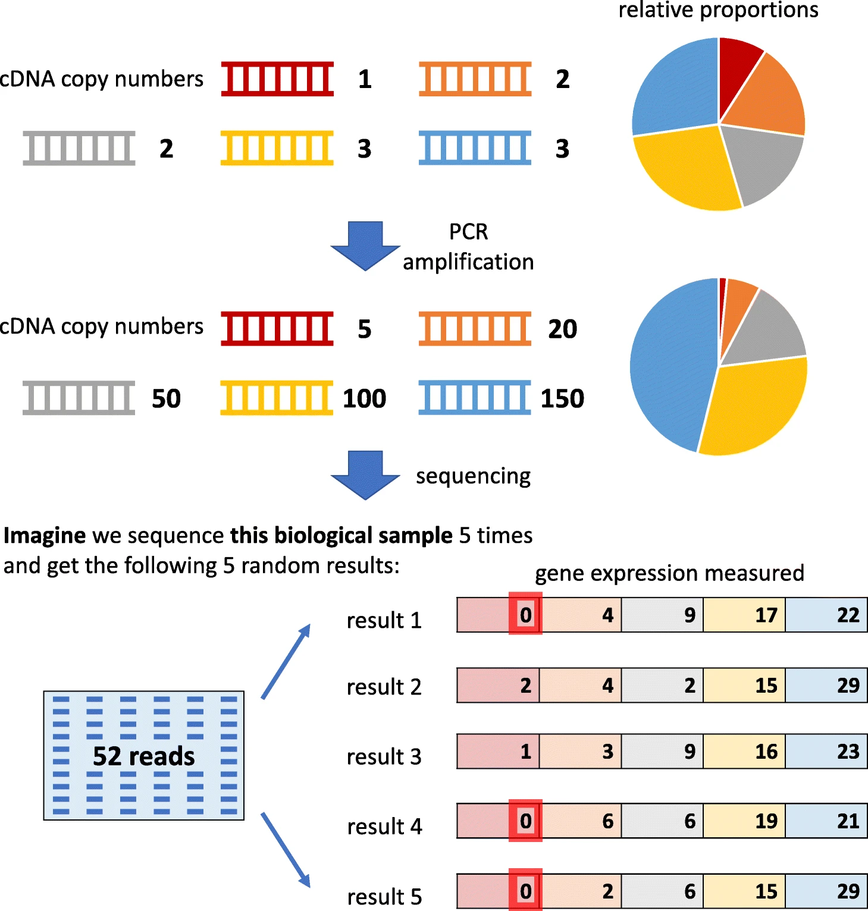
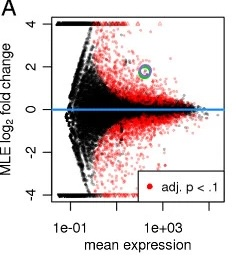

# Module 2 : Data types and core statistical properties

!!! info "Learning objectives"
    By the end of this module, participants will be able to:
    - Explain what a sequencing count represents and why raw counts
      cannot be compared directly across samples without accounting for
      sequencing depth.
    - Distinguish between a biological zero (a feature genuinely absent)
      and a technical zero (a feature below detection), and explain why
      treating both identically leads to incorrect biological conclusions.
    - Explain compositionality and relative abundance in intuitive terms
      and describe why naive fold change and correlation analyses can be
      misleading in compositional data.
    - Recognise that omics count data violates the core assumptions of
      classical statistical tests, and understand why this necessitates
      platform-specific approaches such as DESeq2 and edgeR.

---

## Section 1: What a count actually is ?

Before asking what the data means biologically, we need to ask something
more fundamental: **what does the number in your count matrix actually
represent?**

In everyday measurement, a larger number means more of something. A
patient weighing 80 kg weighs more than one weighing 60 kg. The number
is absolute, it does not depend on who else was weighed that day, or
how long the scale ran.

Sequencing counts do not work this way.

### Counts are shares of a fixed budget, not absolute measurements

When you sequence an RNA-seq library, the sequencer does not count every
RNA molecule in the sample. It reads a fixed number of fragments 20
million, 40 million, 80 million determined by the depth of the run.
Every count a gene receives is a share of that total.

This has an immediate, unavoidable consequence: **a gene's count depends
not only on how much RNA it produced, but on how many reads were
generated in total.**

Consider a minimal example:

| | Sample A | Sample B |
|---|---|---|
| **Total reads sequenced** | 20 million | 40 million |
| **Gene X raw count** | 100 | 200 |
| **Naïve interpretation** | — | Gene X doubled |
| **Reality** | 0.0005% of library | 0.0005% of library |

Sample B has twice as many reads as Sample A. Gene X received 200 counts
in Sample B and 100 in Sample A not because it was more active, but
because there were twice as many reads to share. The underlying proportion
is identical: both samples show Gene X at 0.0005% of the library. Without
accounting for depth, a real difference that does not exist appears in
the data.

!!! warning "The naïve interpretation fails in both directions"
    - Comparing raw counts **inflates apparent differences** when one
      sample is deeper than another.
    - Normalising by an inappropriate reference can **introduce
      artificial differences** that are not biological.

    Both errors produce false results. Raw counts from different samples
    are not directly comparable until sequencing depth has been
    accounted for.

### Not all genes benefit equally from greater depth

Depth does not affect all genes the same way.  
Highly expressed genes: those that represent a large fraction of the library, accumulate enough
counts even at low depth to be measured reliably. Lowly expressed genes,
by contrast, are at the mercy of the sequencing budget: at shallow depth,
they may receive zero reads in some samples and a handful in others, not
because their expression changed, but because the sampling was too sparse
to detect them consistently.

{width=100%}

The figure above illustrates this directly. At 10 reads, Gene A present
at 1% true abundance, receives zero reads and is invisible to the
analysis. Gene B at 5% receives just one read detectable by chance, but statistically unreliable. A single read cannot be distinguished from noise: in a replicate experiment, Gene B might receive zero reads entirely, producing a technical zero despite genuine expression. At this depth, a single-read detection is one step away from a false negative and one comparison away from a false positive. At 1,000 reads, the same proportions produce reliable counts
for all three genes: Gene A is now well above the noise floor. **The
biology did not change between the two panels. The budget did.**

This has a direct implication for study design: the sequencing depth
required for an experiment is not arbitrary. It is determined by the
abundance of the least expressed feature you need to detect reliably.
Underpowered depth does not just add noise, it actively converts
lowly expressed genes into zeros, creating a specific class of missing
data that we will examine in detail in Section 2.

### Where the problem starts: before sequencing even begins

There is a further complication that makes depth alone an incomplete
explanation for why zeros appear. **The proportions of cDNA molecules
entering the sequencer are not the same as the proportions of RNA
molecules in the original sample.** PCR amplification — a required step
in library preparation — is non-linear: different cDNA molecules amplify
with different efficiency across cycles. Molecules that happen to amplify
well in early cycles dominate the final library; those that amplify
poorly are underrepresented.

{width=90%}. 
<small>. 
Ref: [Jiang et al. *Genome Biology* 2022](https://link.springer.com/article/10.1186/s13059-022-02601-5){target="_blank"}</small>

The figure above (Jiang et al. 2022, Fig 3) shows this concretely. Five
genes start at equal cDNA concentrations. After PCR amplification, their
relative proportions have shifted — not because of biology, but because
of stochastic amplification differences. When sequencing is then limited
to a fixed depth, Gene 1 receives zero reads in three out of five
hypothetical experiments. It was present. It was amplified. It was simply
unlucky enough to be underrepresented at the moment the reads were
sampled.

This is the origin of **sampling zeros** — one of the two major classes
of technical zeros covered in Section 2. The key point here is that the
path from biology to count data involves two compounding sources of
noise: non-linear amplification and stochastic sampling. Both operate
before any analysis begins.

!!! info "The PCR lottery analogy"
    Think of PCR amplification as a lottery where early winners keep
    winning: a molecule that gets copied in round 1 produces two copies
    that each get copied in round 2, producing four — and so on
    exponentially. A molecule that misses round 1 never catches up.
    By the time the library is sequenced, the winners dominate and the
    losers are invisible — even if they started in equal numbers.

### Depth variation is systematic, not random — and it correlates with biology more than you think

In practice, samples within the same experiment routinely vary in
library size by **2-fold or more**, even with identical input material
and careful handling. Sources include:  
  
- variation in RNA quality and extraction yield.  
- differences in library preparation efficiency between batches.  
- multiplexing imbalances across sequencing lanes.  
- stochastic variation inherent to sequencing itself.     

This variation is technical, not biological. But critically, it ***does not
always distribute randomly across the groups in a study***.   
    - when one tissue type yields consistently lower RNA quality,
    - when a sequencing run fails partially for one batch  

At that point, depth variation is no longer just noise: it
becomes a systematic confounder that mimics or masks biological signal.

??? example "Case study: when depth confounds differential expression"

    A researcher compares gene expression between five cases and five
    controls. Due to library preparation differences across two
    processing batches, the five controls generated around 40M reads each,
    while the five cases generated around 20M reads each.

    No normalisation is applied before differential expression testing.

    **What the analysis finds:** hundreds of genes significantly
    downregulated in cases compared to controls.

    **What actually happened:** genes in case libraries received fewer
    counts because they were sequenced to half the depth — not because
    they were less expressed. The apparent differential expression is
    entirely a depth artefact.

    **The QC check that catches this:** a simple boxplot of library sizes
    grouped by biological condition. If the distributions don't overlap,
    depth is confounded with biology and must be investigated before
    any downstream analysis proceeds.

    **Why normalisation alone is not sufficient here:** standard
    normalisation methods correct for depth differences between samples.
    But when depth is systematically correlated with the biological
    variable — cases consistently shallower than controls — the
    technical signal cannot be cleanly separated from the biological
    signal. This is a design problem, not an analysis problem. It is
    discussed in detail in **Module 4: Bias Identification and Data
    Quality Assessment**.

### The same logic applies across omics platforms — the terminology differs, not the principle

The fixed-budget constraint is not unique to RNA-seq. It appears in
different forms across all major omics platforms:

| Platform | Equivalent of "sequencing depth" | Typical sample-to-sample variation |
|---|---|---|
| **Bulk RNA-seq** | Total read count per sample | 2–5× common within an experiment |
| **Single-cell RNA-seq** | UMI count per cell | 10–100× variation across cells |
| **16S / metagenomics** | Total reads per sample | High; low-biomass samples especially affected |
| **Proteomics (MS)** | Total ion signal / injection volume | Run-to-run intensity drift; DDA vs DIA acquisition differ |
| **Metabolomics (MS)** | Total ion signal / sample concentration | Ionisation variability, sample dilution differences |

In mass spectrometry-based platforms, the equivalent concept is
**total ion signal** rather than read count. A sample with lower overall
signal will appear to have lower abundance across all detected features —
not because concentrations changed, but because less material entered
the instrument or ionisation efficiency varied. The normalisation
challenge is structurally identical to the sequencing depth problem,
even if the methods used to address it differ by platform.

!!! info "One principle across all platforms"
    Whether the currency is reads, UMIs, or ion counts — the number you
    observe depends on how much of the total signal was captured from
    that sample. Comparing raw numbers across samples is comparing
    different fractions of different totals. The fraction, not the
    number, is what carries biological information.

### What this means before you touch the analysis

Raw counts must be normalised before any cross-sample comparison is
valid. The appropriate normalisation strategy depends on the platform,
the experimental design, and the biological question being asked.
Choosing the wrong approach introduces new artefacts. This is covered
in full in **Module 5: Normalisation and Scaling**.

For now, the single most important principle to carry through every
subsequent section of this workshop is:

> **A count is not a measurement. It is a proportion of a budget.**
> **The budget changes between samples, between cells, and between runs.**
> **Every analysis that treats raw counts as absolute quantities will
> produce unreliable results.**

!!! info "Coming up in Section 2"
    Once we understand that counts are budget-constrained proportions,
    a second problem emerges: many of those counts are zero. And not
    all zeros mean the same thing. The PCR lottery and depth limit we
    saw here produce a specific kind of zero — one that reflects a
    measurement failure, not a biological reality. **Section 2** builds
    on this to draw the critical distinction between biological zeros
    and technical zeros, and explains why conflating them is one of the
    most consequential mistakes in omics analysis.

## Section 2 — Sparsity and Zero-Inflation: Not All Zeros Mean the Same Thing

The previous section established that counts are proportions of a fixed
sequencing budget. Section 2 confronts what happens as a direct consequence
of that constraint: **most entries in an omics count matrix are zero**.

This is not a sign of poor experimental quality. It is the expected
mathematical outcome of measuring a large number of features with a finite
budget. But the zeros themselves are not all the same — and treating them as
if they were is one of the most consequential mistakes in omics analysis.

### Sparsity is the rule, not the exception

Before distinguishing zero types, it is worth establishing just how sparse
omics data actually is across platforms — because the scale surprises most
researchers encountering it for the first time.

| Platform | Typical zero rate | Primary driver of zeros |
|---|---|---|
| **Bulk RNA-seq** | 10–40% | Genuinely unexpressed genes |
| **10x Chromium scRNA-seq** | >90% | Shallow per-cell depth + capture inefficiency |
| **SMART-seq2 scRNA-seq** | 60–80% | Lower throughput but deeper per-cell coverage |
| **Drop-seq** | >90% | Similar to 10x Chromium |
| **16S amplicon / metagenomics** | 50–90% | Biological absence + undersampling of rare taxa |
| **Proteomics (label-free DDA)** | 10–50% missing values | Below instrument detection limit |
| **Metabolomics (untargeted)** | 20–50% missing values | Below limit of detection; ionisation variability |

The most striking number in that table is the >90% zero rate for droplet-based
single-cell RNA-seq. In a typical 10x Chromium experiment, fewer than 1 in 10
gene-cell combinations produces a non-zero count. For most researchers trained
on bulk RNA-seq, this feels like catastrophic data loss. It is not — it is the
expected output of a technology that captures only 10–15% of transcripts per
cell by design.

!!! info "Sparsity is a measurement property, not a quality failure"
    High zero rates are **intrinsic to the technology**, not a sign that
    something went wrong. The question is not how to eliminate zeros — it is
    how to correctly interpret what they mean in each platform and context.

---

### Two fundamentally different kinds of zero

The central distinction of this section is between two types of zero that look
identical in the count matrix but arise from completely different biological
and technical processes.
 

{width=90%}

<small>Adapted from: [Jiang et al. *Genome Biology* 2022](https://link.springer.com/article/10.1186/s13059-022-02601-5){target="_blank"} (CC BY 4.0)</small>

The figure above maps each step of the scRNA-seq workflow — transcription,
mRNA degradation, cDNA synthesis, PCR amplification, sequencing — to the
type of zero it produces. Three distinct categories emerge:

**Biological zeros** arise from the biology itself. A gene may not be
transcribed in a particular cell type (gene 1 in the figure), or its mRNA
may be degraded faster than it is produced (gene 2). These zeros reflect
genuine biological absence — the gene truly is not expressed in that cell at
that moment. They carry biological information and should be preserved.

**Technical zeros** arise when a gene's mRNA is present in the cell but
fails to be captured during cDNA synthesis (gene 3). Capture efficiency in
UMI-based protocols is typically around 10–15% — meaning most transcripts
are simply not converted to cDNA and are lost before sequencing begins.
These zeros reflect a measurement failure, not biology.

**Sampling zeros** arise when a gene's cDNA is present in the library but
is not sampled by the sequencer — either because amplification was
stochastic and left too few copies (gene 4, covered in Section 1), or
because the gene's mRNA copy number was so low that even amplification
could not produce sufficient copies to guarantee detection (gene 5).

!!! warning "The matrix cannot tell you which type of zero you are looking at"
    In your count matrix, all three zero types look identical: the cell
    contains a zero. The only way to reason about which type a zero is
    likely to be requires knowing the platform, the gene's expression level
    in other cells, the sequencing depth, and the biology of the system.
    This is why zero-handling decisions cannot be automated away — they
    require biological judgement.

---

### A worked example: reading zeros in practice

Consider a single gene measured across four cells in a 10x Chromium
experiment:

| Cell 1 | Cell 2 | Cell 3 | Cell 4 |
|---|---|---|---|
| 0 | 0 | 3 | 0 |

**The naïve interpretation:** this gene is off in most cells.

**The reality:** with a capture rate of 10–15% and typical 10x library
depths, a gene expressed at low levels in all four cells might easily
produce this pattern. Cell 3 happened to have enough transcripts — or
enough amplification luck — to register 3 counts. Cells 1, 2, and 4
produced zeros, but not necessarily because the gene was absent.

This ambiguity is not resolvable from the count alone. Additional
evidence — expression of the same gene in bulk data from the same
tissue, co-expression with known pathway partners, or comparison
across cell types — is needed to reason about whether a zero is
biological or technical.

??? example "Case study: the same zero, two different meanings"

    **Scenario A — biological zero**

    A T-cell specific transcription factor shows zero counts in all B
    cells in a PBMC dataset. This zero is almost certainly biological:
    the gene is genuinely not expressed in B cells. Imputing a value
    here would fabricate expression for a gene that is not active in
    that lineage.

    **Scenario B — technical zero**

    The same transcription factor shows zero counts in 70% of T cells,
    with counts of 1–5 in the remaining 30%. The gene is expected to be
    expressed across all T cells based on prior literature.

    This pattern is consistent with sampling zeros caused by low
    expression + limited depth. The zeros are not biological absence;
    they reflect the stochastic nature of transcript capture at low
    abundance.

    **The consequence of confusion:**
    Treating Scenario B zeros as biological absence would lead to the
    incorrect conclusion that the transcription factor is only active
    in a minority of T cells — potentially mischaracterising the
    biology of the entire population.

---

### Platform determines what a zero most likely means

The platform choice is the single most important factor in interpreting
zeros — and the interpretation shifts substantially across technologies.

**Bulk RNA-seq** averages expression across millions of cells, so most
zeros represent genes that are genuinely not expressed in the tissue.
The sparsity is modest (10–40%) and predominantly biological. Standard
count models handle this well.

**10x Chromium and Drop-seq** give you thousands of cells, but at a cost: each cell is sequenced very shallowly. Think of it like a blood test that only checks a small sample of your blood — if a rare cell type happens not to end up in that sample, the test reports zero. That does not mean the cell type does not exist. It just was not captured this time. The same logic applies to genes: a gene expressed at low levels in a cell may simply not make it into the sequencer's snapshot for that cell. The zero does not mean the gene is off — it means the coverage was not deep enough to catch it. Svensson (2020) confirmed this directly by sequencing a controlled RNA mixture at known concentrations — no cells, no biological variation. The zeros observed matched what a standard count model predicts given depth and transcript abundance. No extra layer of technical failure was needed to explain them.

**SMART-seq2** uses full-length sequencing without UMIs, giving it
higher sensitivity per cell but lower throughput. It detects roughly
twice as many genes per cell as 10x on matched samples. Because it
lacks UMIs, amplification noise is not collapsed — and statistical
models show that SMART-seq2 data *does* exhibit genuine zero inflation
in approximately 50% of genes, unlike UMI-based data. This is a
platform-specific property, not a universal feature of single-cell data.

**16S amplicon and metagenomics** present the most complex zero
landscape. Many zeros here are genuinely biological — a taxon simply
does not inhabit that environment. But rare taxa are also systematically
underdetected at typical sequencing depths. Distinguishing ecological
absence from undersampling often requires rarefaction analysis or
model-based approaches.

**Proteomics and metabolomics** use different terminology but face the
same conceptual problem. Missing values in label-free proteomics are
predominantly **Missing Not At Random (MNAR)** — proteins are present
but fall below the instrument's detection limit. This is the mass
spectrometry equivalent of a technical zero. A minority of missing
values are **Missing At Random (MAR)** — random analytical failures
unrelated to abundance. The imputation strategy must match the
mechanism: MNAR values require left-censored or abundance-based
approaches, while MAR values can use mean or k-nearest-neighbour
imputation.

!!! info "The platform determines the interpretation, not the zero itself"
    A zero in a 10x Chromium matrix, a bulk RNA-seq matrix, a 16S OTU
    table, and a proteomics intensity matrix all look the same numerically.
    They do not mean the same thing biologically, and they do not warrant
    the same analytical response.

---

### What goes wrong when zeros are conflated

Treating biological and technical zeros identically produces errors that
cascade through every downstream analysis. Three failure modes are worth
naming explicitly before we move on.

**Differential expression testing picks up quality differences as biology.**
If one condition has more technical zeros due to lower library quality or
shallower depth, a naive DE test detects this as signal. Genes appear
differentially expressed not because biology changed, but because one
group was measured less completely.

**Correlation and network analysis gains spurious edges.**
When two unrelated genes both have high zero rates, their shared tendency
to be zero creates an apparent positive correlation — not from biology,
but from shared detection failure. Network methods will infer edges between
genes that are only co-occurring in their mutual missingness.

**Blind imputation creates biology that was never there.**
Imputation methods fill zeros by borrowing from similar cells or features.
But if the gene was genuinely off in that cell, there is nothing missing to recover — the zero was the correct answer. A rigorous benchmark of 18
imputation methods found that most did not improve downstream analysis
compared to using raw data, and several made results worse (Hou et al.
2020). Imputation methods and the decisions around when to use them are
covered in a dedicated future session — the key message here is that
imputing without first reasoning about zero type is an analytical risk,
not a safe default.

!!! warning "The decision cannot be deferred"
    Whether and how to handle zeros must be decided before modelling
    begins, informed by the platform and the biology. The zero type
    is not visible in the matrix — it requires external reasoning.
    Zeros are not a problem to solve; they are information to interpret.

!!! info "Coming up in Section 3"
    The zeros we have been discussing exist within a count matrix that
    has another structural property we have only touched on: the counts
    are compositional. Every gene's count is a proportion of a fixed
    total — which means that when one gene increases, others must
    mathematically decrease, regardless of what the biology actually did.
    **Section 3** explains compositionality, why it makes naive
    fold-change and correlation analyses unreliable, and how to
    recognise when it is affecting your conclusions.

??? abstract "Further Reading · Zero-Inflation and Sparsity in Omics"

    **Conceptual framework — applies across all platforms**

    Jiang R, Sun T, Song D, Li JJ. Statistics or biology: the
    zero-inflation controversy about scRNA-seq data. *Genome Biology*
    2022; 23: 31.
    [doi:10.1186/s13059-022-02601-5](https://doi.org/10.1186/s13059-022-02601-5){target="_blank"}

    Silverman JD, Roche K, Mukherjee S, David LA. Naught all zeros
    in sequence count data are the same. *Computational and Structural
    Biotechnology Journal* 2020; 18: 2789–2798.
    [doi:10.1016/j.csbj.2020.09.014](https://doi.org/10.1016/j.csbj.2020.09.014){target="_blank"}
    *(Covers both transcriptomics and microbiome zeros in a single framework)*

    ---

    **Single-cell RNA-seq**

    Svensson V. Droplet scRNA-seq is not zero-inflated. *Nature
    Biotechnology* 2020; 38(2): 147–150.
    [doi:10.1038/s41587-019-0379-5](https://doi.org/10.1038/s41587-019-0379-5){target="_blank"}

    Wang X, He Y, Zhang Q, Ren X, Zhang Z. Direct comparative analyses
    of 10X Genomics Chromium and Smart-seq2. *Genomics Proteomics
    Bioinformatics* 2021; 19(2): 253–266.
    [doi:10.1016/j.gpb.2020.02.005](https://doi.org/10.1016/j.gpb.2020.02.005){target="_blank"}

    Ding J et al. Systematic comparison of single-cell and
    single-nucleus RNA-sequencing methods. *Nature Biotechnology*
    2020; 38: 737–746.
    [doi:10.1038/s41587-020-0465-8](https://doi.org/10.1038/s41587-020-0465-8){target="_blank"}

    Hou W et al. A systematic evaluation of single-cell RNA-sequencing
    imputation methods. *Genome Biology* 2020; 21: 218.
    [doi:10.1186/s13059-020-02132-x](https://doi.org/10.1186/s13059-020-02132-x){target="_blank"}

    ---

    **16S amplicon and metagenomics**

    Kaul A, Mandal S, Davidov O, Peddada SD. Analysis of microbiome
    data in the presence of excess zeros. *Frontiers in Microbiology*
    2017; 8: 2114.
    [doi:10.3389/fmicb.2017.02114](https://doi.org/10.3389/fmicb.2017.02114){target="_blank"}

    ---

    **Proteomics**

    Lazar C, Gatto L, Ferro M, Bruley C, Burger T. Accounting for the
    multiple natures of missing values in label-free quantitative
    proteomics data sets to compare imputation strategies.
    *Journal of Proteome Research* 2016; 15(4): 1116–1125.
    [doi:10.1021/acs.jproteome.5b00981](https://doi.org/10.1021/acs.jproteome.5b00981){target="_blank"}
    *(Foundational paper on MNAR/MAR classification — the conceptual basis
    for why not all missing values in proteomics should be treated the same)*

    Kong W, Hui HWH, Peng H, Goh WWB. Dealing with missing values in
    proteomics data. *Proteomics* 2022; 22(23–24): e2200092.
    [doi:10.1002/pmic.202200092](https://doi.org/10.1002/pmic.202200092){target="_blank"}
    *(Practical decision chart for method selection — recommended reading
    before the imputation)*

    ---

    **Metabolomics**

    Do KT, Wahl S, Raffler J et al. Characterization of missing values
    in untargeted MS-based metabolomics data and evaluation of missing
    data handling strategies. *Metabolomics* 2018; 14: 128.
    [doi:10.1007/s11306-018-1420-2](https://doi.org/10.1007/s11306-018-1420-2){target="_blank"}

## Section 3 — Compositionality: You Are Always Looking at a Pie Chart

Section 1 established that counts are proportions of a fixed sequencing
budget. Section 2 showed that zeros in that matrix do not all mean the
same thing. Section 3 follows directly from Section 1 and confronts its
most important consequence: **because the total is fixed, every feature's
count is relative to every other feature's count — and this changes what
comparisons actually mean.**

### The fixed-sum constraint

When you sequence a sample, you generate a fixed number of reads. Every
read that goes to Gene A is a read that cannot go to Gene B. This means
the counts are not independent of each other — they are shares of the
same total. If one gene increases its share, the mathematical share of
every other gene must decrease, even if their underlying biology did not
change at all.

This property is called **compositionality**. It is not a data quality
problem and it cannot be normalised away. It is a fundamental property
of how sequencing counts are generated.

The simplest way to remember it:

> **You are always looking at a pie chart, not a bar chart.**
> A bar chart shows you absolute quantities. A pie chart shows you
> proportions. Sequencing gives you a pie chart — and a larger slice
> for one gene automatically means smaller slices for all the others,
> regardless of what the biology actually did.

### A worked example: when proportions mislead

??? example "Case study: The antibiotic experiment that wasn't what it looked like"

    A researcher is studying the gut microbiome of mice before and after
    a heavy dose of antibiotics. They sequence stool samples from both
    time points.

    {width=98%}
    ## Species Composition Summary

    | Species    | Before | After  | Reality                                                   |
    |------------|--------|--------|------------------------------------------------------------|
    | Species A  | 20%    | 80% ↑  | Unchanged — same absolute numbers                          |
    | Species B  | 30%    | 0%     | Below detection — not necessarily absent                   |
    | Species C  | 50%    | 20% ↓  | Reduced, but proportions distorted by biomass loss         |

    The researcher runs a standard statistical test on these percentages.
    Species A shows a dramatic and highly significant increase.

    **The published conclusion:** *"Antibiotic X acts as a growth-booster
    for Species A."*

    ---

    **What actually happened:**

    The antibiotics killed 99% of all bacteria in the gut. Species A did
    not grow — its absolute numbers stayed the same. But because everything
    else was wiped out, Species A now represents 80% of what remains. The
    pie shrank dramatically; Species A's slice simply got bigger by
    default.

    **Failure 1 — The compositional trap:**
    The researcher measured a proportionate increase and interpreted it as
    a biological expansion. The two are not the same thing. Species A was
    not a winner — it was the last one standing.

    **Failure 2 — The detection limit problem:**
    Species B and C both show near-zero or zero counts after antibiotics.
    The researcher records Species B as "eradicated." But after antibiotic
    treatment the total bacterial biomass is extremely low — so the
    sequencer may simply not have captured the few remaining Species B
    cells. They may not be gone. They may just be below the detection
    limit. This connects directly to the technical zero problem from
    Section 2.

    **Failure 3 — Depth confounding:**
    The before-treatment sample had 10 million reads; the after-treatment
    sample, because of degraded DNA quality in the low-biomass sample,
    produced only 100,000 reads. A meaningful comparison of relative
    abundances across samples with 100-fold different depths requires
    normalisation — and even after normalisation, the information content
    of the shallow sample is fundamentally limited.

    **The teaching point:**
    All three failures are invisible if you only look at the percentage
    table. The numbers look clean. The statistics look significant. The
    biology is wrong.

---

### Two specific ways compositionality corrupts analysis

**Naive fold-change is unreliable.**
A fold-change calculated from compositional data does not tell you
whether a feature genuinely increased — it tells you whether its
proportion of the total increased. These are different things. A
feature can appear to double in relative abundance simply because
half the other features decreased, with no biological change in the
feature itself. Conversely, a feature that genuinely doubled in
absolute abundance may appear flat or even decreased if other features
also expanded.

**Naive correlation is structurally biased.**
If the total is fixed, features are mathematically constrained to
be negatively correlated with each other. Two species that have no
biological relationship whatsoever will appear negatively correlated
in a compositional dataset simply because a larger share for one
means a smaller share for the other. This is not biology — it is
arithmetic. Building ecological or regulatory networks from naive
Pearson correlations on compositional data produces spurious negative
relationships that are artefacts of the measurement constraint.

### Which platforms are affected
Compositionality is most severe in **16S amplicon sequencing** — a technique that targets and sequences a single bacterial marker gene (the 16S rRNA gene) to profile which microbial species are present in a sample — and shotgun metagenomics, which sequences all DNA in a sample to reconstruct both community membership and functional potential. In both cases, the reads produced represent a fixed sample of whatever was in the original mixture, not absolute cell counts. This has long been recognised as a fundamental analytical challenge, and an extensive dedicated methods literature has grown around it.

But compositionality is not a microbiome-only problem.

**Bulk RNA-seq** has the same structural property: the sequencer generates a fixed number of reads per sample, and every gene's count is a proportion of that total. A highly expressed gene absorbing more reads mathematically reduces the share available to every other gene, regardless of whether their underlying expression changed.

**Label-free proteomics** — where samples are run through the mass spectrometer without chemical tags and protein levels are compared by measuring ion signal intensity across separate runs — behaves compositionally for the same reason. The ions the instrument detects are a sub-sample of what was present in the mixture, not an absolute measure of protein concentration. Because each sample is run independently, proteins near the detection threshold may be quantified in one run and absent in another — a missing-value problem that is structurally parallel to the technical zeros described in Section 2.

The difference between platforms is one of degree, not of kind: compositionality is most visible and most damaging in microbiome data, but the underlying constraint operates wherever a fixed analytical budget is shared across features.

!!! warning "Compositionality is not solved by normalisation alone"
    Standard normalisation methods such as TPM, CPM, or median
    normalisation correct for differences in total library size between
    samples. They do not remove the compositional constraint within
    a sample. After normalisation, the numbers are still proportions —
    and the mathematical relationship between features is still governed
    by the fixed-sum constraint. Analyses that assume independent,
    absolute measurements remain unreliable on normalised compositional
    data.

!!! info "Coming up in Section 4"
    Sections 1 through 3 have established three properties of omics
    count data that make it structurally different from the data
    classical statistics were designed for: counts are depth-dependent
    proportions, zeros are heterogeneous in origin, and features are
    compositionally constrained. **Section 4** brings these together
    to explain why applying a t-test or ANOVA directly to omics count
    data produces unreliable results — and what was developed to
    replace them.

??? abstract "Further Reading · Compositionality in Omics Data"

    **Foundational framework**

    Gloor GB, Macklaim JM, Pawlowsky-Glahn V, Egozcue JJ.
    Microbiome datasets are compositional: and this is not optional.
    *Frontiers in Microbiology* 2017; 8: 2224.
    [doi:10.3389/fmicb.2017.02224](https://doi.org/10.3389/fmicb.2017.02224){target="_blank"}
    *(The accessible entry point — argues compositionality applies
    broadly, not only to microbiome data)*

    Quinn TP, Erb I, Richardson MF, Crowley TM. Understanding
    sequencing data as compositions: an outlook and review.
    *Bioinformatics* 2018; 34(16): 2870–2878.
    [doi:10.1093/bioinformatics/bty175](https://academic.oup.com/bioinformatics/article/34/16/2870/4956011){target="_blank"}
    *(Extends the compositional argument explicitly to RNA-seq
    and other sequencing-based platforms)*

    ---

    **The microbiome case — most extensively studied**

    Weiss S et al. Normalization and microbial differential abundance
    strategies depend upon data characteristics.
    *Microbiome* 2017; 5: 27.
    [doi:10.1186/s40168-017-0237-y](https://doi.org/10.1186/s40168-017-0237-y){target="_blank"}
    *(Practical benchmark showing how compositional structure
    affects normalization method choice)*

 ## Section 4 — Why Classical Statistics Fail on Count Data

Sections 1 through 3 established three structural properties of omics
count data: counts are depth-dependent proportions, zeros are
heterogeneous in origin, and features are compositionally constrained.
This section asks the practical question: given a count matrix and two
conditions to compare, when does a standard statistical test fail —
and what do DESeq2, edgeR, and limma do that a t-test cannot?

The answer is not "t-tests always fail on omics data." It is more
nuanced than that — and understanding the nuance is what separates
informed tool choice from cargo-cult bioinformatics.

### The question is not raw counts vs the right tool

It is a progression of increasingly adequate approaches, each solving
the problems that the previous level leaves behind.

---

**Level 1 — t-test on raw counts**

A t-test on raw counts fails immediately and comprehensively:

- Raw counts from different samples are not comparable — library
  sizes differ and compositional effects distort relative abundances
  (Sections 1 and 3)
- Counts are discrete non-negative integers — the normal approximation
  underlying t-test theory does not hold at low counts of 0, 1, 2
- For any individual gene, the within-group variance estimated from
  n = 3 observations has only 2 degrees of freedom — the estimate
  could easily be half or double the true value, making the t-test
  statistic unreliable regardless of expression level

This approach is simply wrong and produces unreliable p-values and
inflated false positive rates regardless of expression level.

---

**Level 2 — t-test on log-normalised counts (log-CPM)**

After normalisation followed by log transformation — the mechanics of
which are covered in **Module 5** — the data becomes **continuous and
approximately comparable** across samples. Normalisation corrects for
depth and composition differences between samples. Log transformation
compresses the dynamic range and makes the distribution more symmetric.

For **moderately and highly expressed genes**, this approach is
actually not unreasonable. If your experiment has many replicates,
the per-gene variance estimate becomes more reliable, and the
normality assumption is more defensible. Many early RNA-seq papers
used exactly this approach.

**But two problems survive the log-normalisation step:**

**Problem 1 — The normal approximation breaks down at low expression.**
A t-test is run on one gene at a time. For a lowly expressed gene —
counts of 0, 1, 2 across replicates — log transformation does not
rescue normality. The data is still essentially discrete at these
values. Furthermore, lowly expressed genes have higher relative
biological variability between replicates, so the within-group
variance estimate for that specific gene is both noisier and less
stable than for a highly expressed gene. The t-test has no way to
know this — it treats a variance estimate from counts of 0, 1, 2
with the same confidence as one from counts of 500, 600, 550.

This is why the MA plot for log-CPM data shows a characteristic fan
shape: at low average expression, fold change estimates scatter
wildly in both directions — not because of biology, but because
the underlying variance estimates are unreliable. The figure below
illustrates this directly.

{style="width:90%; height:auto; min-height:500px"}

*Data pattern typical of RNA-seq count data, as seen in studies such as
Derakhshani et al. (2020, PLoS One 15:e0230820). The fan-shaped spread
at low average expression — where variance vastly exceeds the mean —
is the core reason a plain t-test produces unreliable results on count
data. DESeq2 and edgeR were built specifically to model this
mean-variance relationship.* 

**Problem 2 — Per-gene variance estimates from small n are still
unreliable.**
Whether the data is raw counts or log-CPM, a sample variance from
three observations still has 2 degrees of freedom. The estimate
remains noisy. A plain t-test uses this unreliable per-gene estimate
directly in the test statistic — with no mechanism to stabilise it.

---

**Level 3 — limma-voom: a t-test framework done correctly**

**limma-voom** is the principled version of the log-normalised t-test
approach. It addresses both surviving problems directly:

**Solving Problem 1 — precision weights informed by the mean-variance trend:**
Across the transcriptome, variance in log-CPM values follows a
systematic relationship with mean expression — lowly expressed genes
are consistently more variable than highly expressed genes. This
relationship is not a violation for any single gene's t-test; it is
a biological property of count data. But it is **exploitable**.

The `voom` function in limma estimates this mean-variance trend from
all genes simultaneously, then assigns each observation a precision
weight inversely proportional to its predicted variance. A
log-CPM value from a lowly expressed gene (high predicted variance)
receives a low weight — it contributes less to the test statistic.
A log-CPM value from a highly expressed gene (low predicted variance)
receives a high weight. The subsequent linear model is a **weighted**
least squares fit, not a plain t-test. The fan-shaped scatter in the
MA plot collapses because unstable estimates from low-count genes
are down-weighted rather than treated as equally reliable.

**Solving Problem 2 — empirical Bayes moderation across genes:**
Rather than testing each gene using only its own variance estimate,
limma estimates a common prior distribution for variances across all
genes and uses it to shrink each gene's individual estimate toward the
prior. A gene whose raw variance estimate is based on only 2 degrees
of freedom is pulled toward the pooled estimate — in effect, borrowing
information from hundreds or thousands of other genes. This is the
same core principle as DESeq2 and edgeR: **the test for gene X borrows
information from all other genes**.

The result is a moderated t-statistic that behaves as if it has more
degrees of freedom than the n = 3 replicates alone would provide.
limma-voom performs comparably to DESeq2 and edgeR in benchmarks and
is particularly well suited to large datasets and complex experimental
designs (Ritchie et al. 2015).

---

**Level 4 — DESeq2 and edgeR: modelling counts directly**

DESeq2 and edgeR skip the log-normalisation step and model the raw
counts directly using the **negative binomial distribution** — a count
distribution with two parameters: mean and dispersion. Dispersion
captures the extra-Poisson variability between biological replicates
that is always present in RNA-seq data.

This approach is most important for **lowly expressed genes**, where
log-CPM values are poorly behaved — log of a small integer is
numerically unstable, and the assumptions that make limma-voom work
are weakest at low counts.

Like limma, both tools use **empirical Bayes information sharing**
across genes — fitting a mean-dispersion trend across the whole
transcriptome and shrinking each gene's individual dispersion estimate
toward that trend. The test for gene X is informed by variance
information from every other gene at similar expression levels.

Both tools also incorporate normalisation internally — using methods
covered in **Module 5** — and fit a **generalised linear model** (GLM)
per gene, allowing complex multi-factor experimental designs that a
t-test cannot accommodate.

---

### Putting it together

| Approach | What it fixes | What remains wrong |
|---|---|---|
| t-test on raw counts | Nothing | Not comparable; discrete; normal approx fails; unreliable variance |
| t-test on log-CPM | Comparability; approximate normality at high counts | Normal approx fails at low counts; unreliable per-gene variance from small n |
| limma-voom | All of the above — precision weights + EB moderation | Works less well at very low counts |
| DESeq2 / edgeR | All of the above — NB model for count data + EB moderation | Best for low-count genes; equivalent to limma-voom at higher counts |

The choice between limma-voom and DESeq2/edgeR is not about correctness
— all three are valid. It is about data characteristics and design
complexity. What is not valid is Level 1 or Level 2 without the
moderation step.

!!! info "The practical message"
    The key innovation shared by all three adequate approaches is not
    the distributional model — it is **borrowing information across
    genes to stabilise variance estimates at small n**. This is what
    makes reliable inference possible when you have three replicates
    per group and 20,000 genes to test simultaneously. A plain t-test
    discards this shared structure entirely.

!!! info "What Module 5 covers"
    The mechanics of normalisation — how TMM, RLE, CPM, and variance-
    stabilising transformations work and when each is appropriate — are
    covered in **Module 5**. The full DESeq2 and edgeR analysis pipeline,
    including dispersion estimation, GLM fitting, and interpretation of
    results, is covered in a dedicated downstream workshop.

### The same principle applies across platforms

The need to account for overdispersion and borrow information across
features extends beyond bulk RNA-seq:

- **Single-cell RNA-seq:** individual cells within a sample are not
  independent biological replicates — treating them as such inflates
  degrees of freedom severely. Pseudobulk approaches (aggregating to
  sample level, then applying edgeR, DESeq2, or limma) are currently
  the benchmark-recommended approach (Squair et al. 2021)
- **16S / metagenomics:** compositional structure additionally requires
  log-ratio based approaches — ANCOM and ALDEx2
- **Proteomics:** intensity data is heteroscedastic; limma with
  empirical Bayes moderation is preferred over naive t-tests, and
  directly applies the same information-sharing principle across
  proteins
- **Metabolomics:** similarly non-normal and heteroscedastic; log
  transformation before a t-test is Level 2 — better than raw, but
  still missing the moderation step

!!! warning "Log transformation is not sufficient on its own"
    Log-transforming count data before a t-test improves things but
    leaves two core problems unsolved: the normal approximation still
    fails for lowly expressed genes, and per-gene variance estimates
    from small n remain unreliable. limma-voom, DESeq2 and edgeR all
    include the moderation step that stabilises those estimates by
    borrowing information across genes — something a plain
    log + t-test cannot do.

??? abstract "Further Reading · Statistical Models for Omics Count Data"

    **The foundational tools**

    Love MI, Huber W, Anders S. Moderated estimation of fold change
    and dispersion for RNA-seq data with DESeq2. *Genome Biology*
    2014; 15: 550.
    [doi:10.1186/s13059-014-0550-8](https://doi.org/10.1186/s13059-014-0550-8){target="_blank"}
    *(DESeq2 — introduces shrinkage estimation for dispersions and fold
    changes; methods section explains why per-gene variance estimation
    fails at small n)*

    Robinson MD, McCarthy DJ, Smyth GK. edgeR: a Bioconductor package
    for differential expression analysis of digital gene expression data.
    *Bioinformatics* 2010; 26(1): 139–140.
    [doi:10.1093/bioinformatics/btp616](https://doi.org/10.1093/bioinformatics/btp616){target="_blank"}
    *(edgeR — empirical Bayes moderation of tagwise dispersions toward
    a common value across genes)*

    Ritchie ME, Phipson B, Wu D, Hu Y, Law CW, Shi W, Smyth GK.
    limma powers differential expression analyses for RNA-sequencing
    and microarray studies. *Nucleic Acids Research* 2015; 43(7): e47.
    [doi:10.1093/nar/gkv007](https://doi.org/10.1093/nar/gkv007){target="_blank"}
    *(limma-voom — precision weights for heteroscedasticity plus
    empirical Bayes moderation; bridges RNA-seq, microarray and
    proteomics in a single framework)*

    ---

    **Empirical validation**

    Schurch NJ et al. How many biological replicates are needed in an
    RNA-seq experiment and which differential expression tool should
    you use? *RNA* 2016; 22(6): 839–851.
    [doi:10.1261/rna.053959.115](https://doi.org/10.1261/rna.053959.115){target="_blank"}
    *(48-replicate benchmark — n = 3 detects only 20–40% of true DE
    genes; tools with information sharing across genes outperform
    those without)*

    Gierliński M et al. Statistical models for RNA-seq data derived
    from a two-condition 48-replicate experiment. *Bioinformatics*
    2015; 31(22): 3625–3630.
    [doi:10.1093/bioinformatics/btv425](https://doi.org/10.1093/bioinformatics/btv425){target="_blank"}
    *(Empirical confirmation that per-gene counts are consistent with
    both NB and log-normal distributions; establishes the mean-variance
    relationship in real RNA-seq data)*

    Squair JW et al. Confronting false discoveries in single-cell
    differential expression. *Nature Communications* 2021; 12: 5692.
    [doi:10.1038/s41467-021-25960-2](https://doi.org/10.1038/s41467-021-25960-2){target="_blank"}
    *(Pseudobulk benchmark for scRNA-seq — 46 datasets showing why
    treating cells as independent replicates produces false discoveries)*

---

### Module 2 — Summary

The four sections of this module have built a connected picture of why
omics data requires its own analytical framework:

- **Counts are proportions** of a fixed sequencing budget — raw counts
  cannot be compared across samples without accounting for depth
- **Zeros are not all the same** — biological absence, technical
  dropout, and sampling failure produce identical zeros but require
  different responses
- **Features are compositionally constrained** — proportions not
  absolute quantities are measured, making naive fold-change and
  correlation analyses unreliable
- **Classical t-tests fail on count data — but the reason is not simply
  that the data is non-normal.** The core problem is that per-gene
  variance cannot be reliably estimated from small n. limma-voom,
  DESeq2, and edgeR all solve this by borrowing information about
  variance structure across all genes simultaneously. That shared
  structure is what makes inference possible with three replicates.

!!! info "End of Day 1 theory — coming up: practical session"
    The Day 1 practical session gives you the opportunity to observe
    these properties directly in a real dataset — examining count
    distributions, library depth variation, zero rates, and the
    mean-variance relationship that motivates the tools covered in
    this section. The concepts from Modules 1, 2, and 3 will all
    appear in the data.

    Github Folder: For ***practical*** download and open .html file in Chrome/Edge Browser.