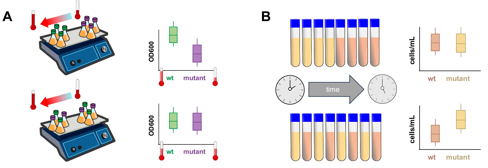
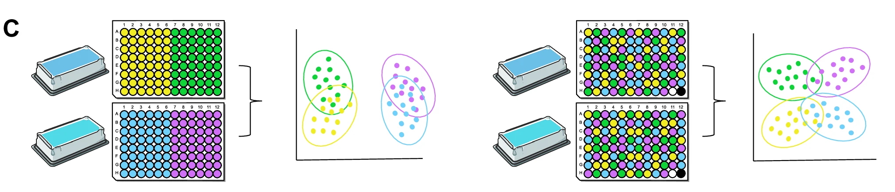

# Module 3 — Experimental Design Fundamentals for Omics

Module 3 focuses on decisions that have to be made before sequencing. Once data is generated, you can model around problems, but you rarely get back to what you intended to measure.

## Randomisation: getting the basics right early

!!! info "Learning objectives"
    By the end of this section, participants will be able to:

    - Identify what needs to be randomised beyond group assignment  
    - Recognise common sources of structured technical variation  
    - Understand how randomisation prevents confounding rather than “fixing” noise  

---

Randomisation in omics is not a single step. It’s something you apply repeatedly as samples move through the workflow.

The practical rule is simple enough:  
**don’t let your biological groups travel through the experiment in blocks.**

In real labs, that’s exactly what tends to happen; samples arrive labelled, get processed together, and stay grouped all the way to sequencing. It’s efficient. It’s also how confounding gets baked in.

What you want instead is mixing: each technical step should see a bit of everything.

---

### What actually needs to be randomised

There are a few points in the workflow where structure creeps in reliably:

- when samples are processed (order and timing)  
- where they sit on a plate  
- which library prep batch they go through  
- how they are distributed across sequencing lanes  

You don’t need perfect randomness. You need enough mixing that no single technical factor lines up cleanly with your biological comparison.

---

### Processing order

If you process all cases first and controls later, you’ve already introduced a pattern, whether you meant to or not.

Reagents don’t behave the same at 9am and 4pm. People don’t pipette the same way at the end of a long run. Small effects, but consistent enough to matter.

The fix is straightforward: interleave samples.  
In practice, that might mean alternating conditions, or shuffling within each day’s worklist. It doesn’t have to be elegant, just not structured.

---

### Plate layout

Plate effects are one of those things people believe in theory and ignore in practice.

Edge wells dry out faster. Corners behave slightly differently. Most of the time the effect is subtle; until it lines up with your condition, and then it isn’t.

The failure mode is predictable: someone loads columns 1–4 with cases and 5–8 with controls because it’s easy to track.

It is easy. It also guarantees that any spatial bias becomes a biological signal.

Randomising well positions, or at least spreading groups across the plate, avoids that. ***Takes minutes, saves a lot of interpretation later.***

---

### Library preparation batches

Batches are where things quietly go wrong.

If you run one condition in one batch and another condition in the next, you’re no longer comparing biology, you’re comparing reactions.

Even when protocols are identical, batches drift. Slight differences in reagent handling, timing, or environment are enough.

The only reliable approach is to mix conditions within each batch. If that’s not possible, you should treat batch as part of the design explicitly, not something to “correct later”.

---

### Sequencing allocation

By the time you get to sequencing, most of the structure is already set.

**Lane effects** are real, but they’re rarely the main problem. The bigger issue is when earlier grouping carries through to this stage.

**Multiplexing by condition**, one group per lane, still happens more often than it should. It makes downstream interpretation harder than it needs to be.

A simple spread across lanes avoids that.

---

### What happens when this is skipped

When samples move through the workflow in blocks, technical effects line up with biological groups.

At that point, you can’t tell whether a difference came from the biology or from how the samples were handled. Statistical models don’t rescue this cleanly, they just redistribute uncertainty.

The figures below show two versions of this problem:

- spatial structure producing an apparent difference that isn’t real  
- timing differences masking one that is  

{width=90%}

<small>
**Figure explanation.** Panel A: shows *spatial confounding*: a temperature gradient across the plate creates an apparent difference between groups because samples were arranged by condition. This produces a **false positive**, the effect is technical, not biological. Panel B : shows *temporal confounding*: samples measured later have more time to grow, masking a real difference between conditions. This produces a **false negative**.   
In both cases, the issue is not the presence of technical variation, but that it is **aligned with the biological groups**. Randomisation breaks this alignment.
</small>
<small>Ref: Wagner & Kleiner. *Nature Communications* 16, 7263 (2025).  
[doi:10.1038/s41467-025-62616-x](https://www.nature.com/articles/s41467-025-62616-x){target="_blank"}  
(CC BY-NC-ND 4.0)</small>

---

### A familiar failure mode: plate position

Thermocyclers are not perfectly uniform, even when they claim to be.

Most runs are fine. Occasionally, you see a pattern, edges slightly off, or a gradient you didn’t expect. If your samples are evenly spread, that shows up as noise. If they’re grouped, it shows up as biology.

That’s the difference randomisation makes in practice.

The example below shows how grouping conditions within batches exaggerates separation, while mixing them gives a more honest picture. Including shared controls across batches helps you spot drift when it does happen.

{width=90%}

<small>Ref: Wagner & Kleiner. *Nature Communications* 16, 7263 (2025).  
[doi:10.1038/s41467-025-62616-x](https://www.nature.com/articles/s41467-025-62616-x){target="_blank"}  
(CC BY-NC-ND 4.0)</small>

---

### What randomisation buys you

Randomisation doesn’t make the data cleaner. It makes the problems manageable.

Instead of systematic differences between groups, you get variation that’s spread around. That’s something statistical models can deal with.

If variation is aligned with your comparison, you’re stuck with it.

**Blocking**, in the next section, is what you use when you already know where the variation will come from.