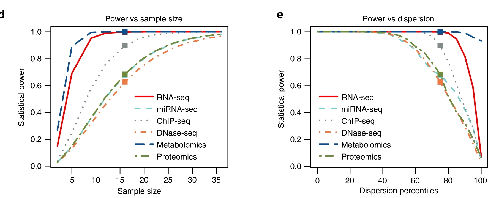
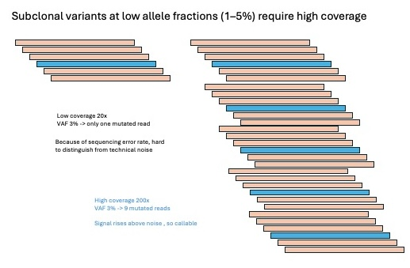

## Sample Size and the Sequencing Depth Trap

!!! info "Learning objectives"
    By the end of this section, participants should be able to:

    - Work through the trade off between sample size and sequencing depth under a fixed budget
    - Recognise the relatively narrow situations where increasing depth is biologically justified

In practice, sample size in omics studies is rarely determined by a formal power calculation. More often, it is constrained by practical limits such as budget, sample availability, or sequencing capacity. As a result, many studies are technically well executed but statistically underpowered. This may not be obvious during analysis and often only becomes apparent later, when findings do not replicate across cohorts or platforms.

---

### Why classical power calculations do not translate well to omics

Most standard power calculations assume a single hypothesis, an approximately known variance, and a significance threshold of 0.05. That framework does not translate cleanly to omics data.

In omics studies, thousands to millions of features (e.g. genes/proteins) are tested simultaneously. Variance differs across features and is usually not well characterised in advance. Multiple testing correction further reduces the effective significance threshold.

The practical consequence is that a study appearing adequately powered for a single feature is not necessarily well powered across the full dataset. For example, *n* = 6 per group may recover a reasonable number of signals before correction, but after false discovery rate (FDR) adjustment, the number of statistically significant features can decline substantially.

---

### What tends to work better in practice

Because of these limitations, empirical approaches are generally more informative than closed form calculations.

**Pilot-data simulation** is one common strategy. Count distributions are estimated from a small dataset, and the full analysis is simulated across different sample sizes. This preserves realistic measurement noise instead of relying on simplified variance assumptions. Tools such as `RNASeqPower` and `PROPER` are commonly used for RNAseq.

Another useful approach is to investigate and conclude from **large replication studies**. These provide direct evidence of how sample size affects detection and reproducibility. Several studies, for example, have shown that *n* = 3 per group misses a substantial proportion of true differential expression signals.

Neither approach is perfect. Pilot datasets may not capture the full study population, and published benchmarks are often platform or tissuecspecific. Even so, both are usually more informative than relying on simplified analytical assumptions.

---

Even when **effect sizes** are similar, higher **biological variability** substantially increases the number of samples required to achieve the same power. In omics, this is compounded by multiple testing (FDR, usually BH method), which makes it harder for any individual feature to reach statistical significance.

{width=90%}

<small>
Ref: Wagner & Kleiner. *Nature Communications* 16, 7263 (2025).  
[doi:10.1038/s41467-025-62616-x](https://www.nature.com/articles/s41467-025-62616-x){target="_blank"}  
(CC BY-NC-ND 4.0)
</small>

---

### Practical lower bounds across platforms

These are not strict rules, but there are useful lower bounds below which reproducibility often becomes difficult.

!!! info "Indicative sample size ranges across platforms"

    **Bulk RNA-seq (differential expression)**  
    *n* = 3 per condition remains common in the literature but is rarely sufficient for stable inference. It can detect large effects, but feature lists often vary substantially between analyses.  
    - *n* ≥ 6 per group: workable minimum for moderate to large effects  
    - *n* ≥ 12 per group: more appropriate when smaller changes are biologically important  

    **Proteomics (label-free MS)**  
    Missing values are a major issue. Many proteins are not detected in every sample, effectively reducing usable sample size.  
    - *n* ≥ 5–8 per group: practical lower bound  
    - Higher *n* is often needed for low abundance or highly variable proteins  

    **Metabolomics**  
    Metabolite profiles are often highly sensitive to environmental and physiological variation, resulting in greater between sample variability. For example, two individuals with the same genetic background can show very different blood metabolite levels if one has fasted overnight while the other has just eaten a high fat meal, or if samples are collected at different times of day.   

    - *n* < 20 per group: high risk of unstable results  
    - Larger cohorts are typically required for robust biomarker studies  

    <small>
    Schurch et al. *RNA* 2016.  
    [PMC4878611](https://pmc.ncbi.nlm.nih.gov/articles/PMC4878611/){target="_blank"}

    Atwal et al. *Nature Communications* 2025.  
    [doi:10.1038/s41467-025-65022-5](https://www.nature.com/articles/s41467-025-65022-5){target="_blank"}

    Cochran et al. *TrAC Trends in Analytical Chemistry* 2024.  
    [doi:10.1016/j.trac.2024.117749](https://www.sciencedirect.com/science/article/pii/S0165993624004011){target="_blank"}
    </small>

These differences reflect genuine differences in how platforms behave, including dynamic range, missingness, and technical variability.

{width=90%}

<small>
Ref: Tarazona S, et al. *Nature Communications* 11, 3092 (2020).  
[doi:10.1038/s41467-020-16937-8](https://www.nature.com/articles/s41467-020-16937-8){target="_blank"}  
(CC BY 4.0)
</small>

___ 

### Sample size in multi-omics studies

In multi-omics studies, sample size cannot be optimised independently for each platform. A single sample size must support all datasets. You cannot `borrow` extra samples for one platform without affecting the others. In practice, this usually means designing around the platform with the weakest statistical power.

The figure below (Tarazona et al., 2020) makes this concrete. Using a conservative dispersion estimate (75th percentile of pooled standard deviation), the MultiPower tool identifies n = 16 per group as the jointly optimal sample size across platforms in a real multi-omics study. Panels D and E show both that this target is achievable and that the recommendation holds up across the range of variability observed in the data. 

{width=90%}
---

### The sequencing depth trap

A common question is whether deeper sequencing can compensate for limited sample size. This is appealing when additional recruitment is not feasible, but in most discovery-oriented studies it does not solve the underlying problem.

Increasing sequencing depth improves measurement precision within a sample, but it does not reduce uncertainty arising from biological variability between samples. Statistical power in most omics studies is therefore driven primarily by the number of independent biological replicates.

> **Practical rule:** Under a fixed budget, prioritising biological replication usually provides a greater gain in power than increasing sequencing depth.

<small>
Liu Y, et al. *Bioinformatics* 2014; 30(3): 301–304.  
[doi:10.1093/bioinformatics/btt688](https://academic.oup.com/bioinformatics/article/30/3/301/228651){target="_blank"}
</small>

---

### When increasing depth does make sense

There are situations where sequencing depth is genuinely limiting.

- **Low-abundance transcript detection**  
  If a feature is not detected at all, additional replication does not help. The feature must first be measurable.

- **Somatic variant detection in tumour samples**  
  Detecting low-frequency variants (approximately 1–5% allele fraction) requires high coverage to separate signal from sequencing noise.

{width=90%}

- **Rare cell populations in single-cell studies**  
  Very rare populations may require deeper sequencing or targeted enrichment, depending on the biological question.

In these cases, the issue is not classical statistical power but whether the signal is observable at all. Targeted approaches (e.g. enrichment or panel-based sequencing) are often more efficient than increasing sequencing depth across the entire dataset.

---

??? info "scRNA-seq: number of donors vs number of cells per sample"
    Statistical replication occurs at the donor level, not the cell level. Increasing the number of cells per donor improves resolution, but does not increase the number of independent observations.

    - *n* = number of donors per condition  
    - Cell numbers primarily affect resolution, not statistical power  

    Moving from 5 to 20 donors substantially increases power because each donor contributes new biological information. By contrast, increasing cells per donor from 25 to 500 has relatively little impact on power.

    {width=90%}

    <small>
    Zimmerman K, et al. *Nature Communications* (2021)  
    [doi link](https://www.nature.com/articles/s41467-021-21038-1){target="_blank"}
    </small>

---

### Further reading

??? abstract "Power estimation in omics"

    Schurch NJ et al. *RNA* 2016  
    [PMC4878611](https://pmc.ncbi.nlm.nih.gov/articles/PMC4878611/){target="_blank"}

    Tarazona S et al. *Nature Communications* 2020  
    [doi:10.1038/s41467-020-16937-8](https://www.nature.com/articles/s41467-020-16937-8){target="_blank"}

    Atwal S et al. *Nature Communications* 2025  
    [doi:10.1038/s41467-025-65022-5](https://www.nature.com/articles/s41467-025-65022-5){target="_blank"}

    Liu Y et al. *Bioinformatics* 2014  
    [doi:10.1093/bioinformatics/btt688](https://academic.oup.com/bioinformatics/article/30/3/301/228651){target="_blank"}