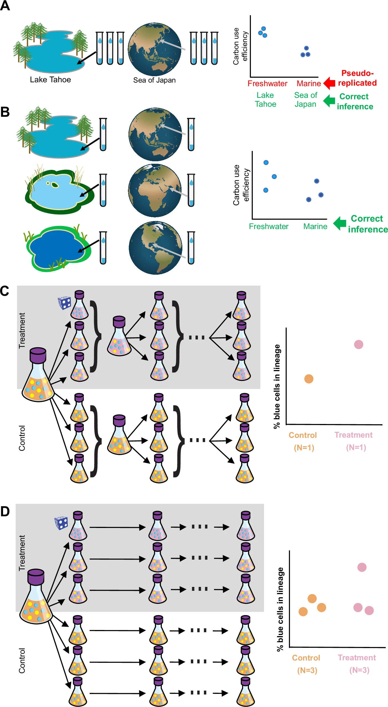
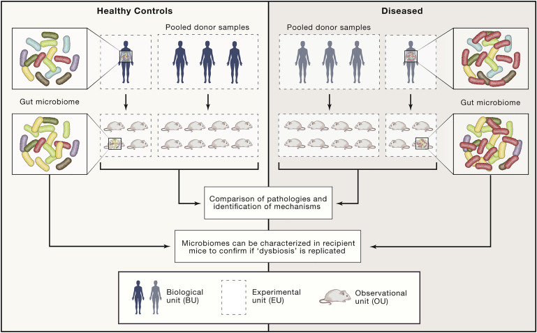
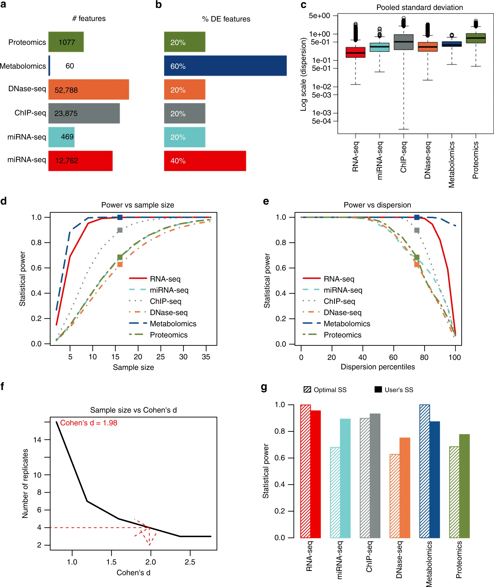
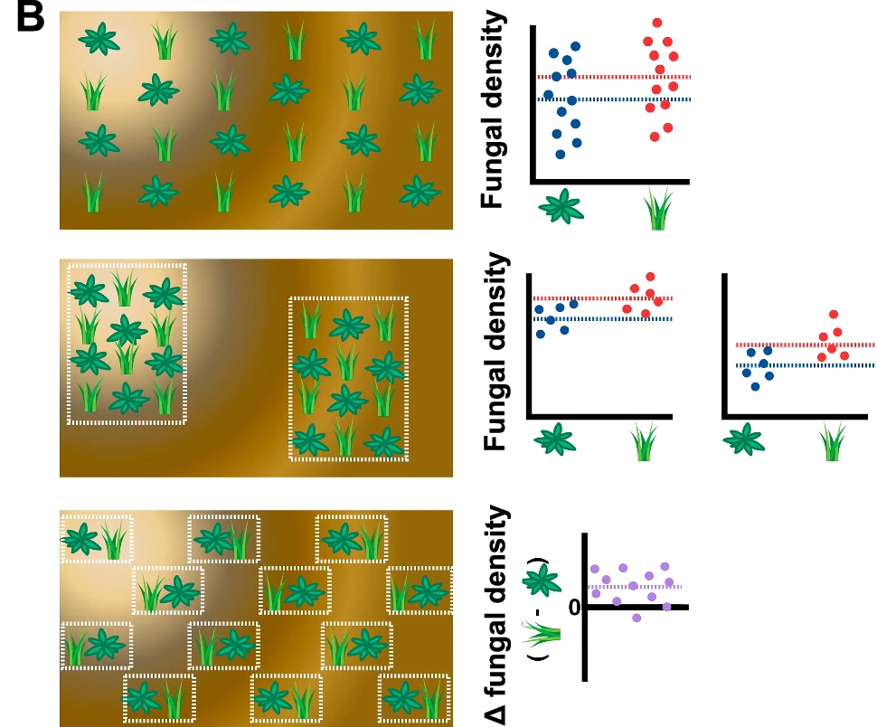
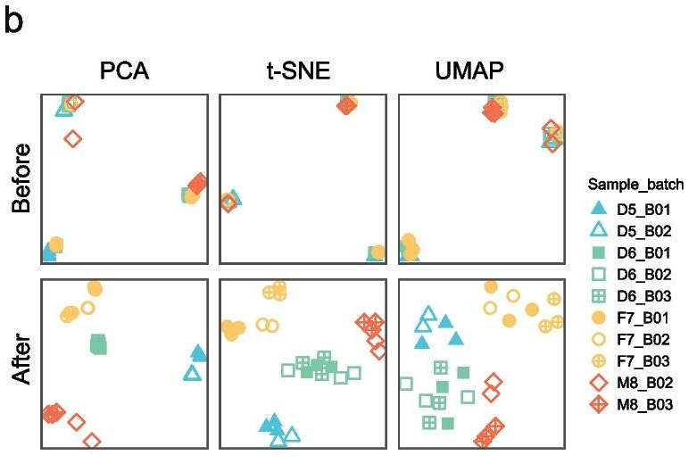

# Module 3 — Experimental Design Fundamentals for Omics

!!! info "Learning objectives"
    By the end of this module, participants will be able to:

    - Identify what to randomise in an omics experiment — beyond sample 
      assignment — and explain how failures at the plate, batch, and lane 
      level introduce batch effects that cannot be corrected later.
    - Distinguish biological replicates from technical replicates, explain 
      why the correct unit of replication differs by platform, and describe 
      the pseudobulk principle as a design decision rather than a computational 
      workaround.
    - Apply the sample size and sequencing depth trade-off to a fixed budget 
      scenario, including recognising the legitimate exceptions where depth 
      genuinely matters.
    - Explain blocking as a prospective design strategy and evaluate why it 
      is more reliable than post-hoc batch correction, including when 
      correction is mathematically impossible.
    - Draft a minimal metadata checklist for their own project and explain 
      why an unrecorded variable cannot be modelled, corrected for, or even 
      identified after data collection.

---

!!! info "Where this module sits in the workshop arc"
    Modules 1 and 2 established *what goes wrong* and *why omics data is 
    structurally unusual*. Module 3 is the last point at which any of those 
    failures can still be prevented. Every section covers a decision that 
    must be made before data generation — not revisited after.

---

## Section 1 — Randomisation: The Design Step Most Researchers Skip

When researchers think about randomisation in experimental design, they 
typically think about randomising which samples go into which treatment 
group. In omics, this is necessary but far from sufficient. The more 
consequential randomisation decisions happen at the level of *how* samples 
are processed — and these are routinely skipped.

### What to randomise in an omics workflow

An omics experiment involves a sequence of physical handling steps before 
a single read is generated: sample thawing, RNA or protein extraction, 
library preparation, pooling, and sequencing. Each step introduces 
technical variation. When samples from the same biological group pass 
through the same step at the same time, that variation is shared within 
the group — and becomes indistinguishable from biology.

The specific decisions that must be randomised are:

**Sample processing order.** Reagents degrade across a day of work. An 
operator's technique improves over a morning and deteriorates by afternoon. 
If all cases are extracted Monday and all controls extracted Friday, every 
difference in extraction quality is confounded with condition. Processing 
order should be randomised across biological groups *within each day*, and 
samples should be spread across multiple processing sessions where possible.

**Plate and well position.** Thermocyclers and liquid-handling robots 
introduce spatial gradients. Edge wells experience different thermal 
conditions from central wells. In 96-well format, a systematic placement 
of cases in columns 1–4 and controls in columns 5–8 means that any 
positional artefact mimics the biological comparison. Cases and controls 
should be interleaved across the plate, with the specific well assignment 
randomised.

**Library preparation batch.** If a study requires multiple library 
preparation reactions — common when sample numbers exceed single-kit 
capacity — each reaction introduces its own technical signature. Every 
batch should contain samples from every biological group, not groups nested 
within batches.

**Sequencing lane and flow cell.** In multi-lane or multi-flow-cell 
sequencing runs, each lane or flow cell can differ in cluster density, 
quality scores, and read depth. Multiplexing all samples from one condition 
into a single lane converts a sequencing artefact into apparent biology. 
Samples from all conditions should be distributed across lanes.

The two panels below show what happens when these decisions are skipped. 
In the top panel (A), an undetected temperature gradient across the bench 
causes a false positive — the mutant strain appears to grow more slowly 
than wild-type, but only because it occupies the cooler side of the lab. 
After randomising flask positions in space, the effect disappears. In the 
lower panel (B), time-of-measurement introduces a false negative — all 
rich-media replicates are counted first, giving poor-media replicates extra 
time to grow and masking the true treatment effect. Randomising measurement 
order reveals it.

{width=90%}

<small>Ref: Wagner & Kleiner. How thoughtful experimental design can empower 
biologists in the omics era. *Nature Communications* 16, 7263 (2025).
[doi:10.1038/s41467-025-62616-x](https://www.nature.com/articles/s41467-025-62616-x){target="_blank"}
(CC BY-NC-ND 4.0)</small>

### The temperature gradient problem

One of the least-discussed sources of technical variation in omics is 
spatial position within a reaction plate. Thermocyclers maintain target 
temperatures across a block with finite precision — wells at the edges and 
corners experience subtly different thermal trajectories from those in the 
centre. For PCR-based library preparation, this can produce systematic 
differences in amplification efficiency that track with position, not 
biology.

The practical consequence: if one condition is consistently placed in edge 
wells and the other in central wells, the library preparation variation 
correlates with the biological comparison. No amount of computational 
correction can separate these signals after the fact, because the position 
effect and the biological effect were applied to the same samples at the 
same step. The fix — randomising well assignment — takes seconds at the 
design stage and costs nothing.

The panel below illustrates this directly in an omics context. On the left, 
samples are nested within batches by condition — yellow and green in one 
batch, purple and blue in another. The resulting clusters exaggerate 
within-condition similarity and exaggerate between-condition difference. On 
the right, randomising samples from all four groups across both batches 
produces a more accurate picture of the true similarities and differences. 
Black and white reference samples included in every batch provide an 
independent check on batch drift.

{width=90%}

<small>Ref: Wagner & Kleiner. *Nature Communications* 16, 7263 (2025).
[doi:10.1038/s41467-025-62616-x](https://www.nature.com/articles/s41467-025-62616-x){target="_blank"}
(CC BY-NC-ND 4.0)</small>

!!! warning "Randomisation distributes unknowns — it does not eliminate them"
    A well-randomised experiment will still contain technical variation. 
    The purpose of randomisation is to ensure that variation is distributed 
    roughly evenly across biological groups rather than systematically 
    concentrated in one. This converts a *confounder* into *noise* — noise 
    can be accounted for statistically; a confounder cannot. Blocking, 
    covered in Section 4, goes further by actively controlling for known 
    sources of variation.

---

## Section 2 — Replication: What Actually Counts as n

The distinction between biological and technical replicates is one of the 
most frequently confused concepts in omics — and one of the most 
consequential. Getting it wrong inflates apparent sample size, produces 
false-positive results, and generates findings that do not replicate.

### The definition, stated precisely

A **biological replicate** is an independent biological sample drawn from 
the same population: a different patient, a different mouse, a different 
culture flask. Biological replicates capture natural variation within the 
population and are the unit of statistical inference. They drive the n 
in every power calculation and every statistical test.

A **technical replicate** is the same biological sample measured more than 
once. Technical replicates capture measurement variability — how 
consistently the platform quantifies the same input. They do not add 
independent biological information.

Treating technical replicates as biological replicates inflates the 
effective sample size, artificially narrows confidence intervals, and 
produces p-values that are lower than they should be. The result is false 
positives that appear statistically robust but vanish in independent 
datasets.

### The platform determines whether technical replicates are useful at all

This is a distinction that most training materials gloss over — the 
decision to include technical replicates is not universal. It depends on 
the platform's noise characteristics relative to biological variability.

In **bulk RNA-seq**, technical variance from library preparation and 
sequencing is typically small compared to biological variance between 
samples. Including technical replicates occupies sequencing budget without 
providing meaningful additional information about measurement error — budget 
that would be better spent on additional biological samples. Technical 
replicates in bulk RNA-seq are rarely justified.

In **mass spectrometry-based proteomics**, the relationship is different. 
Run-to-run variation from ionisation differences, instrument drift, and 
sample injection variability can be comparable in magnitude to biological 
differences between groups. Here, technical replicates provide genuine 
information about measurement stability, and their inclusion — when done 
strategically — can be used to quantify and correct for this technical 
noise. The RUVIII approach described in the further reading block below 
formalises this into a principled correction strategy.

| Platform | Technical variance vs biological variance | Technical replicates useful? |
|---|---|---|
| **Bulk RNA-seq** | Technical << biological | Rarely — invest budget in biological n |
| **scRNA-seq** | Varies; cell capture is technical | No — additional donors are what drives power |
| **Proteomics (MS)** | Technical often ≈ biological | Yes — if used as input to principled correction |
| **Metabolomics (MS)** | Technical often ≈ biological | Yes — pooled QC samples are standard |
| **16S / metagenomics** | Extraction and PCR variation substantial | Useful for contamination detection |

### Pseudoreplication and what it means for design

When measurements are taken from the same biological unit multiple times 
and treated as independent, the result is pseudoreplication — a form of 
false inflation of n that was covered in detail in Module 1. Rather than 
revisiting the statistical consequences here, the design principle is 
simple:

**Identify the true biological unit before the experiment starts, and ensure 
your replication strategy matches it.**

The figure below, from Wagner & Kleiner (2025), shows four scenarios that 
clarify this principle. Panels A and B contrast pseudoreplicated vs valid 
designs for comparing freshwater and marine microbial communities — three 
vials from Lake Tahoe are not three independent observations of freshwater 
microbiomes; they are three observations of Lake Tahoe. Panel B shows the 
correct design: one vial from each of three independently selected 
freshwater bodies. Panels C and D then apply this to experimental 
evolution, showing how pooling replicates between passages eliminates 
independence — a stochastic event arising in one lineage can spread to 
all, confounding the treatment comparison.

{width=90%}

<small>Ref: Wagner & Kleiner. *Nature Communications* 16, 7263 (2025).
[doi:10.1038/s41467-025-62616-x](https://www.nature.com/articles/s41467-025-62616-x){target="_blank"}
(CC BY-NC-ND 4.0)</small>

??? example "Case Study: Pseudoreplication at Scale — 95% of HMA Microbiome Studies"

    A 2020 systematic review by Walter et al. examined 38 published studies 
    that used human microbiota-associated (HMA) rodents to establish causal 
    links between gut microbiome alterations and human disease. These studies 
    transplant fecal microbiota from human donors (cases and controls) into 
    germ-free rodents and compare pathological phenotypes in the recipients.

    The review found that 95% of studies (36/38) reported successful transfer 
    of disease-associated phenotypes — a rate the authors describe as 
    biologically implausible given the known limitations of cross-species 
    microbiome transfer.

    A key driver of this inflation was pseudoreplication. Figure 1 of the 
    paper (below) maps the three-level structure of these experiments: the 
    **Biological Unit (BU)** is the human donor — the entity about which 
    causal inferences are being made. The **Experimental Unit (EU)** is the 
    inoculum used to colonise the mice — which, when donors are pooled, 
    collapses to the number of pools rather than the number of donors. The 
    **Observational Unit (OU)** is the individual mouse — just a measurement 
    platform, not an independent replicate.

    {width=90%}

    <small>Ref: Walter J, Armet AM, Finlay BB, Shanahan F. Establishing or 
    Exaggerating Causality for the Gut Microbiome: Lessons from Human 
    Microbiota-Associated Rodents. *Cell* 180, 221–232 (2020).
    [doi:10.1016/j.cell.2019.12.025](https://doi.org/10.1016/j.cell.2019.12.025){target="_blank"}</small>

    Of the 38 studies reviewed, 84% used the individual animals as the unit 
    of statistical inference — even though animal numbers were far larger than 
    the number of human donors and the donors were the true experimental unit. 
    Many studies also pooled donor samples before inoculation, reducing the 
    effective n from the number of donors to the number of pools — sometimes 
    to n = 1 per condition.

    **The connection to Module 1:** The Koren et al. (2012) pregnancy 
    microbiome study used as the Module 1 design activity is one of the 
    studies cited in this systematic review. The Walter et al. Figure 1 
    provides the formal conceptual framework for why that design was 
    pseudoreplicated — and why 84% of similar studies made the same error.

    **The design fix:** use the number of human donors as n; do not pool 
    samples before inoculation; prevent microbial spread between cages from 
    different donors. These are design decisions, not analytical ones — they 
    cannot be applied retrospectively.

### The single-cell case: donors, not cells, are the unit

Single-cell RNA-seq requires particular care because the technology 
generates tens of thousands of measurements per experiment — a scale that 
creates a powerful illusion of statistical abundance. The empirical reality, 
shown directly by Zimmerman et al. (2021), is different.

As the number of subjects (donors) increases from 5 to 20, statistical 
power increases dramatically. As the number of cells per subject increases 
from 25 to 500, power barely changes. The conclusion is direct: **cells 
provide resolution into what is happening within a donor; donors provide 
the statistical power to make claims across a population.** In scRNA-seq, 
as in every other omics platform, more patients — not more measurements 
per patient — is what drives reliable inference.

The design implication: plan your study around the number of donors you can 
recruit, then decide how many cells per donor the question requires. Do not 
substitute cell number for donor number.

The analytical implication — **pseudobulk** — follows directly from this 
design principle. Rather than testing differential expression at the 
individual cell level (which treats thousands of cells from three donors as 
three thousand independent observations), cells from the same donor are 
first aggregated to create one expression profile per donor per cell type. 
Standard tools such as DESeq2, edgeR, or limma are then applied to these 
donor-level profiles. The statistical unit is the donor — which is what it 
should have been by design. Pseudobulk is not a workaround; it is the 
correct analysis for a correctly designed study.

<small>Zimmerman KD, Espeland MA, Langefeld CD. A practical solution to 
pseudoreplication bias in single-cell studies. *Nature Communications* 
2021; 12: 738. 
[doi:10.1038/s41467-021-21038-1](https://www.nature.com/articles/s41467-021-21038-1){target="_blank"}</small>

??? abstract "Further Reading · When Technical Replicates Are an Asset: RUVIII"

    The standard advice is that technical replicates waste sequencing budget 
    that should go toward biological replication. This is correct in most 
    contexts — but there is an important exception that turns technical 
    replicates from a cost into a correction tool.

    **RUVIII (Remove Unwanted Variation, version III)** uses technical 
    replicates as *negative controls* to estimate and remove unwanted 
    variation. The logic: the same biological sample measured in two 
    different batches should produce identical expression profiles. Any 
    systematic disagreement between the two measurements reflects technical 
    noise — not biology. RUVIII learns the structure of this disagreement 
    across all technical replicate pairs and subtracts it from every sample 
    in the dataset.

    This approach was applied to a NanoString cohort of inflammatory bowel 
    disease samples where batch effects were large relative to the biological 
    signal. Including a small number of technical replicate samples — the 
    same RNA measured across multiple processing runs — enabled RUVIII to 
    estimate batch structure that could not have been estimated from the 
    biological samples alone.

    **The critical requirement:** technical replicates must be included *by 
    design*, before data collection begins. RUVIII cannot be applied 
    retrospectively if no true technical replicates exist. This is why it 
    belongs in a module on design, not analysis.

    <small>
    Molania R, et al. A new normalization for Nanostring nCounter gene 
    expression data. *Nucleic Acids Research* 2019; 47(12): 6073–6083.
    [doi:10.1093/nar/gkz433](https://doi.org/10.1093/nar/gkz433){target="_blank"}

    Luijk R, et al. Normalisation of Illumina Infinium 450K and EPIC 
    methylation array data using RUV-III. *Nucleic Acids Research* 2022.
    [doi:10.1093/nar/gkab1117](https://doi.org/10.1093/nar/gkab1117){target="_blank"}
    </small>

---

## Section 3 — Sample Size and the Sequencing Depth Trap

In many omics studies, sample size is determined by budget or sample 
availability — not by statistical need. This is one of the most consequential 
design failures in the field, because the consequences (underpowered findings 
that do not replicate) only become apparent years later, in other labs, with 
other datasets.

### Why power calculations from clinical trials do not transfer

Standard power calculations — the kind used for clinical trials — assume a 
single outcome variable, a known or estimated variance, and a target effect 
size. Omics experiments test thousands of features simultaneously under a 
multiple testing correction burden that dramatically reduces effective power 
per feature.

A study powered to detect a 2-fold change at 80% power for a single gene, 
at n = 6 per group, will detect far fewer than 80% of genes truly changing 
at that magnitude across the full transcriptome — because the FDR correction 
required when testing 20,000 genes simultaneously raises the effective 
p-value threshold. The sample sizes that classical power analysis recommends 
for single-outcome studies are systematically insufficient for omics.

**Appropriate approaches for omics power estimation:**

- **Simulation-based estimation using pilot data:** simulate the expected 
  count distribution from a small pilot experiment, apply the intended 
  analysis pipeline, and measure how power changes as n increases. Tools 
  such as `RNASeqPower`, `PROPER` (for RNA-seq), and `PWMEnrich` provide 
  formal frameworks.
- **Published platform-specific benchmarks:** the literature contains 
  empirically derived power estimates from large replication experiments 
  (see further reading). These provide minimum n recommendations grounded 
  in real data rather than distributional assumptions.

The figure below illustrates the central relationship that power analysis 
quantifies. Each panel shows two populations (e.g., two biological 
conditions) with the same true effect size (distance between horizontal 
lines) but different within-group variance. When variance is high relative 
to the effect, far more replicates are needed to achieve 80% power. The 
minimum sample sizes shown are from a t-test power analysis — in omics, 
where thousands of features are tested simultaneously and FDR correction 
applies, the required n for any individual gene is larger still.

{width=90%}

<small>Ref: Wagner & Kleiner. *Nature Communications* 16, 7263 (2025).
[doi:10.1038/s41467-025-62616-x](https://www.nature.com/articles/s41467-025-62616-x){target="_blank"}
(CC BY-NC-ND 4.0)</small>

### The practical floor across platforms

!!! info "Sample size benchmarks across omics platforms"

    **Bulk RNA-seq (differential expression)**

    - n = 3 per condition: the field norm — and consistently shown to be 
      insufficient. Detects only 20–40% of truly differentially expressed 
      genes; false positive rate is high among what is detected.
    - n ≥ 6 per condition: minimum for reliable detection of moderate-to-high 
      fold-change genes.
    - n ≥ 12 per condition: recommended when low fold-change genes (log2FC 
      < 1) are biologically relevant.
    - The greatest loss of performance is seen below n = 7 per group, where 
      heterogeneity in pipeline performance becomes severe.

    **Proteomics (label-free MS)**

    - Missing values compound at low n — proteins near the detection limit 
      are observed in some samples and absent in others, reducing the 
      effective n per protein below the nominal sample size.
    - n ≥ 5–8 per group is a practical minimum; higher n is needed when 
      low-abundance proteins are the target of interest.

    **Metabolomics**

    - Inter-individual biological variation in metabolite levels is 
      inherently high — far higher than in gene expression studies. Studies 
      with n < 20 per group routinely produce metabolite sets that are 
      study-specific and fail to replicate.
    - The 2024 meta-analysis of 244 clinical metabolomics studies found that 
      72% of significant metabolites were identified in only one study, with 
      small sample size as the primary driver.

    **Single-cell RNA-seq**

    - n = number of donors per condition, not number of cells. The Zimmerman 
      et al. empirical data (Section 2) applies: 5→20 donors produces 
      dramatic power gains; 25→500 cells per donor does not.
    - For studies of rare cell populations, the relevant n is the number of 
      donors in whom that cell type is sufficiently represented — which may 
      be substantially smaller than the total donor count.

    <small>
    Schurch et al. *RNA* 2016.
    [PMC4878611](https://pmc.ncbi.nlm.nih.gov/articles/PMC4878611/){target="_blank"}

    Atwal et al. *Nature Communications* 2025.
    [doi:10.1038/s41467-025-65022-5](https://www.nature.com/articles/s41467-025-65022-5){target="_blank"}

    Cochran et al. *TrAC Trends in Analytical Chemistry* 2024.
    [doi:10.1016/j.trac.2024.117749](https://www.sciencedirect.com/science/article/pii/S0165993624004011){target="_blank"}
    </small>

The reason these numbers differ so substantially across platforms is not 
arbitrary — it reflects fundamental differences in how each platform 
measures molecular features. The table below (Tarazona et al. 2020) 
compares seven Figures of Merit across the major omics platform types, 
covering reproducibility, sensitivity, linear and dynamic range, limit of 
detection, selectivity, identification, and coverage. Each property 
directly influences measurement variability and effect size detectability — 
the two parameters that most determine how many samples are required. A 
platform with high technical variability (low reproducibility) and a narrow 
dynamic range needs more samples to achieve the same power as a platform 
with low noise and broad range, even if the underlying biology is identical.

{width=90%}

<small>Ref: Tarazona S, et al. Harmonization of quality metrics and power 
calculation in multi-omic studies. *Nature Communications* 11, 3092 (2020).
[doi:10.1038/s41467-020-16937-8](https://www.nature.com/articles/s41467-020-16937-8){target="_blank"}
(CC BY 4.0)</small>

### The sequencing depth trap

When researchers cannot afford more biological samples, a common instinct 
is to compensate by sequencing more deeply. The logic sounds reasonable: 
more reads means more data, more data means more power. This reasoning is 
wrong in the large majority of cases.

Liu et al. (2014) demonstrated this directly. They compared two approaches 
for a fixed budget: adding three more biological samples at moderate depth, 
versus doubling the sequencing depth for the existing three samples. The 
result was unambiguous — **adding biological samples recovered far more 
true differentially expressed genes** than additional depth. The fundamental 
reason is the same as in Section 2: per-gene variance estimates from small n 
have very few degrees of freedom. No matter how many reads you generate for 
those same samples, the variance estimate for each gene remains unreliable. 
The additional reads confirm what you already measured, rather than reducing 
the uncertainty about what the population looks like.

> **The rule of thumb:** For a fixed budget, prioritise biological n over 
> sequencing depth for any differential expression or discovery question. 
> More patients. Not more reads.

<small>Liu Y, et al. RNA-seq differential expression studies: more sequence 
or more replication? *Bioinformatics* 2014; 30(3): 301–304.
[doi:10.1093/bioinformatics/btt688](https://academic.oup.com/bioinformatics/article/30/3/301/228651){target="_blank"}</small>

The figure below from Tarazona et al. (2020) shows what this looks like in 
practice for a real multi-omics dataset combining RNA-seq and metabolomics. 
Panels a–c show per-omic power curves as sample size increases: the two 
platforms reach 80% power at different n, even though they are measuring 
the same samples in the same study. This is a direct consequence of the 
platform differences shown in Figure 2 above — metabolomics typically 
requires more samples than RNA-seq to achieve equivalent power because 
inter-individual metabolite variability is higher and the effective dynamic 
range is narrower. Panel d shows the combined multi-omic power 
optimisation, where MultiPower identifies the sample size that achieves a 
target average power across all omics layers simultaneously. For the 
dataset shown, Cohen's d = 1.98 — a large effect — yet the platform 
characteristics still dictate that RNA-seq and metabolomics require 
different n to reach the same power threshold.

{width=90%}

<small>Ref: Tarazona S, et al. *Nature Communications* 11, 3092 (2020).
[doi:10.1038/s41467-020-16937-8](https://www.nature.com/articles/s41467-020-16937-8){target="_blank"}
(CC BY 4.0)</small>

!!! tip "Practical tool for multi-omics power estimation"
    **MultiPower** is an R package that implements the framework shown 
    above. It accepts pilot data or user-specified parameters for each 
    omics layer, and returns per-omic and combined power curves across a 
    range of sample sizes. It supports count data (RNA-seq, 16S), 
    normally distributed data (proteomics, metabolomics after 
    normalisation), and binary data, and includes a companion **MultiML** 
    algorithm for sample size estimation in machine learning classification 
    problems. For any study combining two or more omics platforms, 
    MultiPower is the most appropriate tool currently available for 
    planning a jointly powered experiment.

    [github.com/ConesaLab/MultiPower](https://github.com/ConesaLab/MultiPower){target="_blank"}

### Legitimate exceptions where depth genuinely matters

The rule above is not absolute. There are specific biological questions 
where sequencing depth is the correct investment — and recognising them 
prevents the rule from being dismissed as oversimplified.

**Rare transcript detection.** Genes expressed at very low levels require 
sufficient depth to rise above the noise floor. At shallow depth, these 
genes produce zeros across many samples — not because they are absent, but 
because the sequencing budget was insufficient to sample them consistently 
(covered in Module 2, Section 2). If rare transcripts are the specific 
target, additional depth is justified.

**Somatic mutation calling in cancer.** Tumour biopsies contain a mixture 
of tumour and normal cells. A somatic variant present in a subclone may 
have a minor allele fraction (MAF) of 1–5% in the biopsy. Detecting this 
above sequencing noise requires 200–300× coverage. For standard 
differential expression, this depth is entirely unnecessary — but for 
variant calling at low MAF, it is essential.

**Rare cell types in single-cell studies.** Standard sequencing depth in 
10x Chromium captures the major cell types reliably. Characterising a cell 
population present at 0.1–0.5% frequency may require either substantially 
greater total depth or targeted enrichment before sequencing.

**Modern solutions when depth is the correct answer:**

- *Targeted long-read sequencing (Oxford Nanopore):* for known rare variants 
  or specific genomic regions, targeted capture followed by long-read 
  sequencing provides depth where the biology demands it, combined with the 
  read length needed to resolve complex regions that short-read approaches 
  cannot.
- *Cell type enrichment before library preparation:* for rare cell 
  populations, FACS or MACS sorting before sequencing concentrates the 
  target population in the library. Standard n × deeper sequencing will not 
  recover a cell type at 0.1% frequency — enrichment will.

??? abstract "Further Reading · Power Estimation Tools and Benchmarks"

    **RNA-seq power and sample size**

    Schurch NJ et al. How many biological replicates are needed in an 
    RNA-seq experiment and which differential expression tool should you use?
    *RNA* 2016; 22(6): 839–851.
    [PMC4878611](https://pmc.ncbi.nlm.nih.gov/articles/PMC4878611/){target="_blank"}
    *(48-replicate benchmark — the most comprehensive empirical basis for 
    n recommendations in bulk RNA-seq)*

    Peng X et al. A statistical method to estimate the power of RNA-seq 
    differential expression analysis. 
    *BMC Bioinformatics* 2014. 
    [doi:10.1093/bioinformatics/btu552](https://academic.oup.com/bioinformatics/article/30/21/3069/2422294){target="_blank"}
    *(RNASeqPower: simulation-based power estimation from pilot data)*

    Atwal S et al. Insufficient sample size and overfitting in omics studies.
    *Nature Communications* 2025; 16: 10173.
    [doi:10.1038/s41467-025-65022-5](https://www.nature.com/articles/s41467-025-65022-5){target="_blank"}
    *(Cross-platform analysis of underpowering consequences — covers 
    RNA-seq, proteomics, and metabolomics in a single framework)*

    ---

    **Multi-omics power estimation**

    Tarazona S et al. Harmonization of quality metrics and power calculation 
    in multi-omic studies.
    *Nature Communications* 2020; 11: 3092.
    [doi:10.1038/s41467-020-16937-8](https://www.nature.com/articles/s41467-020-16937-8){target="_blank"}
    *(Introduces Figures of Merit and the MultiPower/MultiML framework — 
    the primary reference for the figures used in Section 3 of this module. 
    Covers RNA-seq, proteomics, metabolomics, ChIP-seq, ATAC-seq, and 
    Methyl-seq in a single unified framework)*

    ---

    **Proteomics sample size**

    Goh WWB et al. Why batch effects matter in omics data, and how to 
    avoid them.
    *Trends in Biotechnology* 2017; 35(6): 498–507.
    [PMC11566501](https://pmc.ncbi.nlm.nih.gov/articles/PMC11566501/){target="_blank"}
    *(Specific treatment of sample size requirements for proteomics ML 
    classification — the gap between feature count and sample count)*

    **Additional practical tool**

    Power and Sample Size for Omics (OHSU workshop materials):
    [ohsu.edu/sites/default/files/2024-02/pss4omics.pdf](https://www.ohsu.edu/sites/default/files/2024-02/pss4omics.pdf){target="_blank"}
    *(Platform-specific guidance and worked examples — useful supplement 
    to MultiPower for single-platform studies)*

---

## Section 4 — Blocking: Designing Batch Effects Out

Section 1 covered randomisation — distributing unknown sources of variation 
evenly across groups so they do not mimic biology. Blocking is a related 
but distinct strategy: it actively controls for *known* sources of variation 
by ensuring that every biological group is represented within every technical 
batch. Both strategies are required; they address different problems.

### What a batch is, defined precisely

A **batch** is any group of samples that were processed together under 
shared technical conditions. The following all create batches:

- A set of samples extracted on the same day by the same operator
- A set of libraries prepared in the same reaction (same reagent lot, same 
  thermocycler run)
- A set of samples loaded onto the same sequencing flow cell or run in the 
  same mass spectrometry injection sequence
- A set of samples stored in the same freezer box, with the same number of 
  freeze-thaw cycles

Any of these can introduce systematic technical differences between groups 
of samples. The critical question is not whether batches exist — they always 
do — but whether biological groups are distributed across them or nested 
within them.

### The blocking principle

A batch effect only becomes a confounder when one biological group is 
predominantly or exclusively present in one batch. If cases are processed 
in batch 1 and controls in batch 2, any technical difference between batches 
is mathematically inseparable from the biological comparison. This was 
established in Module 1's Pitfall 1 — and cannot be corrected after the fact.

The blocking solution is straightforward: **ensure that every biological 
group appears in every batch.** This does not eliminate the batch effect — 
the technical variation still exists. But it ensures that the variation 
affects all biological groups equally, making it estimable and correctable 
during analysis.

The figure below shows blocking in a field experiment context that 
translates directly to omics batch design. Without blocking (top panel), 
soil quality — an unmeasured environmental variable — influences fungal 
density for each plant replicate in an unpredictable way, inflating 
within-group variance and masking any true species difference. With spatial 
blocking (middle panel), replicates are arranged so that both species 
appear in each block, allowing soil quality effects to be estimated and 
removed. The paired design (bottom panel) goes furthest — each block 
contains exactly one replicate from each species, so the difference can be 
calculated directly within each pair. In omics terms: replace "plant 
species" with "cases and controls," "soil quality" with "processing batch," 
and the logic is identical.

{width=90%}

<small>Ref: Wagner & Kleiner. *Nature Communications* 16, 7263 (2025).
[doi:10.1038/s41467-025-62616-x](https://www.nature.com/articles/s41467-025-62616-x){target="_blank"}
(CC BY-NC-ND 4.0)</small>

**A minimal worked example:**

Twenty samples, two conditions (10 cases, 10 controls), two library 
preparation batches of 10 samples each.

*Wrong design:* 10 cases in batch 1, 10 controls in batch 2. Any 
batch effect is fully confounded with the biological comparison. 
Correction is impossible.

*Correct design:* 5 cases and 5 controls in batch 1; 5 cases and 
5 controls in batch 2. The batch effect can be estimated from the 
within-batch differences and removed during analysis without touching 
the biological signal.

The correct design requires no additional samples, no additional sequencing 
cost, and no additional analysis complexity. It requires only that the 
sample-to-batch assignment is planned before processing begins.

### The reference sample anchor

A complementary strategy — particularly useful in mass spectrometry-based 
platforms where run-to-run drift is substantial — is to include a **common 
reference sample** in every batch. This is typically a pooled aliquot 
prepared by combining equal volumes from all biological samples, measured 
repeatedly alongside the experimental samples.

The reference serves two functions: it provides an independent estimate of 
technical drift between batches (the same material should produce the same 
signal in every run), and it provides a normalisation anchor for between-batch 
scaling. In metabolomics, pooled QC samples run at regular intervals during 
a batch are now standard practice. In proteomics, a pooled reference run 
on every plate or injection sequence serves the same purpose.

Including a reference sample is a design decision — the reference must be 
prepared at the start of the study, from the same biological material as 
the experimental samples, and stored in aliquots sufficient for the full 
run.

### Why prospective blocking outperforms post-hoc correction

Batch correction methods — ComBat, limma's `removeBatchEffect`, Harmony, 
and others — can remove batch effects that are orthogonal to the biological 
signal. They work well when the design is balanced: when both cases and 
controls appear in every batch, the batch effect can be estimated from 
samples that share biology but differ in batch.

When batch and biology are correlated rather than orthogonal, correction 
methods face a fundamental mathematical problem: they cannot estimate what 
belongs to the batch and what belongs to the biology. Correcting under 
these conditions removes biological signal along with technical noise.

Prospective blocking guarantees orthogonality by design. No computational 
method can recover what a poorly designed experiment has conflated.

The pair of plots below shows what balanced design enables computationally. 
Before batch correction (left), samples cluster by batch rather than by 
biological condition — the technical signal dominates. After correction 
(right), biological groups separate cleanly. This result is only achievable 
because the design was balanced: both conditions were present in both 
batches, allowing the batch effect to be estimated and removed. An 
unbalanced design would produce the left panel with no path to the right.

{style="width:90%; height:auto; min-height:300px"}

<small>Ref: Yu Y, et al. *Genome Biology* 25.1 (2024)</small>

!!! danger "The unrecoverable rule"
    If batch and biological group are fully correlated — all cases in one 
    batch, all controls in another — no correction method can separate the 
    two signals. This is a design failure. The only resolution is to repeat 
    the experiment with a balanced design.

!!! info "Coming up in Module 4"
    When batch effects are present but the design is balanced, computational 
    correction is appropriate. The methods for identifying batch effects 
    through PCA and RLE plots, assessing whether correction is safe to 
    apply, and choosing between correction approaches are covered in 
    **Module 4: Bias Identification and Data Quality Assessment**.

---

## Section 5 — Metadata: The Interpretive Scaffold

High-quality sequencing or mass spectrometry data is only as useful as the 
information recorded alongside it. Metadata — the structured record of 
biological and technical variables associated with each sample — is not 
documentation. It is the interpretive framework that makes every downstream 
analysis possible, including analyses that have not yet been conceived when 
the experiment runs.

### Why unrecorded variables are permanent confounders

Every analysis that could be done on an omics dataset in the future depends 
on the metadata available today. A clinical variable not recorded at sample 
collection cannot be retrieved later. A processing date not logged cannot be 
reconstructed. A reagent lot number not noted cannot be recovered from the 
samples themselves.

The consequence is asymmetric: a recorded variable that turns out to be 
irrelevant costs only a column in a spreadsheet. An unrecorded variable 
that turns out to be a confounder cannot be modelled, corrected for, or 
even confirmed as the source of an anomaly. Its only trace may be an 
unexplained axis in a PCA plot — suggestive of a problem, but impossible 
to resolve without the original records.

!!! danger "The unrecoverable rule"
    Every metadata field not recorded at the time of sample collection is 
    a potential confounder you can never remove. The cost of recording is 
    trivial. The cost of not recording is permanent.

### Confounding by indication — a trap specific to clinical omics

In clinical omics studies, a particularly insidious form of confounding 
arises from the reason a patient received a treatment. Patients assigned to 
Drug A were different — often sicker, or with a different disease subtype — 
from patients assigned to Drug B. The treatment variable and the disease 
severity variable are correlated by the logic of clinical care, not by 
random assignment.

If disease severity is not recorded in the metadata, a comparison between 
Drug A and Drug B patients reflects both the treatment effect and the 
severity difference. The two cannot be disentangled analytically, because 
the variable that would allow disentanglement was never measured. This 
problem is common in retrospective cohort studies and is not detectable 
from the omics data alone — it requires knowledge of the clinical context 
and the metadata to record that context.

### A minimal metadata checklist

The following checklist is organised into three tiers by the universality 
of the variable. Not every item applies to every study — but the decision 
to omit a variable should be explicit and documented, not accidental.

---

**Tier 1 — Biological variables (required for every study)**

These describe the biological characteristics of the sample and determine 
the primary and secondary analyses.

| Variable | Why it matters |
|---|---|
| Age | Confounds gene expression, metabolite levels, microbiome composition across most disease comparisons |
| Sex / biological sex | Systematic expression differences across thousands of genes; regulatory elements are sex-specific |
| Diagnosis / condition | The primary biological grouping |
| Disease severity / stage | Determines whether comparison groups are biologically comparable |
| Treatment history | Current and recent medications alter expression, metabolite profiles, and microbiome |
| Collection site | Multi-site studies introduce site-specific clinical and processing variation |
| Collection date / time | Circadian variation in metabolites and some transcripts; batch tracking |
| Fasting status | Critical for metabolomics; affects circulating metabolites substantially |
| Tissue type and anatomical location | Expression profiles differ across regions of the same organ |
| Sample preservation method | FFPE vs fresh-frozen vs snap-frozen vs stabilisation reagent (e.g. PAXgene, RNAlater) |

---

**Tier 2 — Technical variables (required for every study)**

These describe the handling of the sample from collection through 
sequencing and are essential for batch effect identification and correction.

| Variable | Why it matters |
|---|---|
| Sample extraction batch | Groups samples that share extraction conditions |
| Operator ID | Operator-specific technique variation is real and systematic |
| Extraction date | Day-level batch tracking; reagent and equipment state |
| Library preparation batch | Identifies which samples share a library prep reaction |
| Sequencing run / flow cell ID | Identifies which samples share a sequencing run |
| Instrument ID | Systematic differences exist between instrument units of the same model |
| Sequencing lane | Lane-level variation within a flow cell |
| RNA/DNA quality metrics | RIN, 260/280, DIN — baseline quality for each sample |
| Input quantity | Amount of material used for library preparation |

---

**Tier 3 — Contextual variables (study-specific)**

These apply to specific sample types, platforms, or study designs. The 
decision to record them should be made during study design, not after the 
first anomalous PCA plot appears.

| Variable | Applies to |
|---|---|
| Ischaemia time (delay from collection to preservation) | Tissue biopsies, surgical and post-mortem samples |
| Freeze-thaw cycle count | Any frozen sample — protein and RNA integrity degrade with each cycle |
| Shipping conditions and duration | Samples transported between sites |
| Reagent lot numbers | Antibodies, extraction kits — lot variation is documented across platforms |
| Cell passage number | Cell line experiments |
| Growth conditions / media batch | In vitro experiments |
| BMI / body composition | Metabolomics, immune profiling |
| Ethnicity / ancestry | GWAS, pharmacogenomics, biomarker studies |
| Time from symptom onset | Infectious disease, acute injury studies |

---

!!! success "Practical recommendation"
    Create the metadata collection sheet *before* the first sample is 
    collected. Assign a person responsible for completing it at the time 
    of each sample event. Do not rely on retrospective reconstruction from 
    lab notebooks or electronic health records — partial recovery is 
    possible but incomplete, and the variables most likely to be lost are 
    the technical ones that are most useful for batch effect investigation.

---

## Module 3 Summary — Six Questions to Ask Before Any Omics Experiment

The design principles in this module can be distilled into six questions 
that should be answered *before* data generation begins. These questions 
apply to every omics platform — the specific answers will differ, but the 
need to answer them does not.

!!! info "Pre-experiment checklist"

    **Q1 — Unit of replication:**
    What is the biological question, and what constitutes one independent 
    replicate? Is the unit a patient, a mouse, a cell line passage, a 
    microbiome donor? Ensure the n in your study design reflects this unit — 
    not cells, wells, or technical measurements of the same sample.

    **Q2 — Batch design:**
    Are all biological groups present in every processing batch? If any batch 
    contains only one biological group, batch correction is not possible and 
    the study is at risk of an unrecoverable confound.

    **Q3 — Metadata:**
    What biological and technical variables will be recorded, by whom, and 
    at what point in the workflow? Every variable not recorded is a 
    confounder that cannot be removed.

    **Q4 — Sample size:**
    Was n determined by a power estimate appropriate for omics, or by budget? 
    If by budget, what are the consequences for the claims the study will 
    make, and are those claims honest about the study's limitations?

    **Q5 — Platform fit:**
    Does the technology match the resolution and scale the biological question 
    requires? Bulk where single-cell is needed, short-read where long-read is 
    needed, or DDA where DIA is needed — these mismatches cannot be corrected 
    downstream.

    **Q6 — Controls:**
    Are positive and negative controls included in the experimental design? 
    Negative extraction controls for microbiome studies, ERCC spike-ins for 
    RNA-seq, pooled QC samples for metabolomics and proteomics. Without them, 
    contamination and technical artefacts cannot be distinguished from biology.

    ⚠️ **If any answer is "I don't know" or "no" — flag it before analysis 
    begins.** Not to block the work, but to be honest about what the data 
    can and cannot support.

??? question "Activity — Design Review"

    Working in small groups, take a study design scenario (your own 
    or one provided) and apply the six-question checklist:

    1. Identify which of the six questions cannot be fully answered 
       with the current design.
    2. Classify each gap — is it recoverable (can it be addressed 
       during analysis), limitable (can caveats be added), or fatal 
       (does it make a key claim unsupportable)?
    3. Propose one design change that would address the highest-risk gap.
    4. Present your assessment to the group in two minutes.

??? abstract "Further Reading · Experimental Design in Omics"

    **Comprehensive design frameworks**

    Wagner BD, Grunwald GK, Zerbe GO, et al. On the use of diversity 
    measures in longitudinal sequencing studies of microbial communities.
    *Frontiers in Microbiology* 2018; 9: 1037.
    *(Covers randomisation, blocking, and metadata requirements)*

    Wagner & Kleiner. How thoughtful experimental design can empower 
    biologists in the omics era.
    *Nature Communications* 2025; 16: 7263.
    [doi:10.1038/s41467-025-62616-x](https://www.nature.com/articles/s41467-025-62616-x){target="_blank"}
    *(Broad framework covering randomisation, replication, controls, and 
    metadata — directly relevant to all sections of this module)*

    ---

    **Batch effects — design and correction**

    Leek JT et al. Tackling the widespread and critical impact of batch 
    effects in high-throughput data.
    *Nature Reviews Genetics* 2010; 11(10): 733–739.
    [doi:10.1038/nrg2825](https://doi.org/10.1038/nrg2825){target="_blank"}
    *(Foundational paper — establishes why batch effects arise and why 
    they cannot always be corrected; motivates prospective design)*

    Yu Y et al. Benchmarking clustering, alignment, and integration 
    methods for single-cell RNA sequencing.
    *Genome Biology* 2024; 25: 1.
    [doi:10.1186/s13059-023-03132-3](https://doi.org/10.1186/s13059-023-03132-3){target="_blank"}
    *(Source of the before/after batch correction dimension reduction 
    figures; shows what balanced design enables computationally)*

    ---

    **Metadata and reproducibility**

    Wilkinson MD et al. The FAIR Guiding Principles for scientific data 
    management and stewardship.
    *Scientific Data* 2016; 3: 160018.
    [doi:10.1038/sdata.2016.18](https://doi.org/10.1038/sdata.2016.18){target="_blank"}
    *(FAIR principles — Findable, Accessible, Interoperable, Reusable; 
    the metadata requirements for publishable and reusable omics data)*

    Minimum Information About a Microarray Experiment (MIAME):
    [doi:10.1038/ng1201-365](https://doi.org/10.1038/ng1201-365){target="_blank"}

    MINSEQE (Minimum Information about a high-throughput SEQuencing 
    Experiment):
    [fged.org/projects/minseqe](http://fged.org/projects/minseqe/){target="_blank"}

    ---

    **Platform-specific design guidance**

    HBC Training — Experimental Planning Considerations for RNA-seq:
    [hbctraining.github.io](https://hbctraining.github.io/Intro-to-rnaseq-fasrc-salmon-flipped/lessons/02_experimental_planning_considerations.html){target="_blank"}
    *(Practical checklists for RNA-seq experimental design)*

    Planning and describing a microbiome data analysis:
    *Nature Microbiology* 2025.
    [doi:10.1038/s41564-025-01944-6](https://www.nature.com/articles/s41564-025-01944-6){target="_blank"}
    *(Comprehensive design and reporting standards for microbiome studies)*