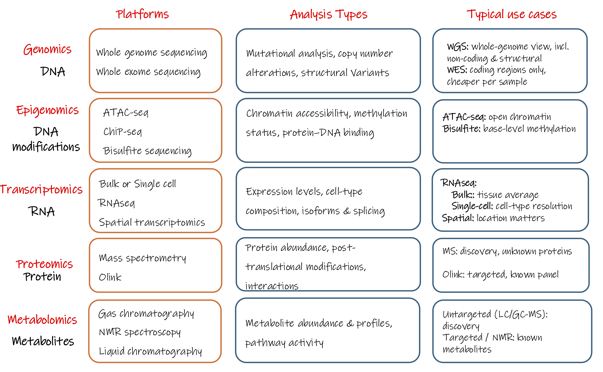
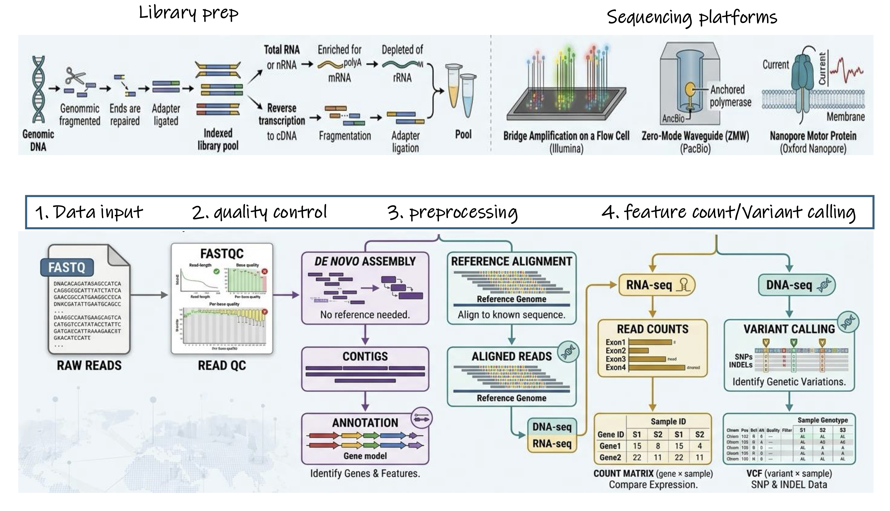

# Choosing the Right Platform

The first design decision in Module 2 is which platform to run at all,
because that choice fixes everything that follows.

The chain is short and it runs one way only:

> **research question → biological molecule → measurement platform → data type**

Each decision constrains the next. Once samples are collected on a particular
platform, you cannot move back up the chain without collecting new data.

---

### Start from the molecule

Different biological molecules require different measurement technologies. DNA
and RNA can be sequenced directly, whereas proteins and metabolites generally
cannot and are instead measured using approaches such as mass spectrometry or
affinity-based assays. The molecule determines the platform, not the other way
around.

The figure below maps each biological layer to the molecule it targets, the
current platforms available to measure it, examples of analyses each enables,
and in the final column when you would choose one platform over another within
the same layer.

{width=100%}

Read the figure left to right, but note that the rightmost column is where the
design decision actually lives. The same pattern recurs down every row: the
choice is almost always **discovery versus targeted** (can the platform see
things you didn't specify in advance?) or **resolution versus average** (does it
resolve individual cells or locations, or only their pooled signal?).

!!! tip "The question chooses the layer; the layer chooses the platform"
    As in Module 1, the research question should decide which layer of biology
    you measure, not the other way around. A platform adopted because it is
    current, then pointed at a question it does not fit, is one of the most
    common and most expensive versions of this pitfall.
---

### Two families of platform

Current omics platforms fall into two broad families, distinguished by how the
instrument measures the biological signal.

**Sequencing-based platforms** determine the nucleotide sequence of DNA or RNA
molecules, and typically yield **reads**, which are processed downstream into
the data types you will work with. RNA-seq, single-cell RNA-seq, ATAC-seq, and
microbiome sequencing all sit here.

**Signal-based platforms** measure a physical signal instead fluorescence, or
ion abundance and typically yield **intensities**. Mass spectrometry
(proteomics, metabolomics), microarrays, and imaging-based assays sit here.

The two families generate data in different ways. The next two
sections walk through each sequencing first, then mass spectrometry, so the
kind of number each produces makes sense before you rely on it.

!!! note "Discovery is a design choice, not a family"
    Sequencing platforms are often used for discovery, and many signal-based
    platforms measure predefined targets but the two don't always line up.
    Untargeted mass spectrometry can also support broad discovery, while
    targeted sequencing panels interrogate only pre-selected regions. Whether an
    assay is discovery-driven or targeted is set during study design, not by
    whether it sequences.

!!! info "Spatial omics sits across both families"
    Spatial transcriptomics is a useful test of the framing above, because which
    family a platform belongs to determines the measurement it produces. Visium
    captures RNA by **sequencing barcoded spots** on a tissue section and
    produces count data. **Imaging-based platforms** such as Xenium and MERFISH
    detect fluorescently labelled RNA directly within intact tissue; although
    fluorescence intensities are measured during acquisition, the pipelines
    typically decode these into transcript counts per cell. The biology being
    measured is similar; the measurement process, and therefore the data type,
    is not.

### Live Activity

***[Click here to join the activity](https://www.menti.com/aluadu62pnrb)***

---

# 2.2 Sequencing: from sample to reads

Sequencing takes extracted DNA or RNA, prepares it into a form the instrument
can read, and reports the nucleotide sequence of millions of fragments. The
output is **reads** the raw sequences coming off the machine, before any
analysis. Everything below is fixed before those reads exist, and the chain
runs one way only.

{width=100%}

<small>First row stops at raw reads. Everything to the right of that quality
control, alignment or assembly, and the count matrix or VCF is downstream
analysis. It is shown here only so you can see
where the reads go next.</small>

Two upstream decisions do most of the design work: what you capture in library
prep, and the read length the platform gives you.

### Library prep decides what you capture

Library prep turns extracted nucleic acid into barcoded, sequenceable
fragments. What you choose to enrich for at this stage sets the ceiling on what
the reads can contain. Sequencing total RNA, mRNA, or small RNA are different
libraries answering different questions; a library built for mRNA cannot be
made to report small RNAs later. As with platform choice, the question decides
the library, not the other way around.

Barcoding at this stage is **multiplexing, not pooling**: barcoded samples
share one sequencing run but stay computationally separable afterwards, unlike
biological pooling, which merges samples irreversibly (Module 1, Pitfall 8).

### Short-read sequencing vs Long-read sequencing

**Short-read sequencing** (e.g. Illumina) reads fragments of roughly 50–300
bases. It is cheap, high-throughput, and highly accurate per base, which makes
it the default for quantifying known features such as gene expression across
many samples. Its limitation is structural: anything longer than a single
fragment has to be reconstructed computationally, and some things cannot be
reconstructed reliably at all.

**Long-read sequencing** (e.g. PacBio, Oxford Nanopore) produces single reads
spanning thousands of bases. Because a read can cover a whole molecule, long
reads resolve full-length isoforms, structural variants, and repetitive regions
directly, rather than inferring them. The trade-off is higher cost per base and
lower throughput; modern long-read platforms are now fairly accurate per read.

The decision follows from the question, not the budget: if you need to see
full-length molecules or structural features, no amount of short-read depth
substitutes for read length. If you are quantifying known features cheaply and
at scale, short reads are the better fit. This is a read-length limit, not a
coverage one, which is why it cannot be fixed after sequencing.

!!! danger "The unrecoverable rule"
    If the platform cannot capture the biological signal of interest, no
    analysis method can recover it. The choice has to be made before data
    collection, not revisited after. This is why platform and read-length choice
    sit in study design, alongside sample size and randomisation, not in
    analysis.

---

# 2.3 Mass spectrometry: from sample to spectrum

Proteins and metabolites cannot be sequenced there is no equivalent of
reading off a nucleotide order. They are measured instead by mass
spectrometry. Mass spectrometry measures charged molecules according to their mass-to-charge ratio (m/z) and records their signal intensity. The output is
**intensities** a continuous signal.

The chain runs one way, exactly as it did for sequencing, and it ends at the
spectrum:
> Proteomics
> **extract → prepare → separate (LC) → ionise → mass spectrometer → spectrum**

{width=100%}

<small>*Source: adapted from [csbiology.github.io Mass spectrometry-based proteomics](https://csbiology.github.io/BIO-BTE-06-L-7/NB02a_Mass_spectrometry_based_proteomics.html){target="_blank"}*</small>

Reading left to right: proteins are extracted and **digested into peptides**
the defining step, and the one thing that makes this workflow look different
from sequencing. The peptides are separated over time by liquid chromatography
(LC) so they don't all hit the instrument at once, sprayed into the mass
spectrometer as charged ions, and weighed. What comes back is a spectrum:
intensity on one axis, m/z on the other.

!!! note "Metabolomics takes the same path, minus one step"
    Metabolites are small molecules and are measured directly, there is no
    digestion step. Everything downstream of extraction is the same: separate,
    ionise, weigh, read out as intensities.

Two decisions inside this chain do most of the work, and neither is a step you
can see in the figure, each is a *mode* the same step can be run in. Both are
fixed before the run, and one of them cannot be undone afterwards.

### Decision 1: label-free or labelled

How samples are quantified against each other is chosen at the bench, not in
analysis.

**Label-free** runs each sample separately and compares signal across runs. It
is cheap, places no fixed limit on sample number, and is often attractive for
larger studies but because samples are measured in different runs, run-to-run
variation and a greater potential for missing measurements across runs are
important considerations. This is where **injection order** matters: instrument
signal drifts over a run, so if samples are injected in an order that lines up
with your biological groups, the drift becomes a batch effect indistinguishable
from biology, the same failure you saw in Module 1, Pitfall 4, in a new guise.
Randomise injection order, and plan **pooled QC** injections to track the drift.
Pooled QC has to be prepared *before* the run; if it was never included, no
later analysis can reconstruct it (Module 1, Pitfall 6).

**Labelled** (e.g. TMT) chemically tags several samples so they can be combined
and measured in a single run. Run-to-run variation is reduced *within* a tagged
set because the samples are measured together, but the number of samples per
set is capped, and each set then becomes its own batch to balance across.
Labelling buys within-set consistency at the cost of throughput and a new layer
of batch structure to design around.

!!! tip "This is the power/cost trade-off, on the bench"
    Label-free maximises sample number for the budget; labelled maximises
    consistency within a set. Neither is correct in the abstract, the right
    choice follows from whether your study is limited more by sample number or
    by run-to-run noise.

### Decision 2: the acquisition mode you cannot revisit

Once ions are inside the instrument, the **acquisition mode** determines how
they are sampled and which are selected for detailed measurement. This is the
mass-spectrometry equivalent of read length: set at acquisition, and
unrecoverable afterwards.

**DDA (data-dependent acquisition)** takes a survey scan and then selects and
fragments a subset of precursor ions, typically favouring the most abundant ions
it sees. This produces relatively less complex MS/MS spectra but by
construction it spends its effort on what is already abundant. Low-abundance
peptides may be sampled sporadically or missed entirely, and which ones are
selected can shift from run to run.

**DIA (data-independent acquisition)** fragments ions across predefined m/z
windows, rather than selecting individual precursors by abundance. This provides
more reproducible sampling across runs, at the cost of more complex, multiplexed
spectra.

!!! danger "The unrecoverable rule"
    The acquisition mode determines how ions are sampled and acquired. A peptide
    that was never selected for acquisition leaves no fragmentation evidence in
    that run, not detected is not the same as not present, but no downstream
    method can recover a signal that was never acquired. This is the same
    principle Module 1 named for platform choice (Pitfall 2), now at the level
    of the instrument.

This is also where a fact from Module 1 finally has its mechanism. Missingness
in mass spectrometry is often informative, not random: a low-abundance molecule
is more likely to fall below the detection threshold, so a missing value can
reflect low abundance rather than absence. DDA's tendency to favour abundant
ions is one contributor to this pattern. That is why, as Module 1, Pitfall 6
warned, filling a missing value with the sample mean is the wrong instinct: it
can turn a potentially low-abundance observation into an average-abundance value
and distort exactly the low-abundance molecules a discovery study is trying to
find. The design decision here sets the shape of the missingness you will have
to reason about later.