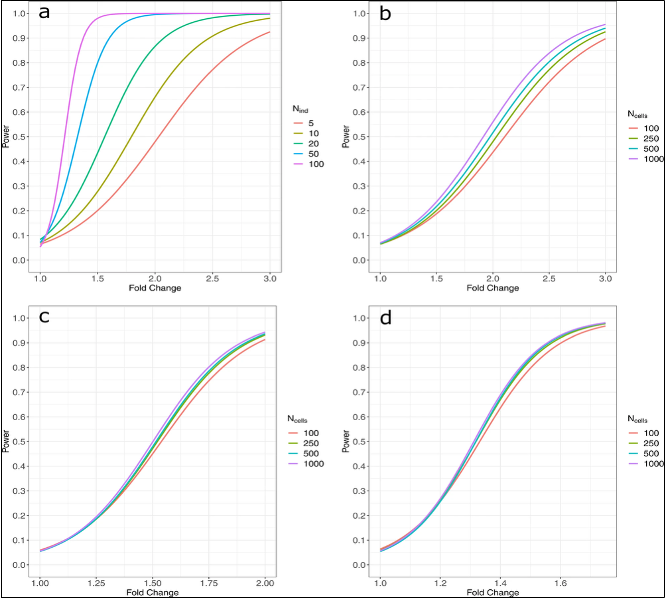

# Module 2.3: Sample size, power, and sequencing depth

<!-- MERGE NOTE (delete before publishing):
     This file merges old Module 3.3 (sample size / depth trap) with the
     depth-detection content from old Module 2.2. Scope is sequencing only:
     metabolomics, methylation, and non-sequencing MS content removed.

     NUMBERING: promoting this to 2.3 pushes zeros -> 2.4, compositionality
     -> 2.5, classical stats -> 2.6. Update every internal "Section 3/4"
     pointer and the "Module 2: Summary" block accordingly.

     FIGURE PATHS: three assets migrate from Figures_module3/ into this
     Module 2 file. Consolidate into one figs folder before publishing. -->

!!! info "Learning objectives"
    By the end of this section, participants should be able to:

    - Explain why omics studies are so often underpowered
    - Identify what actually drives the sample size a study needs: effect
      size, biological variability, and the multiple-testing burden

## 1. Why omics studies end up underpowered

Sample size in omics is rarely set by a power calculation. It is set by budget, sample availability, or sequencing capacity, and the number is often decided before anyone asks what it takes to detect the effect of interest. The result is a study that is well executed at the bench but underpowered on paper. This does not announce itself during analysis. It shows up later, when the findings fail to replicate in a second cohort or on a second platform.

### Why classical power calculations don't translate

Standard power calculations assume a single hypothesis, an approximately known variance, and a 0.05 threshold. None of those hold cleanly in omics.

Thousands to millions of features are tested at once. Variance differs from feature to feature and is usually not known in advance. Multiple-testing correction then lowers the effective significance threshold for every feature.

The practical consequence is that "powered for one feature" is not "powered for the dataset." A study with *n* = 6 per group may recover a reasonable number of signals before correction, and far fewer once false discovery rate (FDR) adjustment is applied.

---

## 2. What determines the sample size you need

Two things dominate, and neither is the number most people reach for first.

**Effect size and biological variability.** Even when the effect size is fixed, more variable biology needs more samples to reach the same power. Variability, not effect size alone, is usually what sinks a small study.

**The multiple-testing burden.** In omics this sits on top of everything else. Because every feature is corrected against every other (FDR, usually the Benjamini–Hochberg method), each individual feature has to clear a higher bar than a single-hypothesis study would face.

{width=90%}

<small>
Ref: Wagner & Kleiner. *Nature Communications* 16, 7263 (2025).
[doi:10.1038/s41467-025-62616-x](https://www.nature.com/articles/s41467-025-62616-x){target="_blank"}
(CC BY-NC-ND 4.0)
</small>

---

## 3. Estimating it in practice

Because closed-form calculations don't fit, empirical approaches are generally more informative.

**Pilot-data simulation.** Estimate the count distribution from a small dataset, then simulate the full analysis across a range of sample sizes. This carries realistic measurement noise through the estimate instead of assuming a variance you don't have.

**Learning from large replication studies.** Big benchmarking studies give direct evidence of how sample size affects detection and reproducibility. Several have shown that *n* = 3 per group misses a large fraction of true differential expression.

Neither is perfect. A pilot may not represent the full study population, and published benchmarks are often specific to one platform or tissue. Both are still more informative than a simplified analytical assumption.

---

## 4. Practical lower bounds

These are not rules, but useful floors below which reproducibility tends to break down.

!!! info "Indicative sample size ranges (sequencing)"

    **Bulk RNA-seq (differential expression)**
    - *n* ≥ 6 per group: workable minimum for moderate to large effects
    - *n* ≥ 12 per group: more appropriate when smaller changes matter

    **Single-cell RNA-seq**
    - *n* = number of **donors** per condition, not number of cells
    - See Section 6 for why cells do not count toward power

    <small>
    Schurch et al. *RNA* 2016.
    [PMC4878611](https://pmc.ncbi.nlm.nih.gov/articles/PMC4878611/){target="_blank"}
    </small>

---

## 5. Depth vs replication: two jobs, one budget

This is the pivot of the whole section, and it is where the depth question usually gets answered wrong.

Sequencing depth does **two different jobs**, and conflating them is the mistake.

### What depth does: detection

Depth is a measurement budget spent *within* a sample. A sequencer cannot count every molecule; it reads a subset of fragments and stops at a target depth. Each feature's count is therefore a share of whatever total was generated for that sample.

At shallow depth, low-abundance features drop in and out of detection across samples, not because their expression changed but because the sampling was too sparse to catch them reliably. Increase the depth and they reappear. The biology didn't change; the measurement improved.

{width=100%}

<small>At a total of 10 reads, a gene at 1% true abundance receives zero reads and is invisible. Another at 5% receives a single read, technically detectable but statistically unreliable; a replicate might return zero. At 1,000 reads, the same proportions produce reliable counts for both. **The biology did not change between the two panels. The budget did.**</small>

So depth sets a floor on **what is visible at all**. It is determined by the abundance of the least-expressed feature you need to detect reliably, not chosen arbitrarily.

!!! tip "Activity"
    Head to the webR page, tab **Count & Depth** → *Multigene Detection*.

### What replication does: power

Here is the part depth cannot do. Increasing depth improves precision *within* a sample. It does nothing about the variability *between* samples, and between-sample variability is what statistical power is made of.

Adding reads to the same six libraries measures those six biological units more precisely. It does not add biological units. Power in most omics studies is driven by the number of independent biological replicates, full stop.

> **Practical rule:** Under a fixed budget, more biological replicates usually buy more power than more reads per sample.

<small>
Liu Y, et al. *Bioinformatics* 2014; 30(3): 301–304.
[doi:10.1093/bioinformatics/btt688](https://academic.oup.com/bioinformatics/article/30/3/301/228651){target="_blank"}
</small>

!!! info "Activity"
    Head to the webR page, tab **Count & Depth** → *Apparent FC vs True FC*.

!!! note "Depth as a confounder is a different problem"
    Depth also matters when it lines up with your biological groups, e.g. one condition consistently sequenced shallower than the other. That is a confounding failure, not a sample-size one, and it is covered in **Module 3: Randomisation**.

---

## 6. When depth genuinely is the limit

The rule above is for discovery studies comparing groups. There are cases where the question is not "is this feature different" but "can I see this feature at all," and there depth is exactly the right lever.

- **Low-abundance transcript detection.** If a feature is never detected, more replicates don't help. It has to be measurable first. This is the direct continuation of the detection mechanism in Section 5.

- **Somatic variant detection in tumour samples.** Calling low-frequency variants (roughly 1–5% allele fraction) needs high coverage to separate signal from sequencing noise.

{width=90%}

- **Rare cell populations in single-cell studies.** Very rare populations may need deeper sequencing or targeted enrichment.

In each case the issue is observability, not classical power. Targeted approaches (enrichment, panel-based sequencing) are often more efficient than deepening the whole dataset.

??? info "scRNA-seq: donors vs cells per sample"
    In single-cell RNA-seq the sequencing budget is shared across all genes in *each individual cell*, and the per-cell budget is small, which is why the count matrix is so sparse. That sparsity is a resolution property, not a replication one.

    Statistical replication happens at the **donor** level, not the cell level. More cells per donor improve resolution; they do not add independent biological observations.

    - *n* = number of donors per condition
    - Cell numbers affect resolution, not power

    Moving from 5 to 20 donors substantially increases power, because each donor is new biological information. Going from 25 to 500 cells per donor barely moves it.

    {width=90%}

    <small>
    Zimmerman K, et al. *Nature Communications* (2021)
    [doi:10.1038/s41467-021-21038-1](https://www.nature.com/articles/s41467-021-21038-1){target="_blank"}
    </small>

    The *analysis* fix that matches this design (pseudobulk aggregation) is covered in **Module 3: Replication**.

---

### Sample size in multi-omics studies

In multi-omics studies, sample size cannot be optimised independently for each platform. A single sample size must support all datasets. You cannot `borrow` extra samples for one platform without affecting the others. In practice, this usually means designing around the platform with the weakest statistical power.

The figure below (Tarazona et al., 2020) makes this concrete. Using a conservative dispersion estimate (75th percentile of pooled standard deviation), the MultiPower tool identifies n = 16 per group as the jointly optimal sample size across platforms in a real multi-omics study. Panels D and E show both that this target is achievable and that the recommendation holds up across the range of variability observed in the data. 

{width=90%}

## 7. Key takeaways

- Sample size is usually set by budget, not by power. Underpowering is invisible until findings fail to replicate.
- What you need is driven by **effect size, biological variability, and the multiple-testing burden**, not by intuition about "enough" samples.
- Empirical estimates (pilot simulation, replication benchmarks) beat classical power calculations for this kind of data.
- **Depth buys detection; replication buys power.** Depth sets what is visible within a sample. Only more biological replicates reduce between-sample uncertainty.
- Under a fixed budget, prioritise replication, unless the question is observability itself (rare transcripts, low-frequency variants, rare cell types), where depth is the correct lever.

---

### Further reading

??? abstract "Power estimation in omics"

    Schurch NJ et al. *RNA* 2016
    [PMC4878611](https://pmc.ncbi.nlm.nih.gov/articles/PMC4878611/){target="_blank"}

    Liu Y et al. *Bioinformatics* 2014
    [doi:10.1093/bioinformatics/btt688](https://academic.oup.com/bioinformatics/article/30/3/301/228651){target="_blank"}

    Zimmerman K et al. *Nature Communications* 2021
    [doi:10.1038/s41467-021-21038-1](https://www.nature.com/articles/s41467-021-21038-1){target="_blank"}