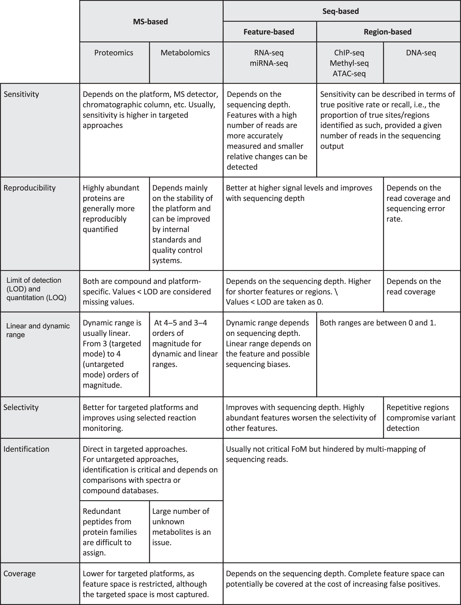

## Guidance and scanerio how to avoid underpower in study

<-  TRACK BACK TO PITFALL 3- under powered studies  -> 

!!! info "Learning objectives"
    By the end of this section, participants should be able to:

    - How effect size influence the sample size 
    - Work through the trade off between sample size and sequencing depth under a fixed budget
    - Describe how measurement depth influences feature (Genes/Taxa) detection and the appearance of zeros or missing values.
    - Recognise the relatively narrow situations where increasing depth is biologically justified

In practice, sample size in omics studies is rarely determined by a formal power calculation. More often, it is constrained by practical limits such as budget, sample availability, or sequencing capacity. As a result, many studies are technically well executed but statistically underpowered. This may not be obvious during analysis and often only becomes apparent later, when findings do not replicate across cohorts or platforms.

---

### Why classical power calculations do not translate well to omics

Most standard power calculations assume a single hypothesis, an approximately known variance, and a significance threshold of 0.05. That framework does not translate cleanly to omics data.

In omics studies, thousands to millions of features (e.g. genes/proteins) are tested simultaneously. Variance differs across features and is usually not well characterised in advance. Multiple testing correction further reduces the effective significance threshold.

The practical consequence is that a study appearing adequately powered for a single feature (Gene/Taxa/Protein) is not necessarily well powered across the full dataset. For example, *n* = 6 per group may recover a reasonable number of signals before correction, but after false discovery rate (FDR) adjustment, the number of statistically significant features can decline substantially.

---

### What tends to work better in practice

Because of these limitations, empirical approaches are generally more informative than closed form calculations.

**Pilot-data simulation** is one common strategy. Count distributions are estimated from a small dataset, and the full analysis is simulated across different sample sizes. This preserves realistic measurement noise instead of relying on simplified variance assumptions. Tools such as `RNASeqPower` and `PROPER` are commonly used for RNAseq.

Another useful approach is to investigate and conclude from **large replication studies**. These provide direct evidence of how sample size affects detection and reproducibility. Several studies, for example, have shown that *n* = 3 per group misses a substantial proportion of true differential expression signals.

Neither approach is perfect. Pilot datasets may not capture the full study population, and published benchmarks are often platform or tissuecspecific. Even so, both are usually more informative than relying on simplified analytical assumptions.

---

### Effect size and biological variability 
Even when **effect sizes** are similar, higher **biological variability** substantially increases the number of samples required to achieve the same power. In omics, this is compounded by multiple testing (FDR, usually BH method), which makes it harder for any individual feature to reach statistical significance.

{width=90%}

<small>
Ref: Wagner & Kleiner. *Nature Communications* 16, 7263 (2025).  
[doi:10.1038/s41467-025-62616-x](https://www.nature.com/articles/s41467-025-62616-x){target="_blank"}  
(CC BY-NC-ND 4.0)
</small>

---

### Practical lower bounds across platforms

These are not strict rules, but there are useful lower bounds below which reproducibility often becomes difficult.

!!! info "Indicative sample size ranges across platforms"

    **Bulk RNA-seq (differential expression)**  
    *n* = 3 per condition remains common in the literature but is rarely sufficient for stable inference. It can detect large effects, but feature lists often vary substantially between analyses.  
    - *n* ≥ 6 per group: workable minimum for moderate to large effects  
    - *n* ≥ 12 per group: more appropriate when smaller changes are biologically important  

    **Proteomics (label-free MS)**  
    Missing values are a major issue. Many proteins are not detected in every sample, effectively reducing usable sample size.  
    - *n* ≥ 5–8 per group: practical lower bound  
    - Higher *n* is often needed for low abundance or highly variable proteins  

    **Metabolomics**  
    Metabolite profiles are often highly sensitive to environmental and physiological variation, resulting in greater between sample variability. For example, two individuals with the same genetic background can show very different blood metabolite levels if one has fasted overnight while the other has just eaten a high fat meal, or if samples are collected at different times of day.   

    - *n* < 20 per group: high risk of unstable results  
    - Larger cohorts are typically required for robust biomarker studies  

    <small>
    Schurch et al. *RNA* 2016.  
    [PMC4878611](https://pmc.ncbi.nlm.nih.gov/articles/PMC4878611/){target="_blank"}

    Atwal et al. *Nature Communications* 2025.  
    [doi:10.1038/s41467-025-65022-5](https://www.nature.com/articles/s41467-025-65022-5){target="_blank"}

    Cochran et al. *TrAC Trends in Analytical Chemistry* 2024.  
    [doi:10.1016/j.trac.2024.117749](https://www.sciencedirect.com/science/article/pii/S0165993624004011){target="_blank"}
    </small>

These differences reflect genuine differences in how platforms behave, including dynamic range, missingness, and technical variability.

{width=90%}

<small>
Ref: Tarazona S, et al. *Nature Communications* 11, 3092 (2020).  
[doi:10.1038/s41467-020-16937-8](https://www.nature.com/articles/s41467-020-16937-8){target="_blank"}  
(CC BY 4.0)
</small>

___ 

### Sample size in multi-omics studies

In multi-omics studies, sample size cannot be optimised independently for each platform. A single sample size must support all datasets. You cannot `borrow` extra samples for one platform without affecting the others. In practice, this usually means designing around the platform with the weakest statistical power.

The figure below (Tarazona et al., 2020) makes this concrete. Using a conservative dispersion estimate (75th percentile of pooled standard deviation), the MultiPower tool identifies n = 16 per group as the jointly optimal sample size across platforms in a real multi-omics study. Panels D and E show both that this target is achievable and that the recommendation holds up across the range of variability observed in the data. 

{width=90%}
---

### The sequencing depth trap

A common question is whether deeper sequencing can compensate for limited sample size. This is appealing when additional recruitment is not feasible, but in most discovery-oriented studies it does not solve the underlying problem.

Increasing sequencing depth improves measurement precision within a sample, but it does not reduce uncertainty arising from biological variability between samples. Statistical power in most omics studies is therefore driven primarily by the number of independent biological replicates.

> **Practical rule:** Under a fixed budget, prioritising biological replication usually provides a greater gain in power than increasing sequencing depth.

<small>
Liu Y, et al. *Bioinformatics* 2014; 30(3): 301–304.  
[doi:10.1093/bioinformatics/btt688](https://academic.oup.com/bioinformatics/article/30/3/301/228651){target="_blank"}
</small>

---

### When increasing depth does make sense

There are situations where sequencing depth is genuinely limiting.

- **Low-abundance transcript detection**  
  If a feature is not detected at all, additional replication does not help. The feature must first be measurable.

- **Somatic variant detection in tumour samples**  
  Detecting low-frequency variants (approximately 1–5% allele fraction) requires high coverage to separate signal from sequencing noise.

{width=90%}

- **Rare cell populations in single-cell studies**  
  Very rare populations may require deeper sequencing or targeted enrichment, depending on the biological question.

In these cases, the issue is not classical statistical power but whether the signal is observable at all. Targeted approaches (e.g. enrichment or panel-based sequencing) are often more efficient than increasing sequencing depth across the entire dataset.

---

??? info "scRNA-seq: number of donors vs number of cells per sample"
    Statistical replication occurs at the donor level, not the cell level. Increasing the number of cells per donor improves resolution, but does not increase the number of independent observations.

    - *n* = number of donors per condition  
    - Cell numbers primarily affect resolution, not statistical power  

    Moving from 5 to 20 donors substantially increases power because each donor contributes new biological information. By contrast, increasing cells per donor from 25 to 500 has relatively little impact on power.

    {width=90%}

    <small>
    Zimmerman K, et al. *Nature Communications* (2021)  
    [doi link](https://www.nature.com/articles/s41467-021-21038-1){target="_blank"}
    </small>

## What the numbers in your data actually represent

By the time omics data reaches you as an analyst, it has already been through substantial processing. Raw sequence reads have been assembled into a continuous sequence or aligned to a reference assembly and summarised. Mass spectrometry signals have been detected and quantified. What you're working with in many cases, is often a **count matrix** or **abundance matrix**. 

In most everyday measurements, numbers are absolute. A patient who weighs 80 kg weighs 80 kg regardless of who else is in the room or how many measurements were taken that day. The value stands on its own. 

Omics data do not behave this way. ***Omics data reflect sampling, not absolute quantity***

Most omics platforms operate under a finite measurement budget, such as a fixed number of reads in sequencing, a fixed ion signal capacity in mass spectrometry, a bounded fluorescence range in arrays. 

As a result, **the count/abundance measured for any feature is relative rather than absolute**. Features effectively compete for a share of the total measurement capacity. Consequently, an increase in one feature can alter the observed abundance of other features, even if their true biological abundance has not changed.

{width=95%}

Each platform has its own version of the same core problem, and its own specific failure modes on top of that. Summarised:

| Platform | Data type | Core problem | Key additional challenge |
|---|---|---|---|
| Bulk RNA-seq | Integer counts | Depth variation | Gene length bias; sampling zeros |
| Single-cell RNA-seq | UMI counts | Depth per cell | Cells ≠ replicates; dropout |
| Proteomics / metabolomics | Continuous intensity | Ion signal variation | MNAR missing values; detection bias |
| Microbiome (16S / shotgun) | Sequencing counts | Compositionality | Contamination in low biomass samples |
| Methylation arrays | Beta values [0–1] | Cell composition | Beta vs M-value; heteroscedasticity |

In mass spectrometry, a sample with lower overall ion signal, from loading
variation, concentration differences, or ionisation efficiency changes
between runs, will appear to have lower abundance across all detected
features. Not because concentrations changed, but because less material
reached the instrument. Whether the currency is reads, UMIs, or ion counts,
the logic is the same: the observed value reflects a share of a total that
varies between samples, not an absolute molecular quantity.

**There is no universal normalisation or statistical method that works across all of these** (Covered in module 4). Applying RNAseq tools and algorithms to proteomics data, or standard differential tests to microbiome data produces wrong results.

## Depth affects detection
Consider the mechanism of gene expression: When a cell expresses a gene, it produces RNA molecules. Some genes are highly active and produce thousands of copies. Others are expressed at very low levels, producing only a handful. This variation in expression level is real biology, it is what makes  a liver cell different from a neuron, and a normal healthy cell different from a cancerous one.

The challenge we face in working with omics data is that our data generation platforms (e.g. sequencers) cannot count every RNA molecule in a sample. Instead it reads a subset of fragments and stops when it reaches a target depth. Each gene's count is therefore a proportion of whatever total happened to be generated for that sample. At shallow sequencing depth, low-abundance genes drop in and out of detection across samples not because their expression changed, 
but because the sampling was too sparse to capture them reliably. Increasing depth often makes these genes reappear. The biology hasn't changed, the measurement has simply improved.

{width=100%}

<small>The figure above illustrates this directly. At total 10 reads, a gene present at
1% true abundance receives zero reads and is invisible to the analysis. Another
gene at 5% receives just one read, technically detectable, but statistically
unreliable. A single read cannot be distinguished from noise; in a replicate
experiment, the same gene might receive zero reads entirely, producing a zero
despite genuine expression. At 1,000 reads, the same biological proportions
produce reliable counts for both genes. **The biology did not change between
the two panels. The budget did.** </small>

This has a direct implication for study design: sequencing depth is not an
arbitrary parameter. It is determined by the abundance of the least expressed
feature that needs to be detected reliably. Underpowered depth does not simply
add noise, it converts lowly expressed features into zeros, creating missing
data with a specific technical origin. This is explored in detail in Section 3.

!!! tip "Activity"
     ***Head to webR page and check out Tab** count & Depth [Play with `View` Multigene Detection ]

#### Depth variation is systematic, not random

In practice, samples within the same experiment routinely vary in total library
size by **2-fold or more**, even with identical input material and careful
handling. Sources include variation in RNA quality and extraction yield,
differences in library preparation efficiency between batches, multiplexing
imbalances across sequencing lanes, and stochastic variation inherent to
sequencing itself.

This variation is technical, not biological. But it does not always distribute
randomly across experimental groups. **When one tissue type consistently yields
lower RNA quality, or when a sequencing run fails partially for one batch,
depth variation becomes correlated with the biological variable of interest.**
At that point it is no longer just noise: **it becomes a systematic confounder
that mimics or masks biological signal.**

!!! danger "Recoverable vs unrecoverable"
    Depth variation distributed randomly across conditions can largely be corrected by normalisation. Depth variation that correlates with biological groups cannot be corrected. It is confounded with the signal of interest and cannot be separated from it analytically. This is a design failure, not an analysis problem. It is discussed in module 3. 

!!! info "Activity: when depth confounds differential expression"
     ***Head to webR page and check out Tab** count & Depth [Play with `View` Apparent FC vs True FC ]

## The same constraint across platforms
The finite measurement budget appears in different forms across all major omics platforms. The currency (reads, Fluorescence/Peak intensities, ion counts) changes; the underlying constraint does not.

#### Single-cell sequencing data

 In bulk RNA-seq, the sequencing budget is shared across all genes in a
sample. In single-cell RNAseq, it is shared across all genes in **each
individual cell** and the per cell budget is far smaller.

Standard 10x Chromium protocols capture approximately [10–30% of transcripts per cell](https://kb.10xgenomics.com/s/article/360001539051-What-fraction-of-mRNA-transcripts-are-captured-per-cell){target="_blank"}. Most RNA molecules are lost before sequencing begins. A gene
expressed at low levels in a cell may produce zero counts not because it is
off, but because none of its transcripts were captured. The result is a count
matrix with zero entries in more than 90% of gene cell combinations, a
direct consequence of the per cell sequencing budget, not a failure of data
quality.

A cell that was captured poorly will have more zeros than a cell of equivalent biology that was captured efficiently.

!!! info "Types of zeros (Sparsity)"
    This property, is covered in detail in **Section 3 of this module**.

!!! warning "Cells are not biological replicates"
    Cells from the same individual share a common genetic background, cellular
    environment, and processing history. They are subsamples of a donor, not
    independent biological observations. The consequences of treating cells as
    independent replicates are covered in **Module 3: Experimental Design
    Fundamentals**.

#### Proteomics and metabolomics abundance data

Mass spectrometry detects ions and measures signal intensity. The budget here is **total ion signal**: a sample run at lower
concentration, or with different ionisation efficiency between runs, will show lower apparent signal across all detected features, not because concentrations
changed, but because less material was detected.

Missing values in label free proteomics are not distributed the way zeros are in RNAseq. A protein is absent from a sample not because its biology changed
but because its signal fell below the instrument's detection threshold, a pattern called **Missing Not At Random (MNAR)**. This means the features most
likely to be missing are systematically the least abundant, precisely the features that can be most biologically relevant in discovery experiments.
Imputation strategies that assume random missingness are not appropriate here. 

#### 16S amplicon sequencing and metagenomics

In microbiome data, sequencing reads are shared across all taxa present in a
sample. Rare taxa, those making up a small fraction of the community, face
the same underdetection risk as lowly expressed genes in RNAseq: at typical
depths, they may produce zero counts by chance even when genuinely present.

Microbiome data carries an additional structural property beyond this detection
problem: because only relative proportions are measured, a genuine biological
change in one taxon alters the apparent abundance of all others, even those
that did not change. This property, **compositionality** is distinct from
the depth problem and is covered in detail in **Section 4 of this module**.

#### Methylation arrays

Methylation arrays measure a ratio of probe intensities rather than a count
or raw intensity, and their detection properties differ from the other
platforms. Zeros in methylation data, beta values of 0 are biologically
meaningful (a fully unmethylated CpG site), not detection artefacts.

The primary technical challenge in methylation data is not missing values or
depth but **cellular composition**: different cell types carry systematically
different methylation profiles. **A sample with different proportions of cell
types will look globally shifted relative to another**, even if the biology of
each individual cell type is identical.  

### Further reading

??? abstract "Power estimation in omics"

    Schurch NJ et al. *RNA* 2016  
    [PMC4878611](https://pmc.ncbi.nlm.nih.gov/articles/PMC4878611/){target="_blank"}

    Tarazona S et al. *Nature Communications* 2020  
    [doi:10.1038/s41467-020-16937-8](https://www.nature.com/articles/s41467-020-16937-8){target="_blank"}

    Atwal S et al. *Nature Communications* 2025  
    [doi:10.1038/s41467-025-65022-5](https://www.nature.com/articles/s41467-025-65022-5){target="_blank"}

    Liu Y et al. *Bioinformatics* 2014  
    [doi:10.1093/bioinformatics/btt688](https://academic.oup.com/bioinformatics/article/30/3/301/228651){target="_blank"}

