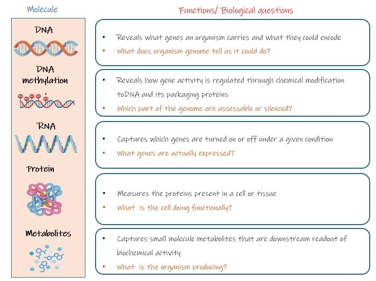

# The omics landscape

!!! info "Learning objectives"
    By the end of this section, participants will be able to:  
    - Match a biological question to the most suitable molecular layer, and identify what each layer can and cannot tell you.

**[Tell us about your study datatyp here](https://www.menti.com/alocqhrd8oet)**  or go to [mentimeter.com](https://mentimeter.com) and enter code **1234 567**

Modern biology has undergone a fundamental shift from measuring one 
biological molecule at a time to profiling entire classes of biological 
molecules simultaneously. This lets us ask questions not just about 
individual genes, proteins, or metabolites, but about the state of a 
whole biological system, a tumour, a leaf under drought, a gut 
microbial community, at the molecular level.

Every living system, whether a bacterium, a migratory bird, or a 
human, can be interrogated across multiple molecular layers, and each 
layer reveals a different dimension of how the system works. **The 
choice of which layer to investigate, and often *which combination* 
of layers, is one of the most consequential decisions a researcher 
makes before an experiment begins.**

## From DNA to metabolite

Most biological questions can be investigated at multiple molecular 
layers. Each layer provides a different type of biological information 
and therefore answers a different version of the same question. The 
layers are connected by the central dogma and its regulation: DNA is 
packaged and made accessible (or not), accessible genes are 
transcribed to RNA, RNA is translated to protein, and protein activity 
drives the metabolic reactions that keep a cell alive. Each layer has 
a blind spot the next layer can partly resolve.

The figure below shows how each layer sits within the broader molecular hierarchy of a cell. 

{width=100%}

To make this concrete, we will follow a single broad clinical 
question through every layer:

!!! question "The question we'll follow"
    **What is driving patient's heart failure?**

---

### Layer 1: DNA / Genome

**What it is:** the long-term genetic blueprint. DNA contains the 
instructions required to build and maintain cells. The complete set of DNA in an organism, every gene, every non-coding region, on every chromosome is called **Genome**. 

**Role in biology**

- Stores hereditary information
- Determines which genes an organism possesses
- Changes relatively little across a lifetime

**What this layer can answer**

- Which genes are present?
- Which mutations are present?
- How are individuals or species genetically related?

!!! warning "What the genome cannot tell us"
    Having a gene does not mean it is active. Two cells can share 
    identical DNA while performing completely different functions.

**Applying it to the heart failure question**

DNA of the patient's blood can identify inherited variants (mutations) 
in genes known to cause cardiomyopathy (type of heart failure), for example a truncating 
mutation in *TTN* (titin) or a missense variant in *MYH7* (beta myosin 
heavy chain).

- **What we learned:** the patient carries a pathogenic *TTN* mutation 
  associated with cardiomyopathy.
- **What we still don't know:** is that variant actually being 
  expressed and contributing to the patient's current disease?

---

### Layer 2: Epigenome 

**What it is:** chemical modifications to DNA and its associated 
histone proteins that determine how accessible different regions of 
the genome are. These modifications regulate gene activity without 
changing the underlying DNA sequence.

**Biological role**

- Acts as a regulatory layer determining which genes can be switched 
  on or off in different cell types and under different environmental 
  conditions
- Explains how genetically identical cells develop specialised 
  functions

**What this layer can answer**

- Which regions of the genome are accessible for transcription?
- Which genes are likely to be active or repressed?
- How do development, ageing, or environmental exposures alter gene 
  regulation?

!!! warning "Limitation"
    Epigenetic changes indicate regulatory *potential*, they do not 
    directly measure gene expression.

**Applying it to the heart failure question**

DNA sequence tells us which genes exist. The epigenome tells us which of those 
genes are accessible for transcription in this cell under these 
conditions. Profiling chromatin accessibility (ATAC-seq) or DNA 
methylation in cardiac tissue can reveal whether **stress-response** 
regions have opened up, and whether a **fetal gene programme** has 
been reactivated, a well described signature in failing hearts where 
genes normally silenced after birth become accessible again under 
sustained stress.

- **What we learned:** the fetal gene programme has become accessible 
  in the patient's failing myocardium.
- **What we still don't know:** are those accessible genes actually 
  being transcribed, and is the reactivation causing dysfunction or 
  compensating for it?

---

### Layer 3: RNA / Transcriptome

**What it is:** the subset of genes actively being transcribed.  
Where:  
- DNA = the instruction manual (genetic potential)   
- Epigenome = the regulatory layer controlling which instructions are available  
- RNA = the active messages showing which instructions are being used. 

The complete set of RNA molecules a cell is producing at a given moment, is called **transcriptome**.

**Role in biology**

- Carries genetic instructions from DNA
- Regulates gene expression
- Changes rapidly in response to the environment

**What this layer can answer**

- Which genes are active?
- Which pathways respond to disease or treatment?
- How do different cell types differ?

!!! warning "Limitation"
    RNA abundance does not always predict protein abundance.

**Applying it to the heart failure question**

Measurement of transcriptome of the failing myocardium moves us from *accessibility* to 
*observed activity*: we can now measure which genes are up or 
downregulated compared with a healthy heart, confirm whether the fetal 
gene programme flagged by the epigenome is actually being transcribed, 
and identify which signalling pathways (fibrosis, inflammation, 
hypertrophy) are engaged.

- **What we learned:** fetal genes are being actively transcribed, and 
  fibrosis and hypertrophy pathways are upregulated.
- **What we still don't know:** are those transcripts being translated 
  into functional protein, and are the resulting proteins correctly 
  localised and active?

---

### Layer 4: Proteins / Proteome

**What they are:** the functional molecules that perform most cellular 
work. Nearly every biological process depends on proteins. The **proteome** is the complete set of proteins present in a cell, tissue, or organism at a given time.

**Role**

- Catalyse reactions
- Form cellular structures
- Transmit signals
- Transport molecules
- Regulate gene expression

**What this layer can answer**

- Which proteins are present?
- Which proteins change in abundance?
- Which proteins have altered post-translational modifications 
  (e.g. phosphorylation)?

!!! warning "Limitation"
    Protein abundance alone does not indicate activity, proteins are 
    also regulated by localisation and post-translational modification.

**Applying it to the heart failure question**

Measurement of proteome of cardiac tissue or plasma tells us which proteins are 
actually present and in what state. This is where clinically 
actionable signals appear: changes such as increased BNP or troponin protein levels, abnormal protein location, or altered phosphorylation of heart muscle proteins that cannot be detected by transcriptomics alone. Protein level data can also reveal mismatches with the RNA picture, a 
transcript can be upregulated while the protein is degraded as fast as it's made, or the reverse.

- **What we learned:** BNP is upregulated, sarcomere proteins are 
  mislocalised, phosphorylation patterns on proteins involved in heart function are abnormal.
- **What we still don't know:** what those proteins are doing 
  biochemically, and how the heart's real time energetic state has 
  shifted.

---

### Layer 5: Metabolites / Metabolome

**What they are**: Small molecules that are produced, consumed, or modified during cellular metabolism. The **metabolome** is the complete set of these metabolites present in a cell, tissue, or organism at a given time.

**Role**  
metabolites provide the closest molecular snapshot of the 
cell's current physiological state.

**What this layer can answer**

- Which metabolic pathways are active?
- How has diet, disease, or treatment affected the organism?
- What is happening right now?

!!! warning "Limitation"
    Metabolites are highly dynamic and influenced by many external 
    factors, timing of collection matters enormously.

**Applying it to the heart failure question**

Measurement of metabolome gives us the failing heart's real-time biochemical state. 
A hallmark of heart failure is a **fuel switch (substrate switch)**: the healthy 
adult heart runs primarily on *fatty acid oxidation*, but failing hearts 
shift toward *glucose oxidation*, a signature detectable directly in 
tissue or plasma metabolite profiles. This is the physiological 
consequence of everything the previous layers described, the mutation, 
the reopened chromatin, the altered transcripts, the changed protein 
complement, all converging on a measurable shift in what the heart is 
burning for fuel.

- **What we learned:** the heart has shifted from fatty acid to 
  glucose oxidation, confirming failing heart physiology at the 
  biochemical level.
- **What we still don't know:** the root cause. A metabolic signature 
  tells us *what* is happening now, but not *why* it started, that 
  trail leads back through the earlier layers.

---

### Pulling the thread together

No single layer answered "what is driving this patient's heart 
failure." 

Each layer answers a different version of the same question, and each 
has a blind spot the next layer partly fills.

| Layer | What it tells us | What it misses |
|---|---|---|
| **Genome** | Genetic predisposition | Whether genes are used |
| **Epigenome** | Regulatory potential | Whether genes are expressed |
| **Transcriptome** | Gene expression | Whether proteins are produced and active |
| **Proteome** | Functional molecules | Physiological consequences |
| **Metabolome** | Current physiological state | The underlying cause |

!!! note "A note on the framework"
    Throughout this module we present the molecular layers as a 
    progression from genome to metabolome because it provides a useful 
    framework for understanding how biological information flows 
    through a cell. In reality, these layers are highly interconnected. 
    Proteins regulate transcription, metabolites influence epigenetic 
    modifications, and feedback loops operate throughout the system. 
    The framework is best viewed as a conceptual model rather than a 
    strict one-way pathway.

---

### Omics and their platforms

Up to this point we've walked through the biology, five molecular 
layers, each with its own information content and blind spots. Each 
of these layers is studied by its own scientific field, and 
collectively these fields are called **omics**: genomics, epigenomics, 
transcriptomics, proteomics, metabolomics. **The suffix simply means 
"the study of all of them at once"**, the whole genome rather than a 
single gene, the whole proteome rather than a single protein.

Each omics field is enabled by a distinct family of laboratory 
platforms, because different molecules require different instruments 
to measure them. DNA and RNA can be sequenced directly. Proteins and 
metabolites cannot, they are measured mostly by mass spectrometry or 
by antibody and affinity-based methods. The figure below maps each 
biological layer to the molecule it targets, the platforms used to 
measure it, and the biological questions it can address.

{width=100%}

<!--

Layer choice and platform choice are separate decisions. First, you decide which layer answers your question (do you need to know about mutations, expression, protein activity, or metabolic state?). Only then do you choose which platform within that layer (WGS vs WES for genomics, bulk vs single-cell for transcriptomics, mass spec vs Olink for proteomics). Both decisions are consequential, and platform are the subject of later modules.

-->
!!! question "Group activity: Walk the layers"

    Pick the broad question closest to your field, or reinterpret 
    the closest example using an organism or system you work with. 
    These examples illustrate broad biological questions rather 
    than specific studies. The design principles apply across 
    organisms, so feel free to translate them to your own research 
    system.

    Walk through each molecular layer: what could it tell you, 
    and what would it miss?

    These are the decisions that shape whether an omics study can 
    answer its biological question. Choices about samples, 
    comparisons, timing, and molecular layer are often difficult to 
    correct after data generation.

    In your group, discuss:

    1. **What could this layer tell us** about the question?
    2. **What would this layer miss** or fail to resolve on its own?
    3. **What samples would we need** to answer this question 
       using this layer, and are they realistic to obtain?
    4. **Budget check:** you can measure only one molecular layer 
       initially. Which layer would you choose, and what would 
       convince you to add a second?

    **Report back:** your priority layer, the one thing another 
    layer would have caught that yours would have missed, and one 
    assumption behind your choice.

??? example "Clinical / human disease"

    **What drives progression from a treatable tumour to one that 
    resists therapy?**

    Consider: where would you sample from, when in the disease 
    course, and what would each molecular layer contribute to 
    understanding progression?

??? example "Wildlife / infectious disease"

    **Why do some populations tolerate an infectious disease while 
    others suffer severe disease from the same pathogen?**

    Consider: is this a host question (immune response, genetic 
    resistance), a pathogen question (strain, virulence factors), 
    or both? Use any host–pathogen system relevant to your field.

??? example "Aquaculture / production biology"

    **Why do some farmed fish grow faster than others despite 
    receiving the same diet?**

    Consider: if diet is held constant, what could explain the 
    variation? Genetics, developmental history, physiology, gut 
    microbes? Which layer would you measure first, and how would 
    you sample to make the comparison meaningful?

??? example "Plant / environmental stress"

    **How does a crop plant respond to acute environmental stress, 
    and what makes some varieties more tolerant than others?**

    Consider: the stress could be drought, heat, or salinity, pick 
    whichever fits your system. The response happens fast, over 
    hours to days. Which layers capture that timescale, and which 
    are too slow or too stable to see it?