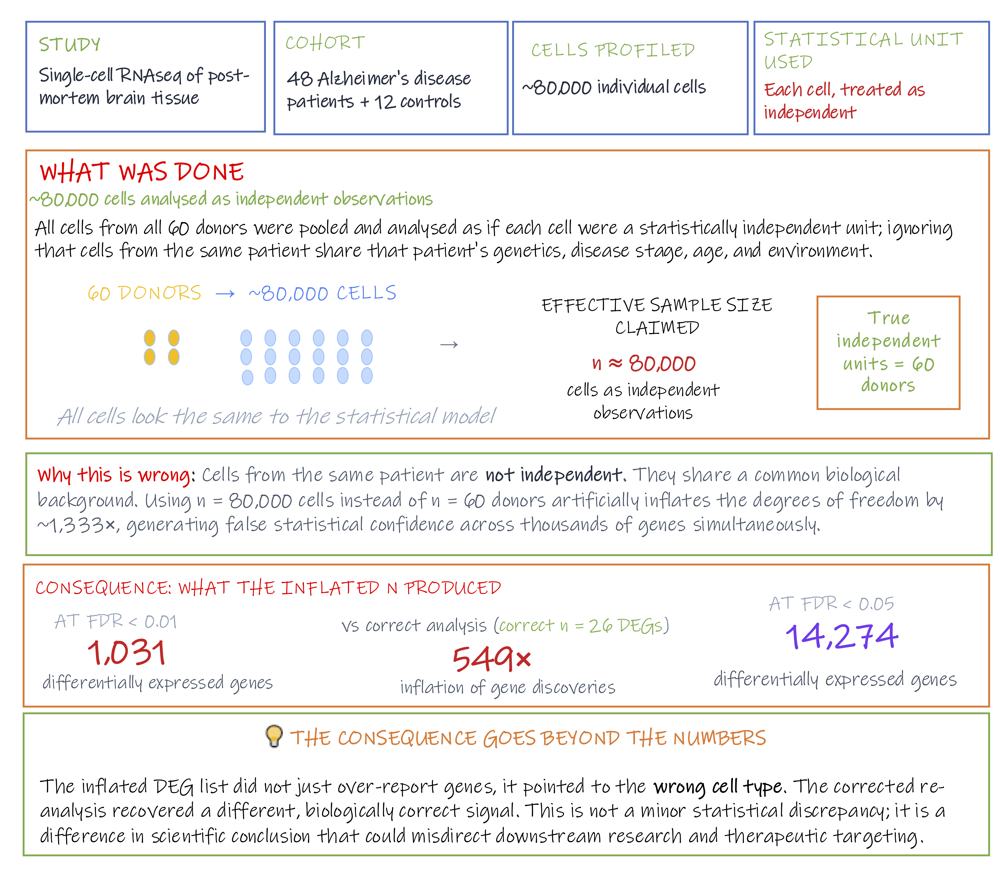

## Module 1.2 (Stage D): Analysis 

### Pitfall 7: Inadequate controls across the study pipeline
 
**Computational and statistical controls**
Analytical controls are used to evaluate, quantify, and sometimes reduce technical noise within the generated dataset.

Examples include permutation based null distributions, decoy databases in proteomics, 

These approaches can be extremely valuable, but they are constrained by the information available in the data. Computational methods cannot measure contamination that was never assessed experimentally, nor can they recover metadata that were never collected.

??? example "Case Study: The placental microbiome"

    Multiple high profile studies reported the existence of a
    placental microbiome using 16S amplicon sequencing; a 
    clinically significant claim with implications for preterm
    birth and neonatal health.

    All of these studies lacked negative extraction controls.
    Samples processed through the full extraction workflow but
    containing no input material. When later studies included
    proper controls, the bacterial signal was traced to reagent
    and laboratory contamination, not placental tissue.

    Subsequent studies with appropriate controls found no
    evidence of a true placental microbiome. The earlier
    conclusions were entirely artefactual, and the clinical
    follow up work they generated was misdirected.

    **Why controls would have caught this:**
    A negative extraction control processed alongside placental
    samples would have shown the same bacterial signal in the
    no input control as in the tissue samples, immediately
    flagging contamination before any biological conclusions
    were drawn.

    <small>
    Wagner & Kleiner. How thoughtful experimental design can
    empower biologists in the omics era.
    *Nature Communications* 16, 7263 (2025).
    [doi:10.1038/s41467-025-62616-x](https://www.nature.com/articles/s41467-025-62616-x){target="_blank"}

    Salter et al. Reagent and laboratory contamination can critically
    impact sequence-based microbiome analyses.
    *BMC Biology* 12, 87 (2014).
    [doi:10.1186/s12915-014-0087-z](https://doi.org/10.1186/s12915-014-0087-z){target="_blank"}
    ← **primary reference — first systematic demonstration of kit contamination**
    </small>

!!! danger "The unrecoverable rule"
    Once information was never collected or never measured, it cannot be reconstructed retrospectively. At best, its impact can be assessed, acknowledged, or partially mitigated. In many situations, the only definitive solution is to redesign and repeat the study.
---

### Pitfall 8: Experimental unit vs. Observational unit

**Experimental unit (EU)**: the smallest unit that could independently have received a different condition or treatment.

Examples:

- Each patient, in a case-control cohort
- Each mouse, in an animal study
- Each independently treated culture dish, in a cell-culture experiment

**Observational unit (OU)**: the entity a measurement is actually taken on.

Examples:

- The tissue biopsy or blood draw taken from that patient
- The individual cell profiled in a single-cell assay
<!-- Leave this for exercise: let them think....The dose of pooled material a given mouse received --> 

In the simplest designs, EU and OU are the same thing: one patient, one sample, one measurement. The distinction only starts to matter once they come apart, and that happens in two different ways.

**Subsampling** profiling many observational units (OUs) from one experimental unit (EU). Thousands of cells from one donor is the clearest case: the donor is still the EU, the cells are OUs nested inside it, and treating each cell as its own independent data point inflates a sample size that was never really there.

**Pooling** merging material from several donors into one shared unit before anything is measured. This is the case that needs a third term: the **biological unit (BU)** is what you actually want to draw a conclusion about, the donor, the participant, the source population. In every example above, BU and EU were the same thing, which is why the distinction hasn't come up yet. Pooling is exactly what breaks it apart: however many donors go into a shared pool, only one pooled unit was ever independently created, so the EU collapses to one, no matter how many downstream samples get measured from it. Those downstream measurements are OUs of that single pooled EU, not EUs in their own right, so pooling typically compounds the same problem subsampling does, just one step earlier in the workflow.

!!! info "Multiplexing vs. pooling"
    Multiplexing should not be confused with biological pooling. Multiplexing 
    combines separately barcoded libraries onto the same sequencing run purely 
    for efficiency; each library still traces back to one experimental unit, 
    and demultiplexing after sequencing recovers them as cleanly separated, 
    fully independent samples. Ten barcoded patient samples run together on 
    one lane are still ten EUs once demultiplexed. Pooling merges the 
    biological material itself, before any barcode is attached, once that 
    happens, there is no computational step that can separate the 
    contributions back out.

Both subsampling and pooling break the same assumption, that each measurement reflects one independent unit, but they fail at different points in the workflow. Subsampling is a modelling choice made at analysis, and is sometimes correctable there. Pooling happens before data collection, so by the time you're analysing the data the number of true experimental units is already fixed, however many observational units you measured.

This general failure, treating non-independent measurements as if they were independent replicates, is called **pseudoreplication**. It artificially inflates the effective sample size and overstates statistical confidence. A simple version: measuring the same patient's blood pressure five times and treating each reading as a separate patient.

??? example "Terminology: biological vs. technical replicate"
    A **biological replicate** is an independent biological sample drawn from 
    the same population: a different patient, a different mouse, a different 
    culture flask. Biological replicates capture natural variation within the 
    population and are the unit of statistical inference — they drive the n 
    in every power calculation and every statistical test.

    A **technical replicate** is the same biological sample measured more than 
    once. Technical replicates capture measurement variability, not 
    additional biological information, and do not increase n.

***Subsampling in practice: pseudoreplication in single-cell RNAseq (scRNAseq)***

Unlike bulk RNAseq, which measures the **average gene expression** 
across thousands of cells in a sample, scRNAseq profiles 
each cell **individually**, capturing the variation that bulk methods 
average away. A single experiment can generate profiles for tens of 
thousands of cells.

{width=95%}

This resolution comes with a statistical trap that is easy to miss. 
Cells from the same individual share a common genetic and environmental 
background, they are subsamples of that individual, not independent 
observations. Analysing them as independent replicates inflates the 
degrees of freedom, leading to elevated type I error rates (false 
positives) and unreproducible findings. Despite this, many single cell 
pipelines do not account for this dependency by default.

??? example "Case study: Pseudoreplication in single cell omics" 
    A reanalysis of a high profile Alzheimer's disease scRNAseq study 
    illustrates how severe the consequences can be. The original analysis 
    treated each cell as an independent observation, inflating the 
    effective sample size from 60 donors to ~80,000 cells. When corrected 
    using a pseudobulk approach, the number of reported differentially 
    expressed genes dropped from 1,031 to just 26 at FDR < 0.01,
    549 fold inflation. Critically, the corrected analysis also pointed 
    to a different, biologically correct cell type.  
    {width=100%}  

    <small>Original study:  [Mathys et al. "Single cell transcriptomic analysis of Alzheimer's disease." Nature 570.7761 (2019)](https://www.nature.com/articles/s41586-019-1195-2){target="_blank"}</small> 
    <small> Re-analysis: [Murphy et al. "Avoiding false discoveries in single-cell RNAseq by revisiting the first Alzheimer's disease dataset." Elife 12 (2023)](https://elifesciences.org/articles/90214){target="_blank"}</small>  

!!! info "This pitfall is not unique to single cell studies"
    The case study above and the activity at the end of this module (a microbiome
    transfer study) use two different platforms on purpose: pseudoreplication
    applies equally to bulk RNAseq, proteomics, and any platform where multiple
    measurements are taken from the same biological unit. The two also show
    different mechanisms i.e. subsampling and pooling.  
