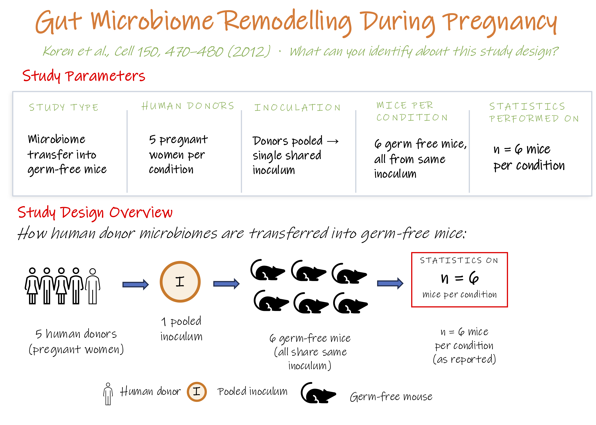

## Understanding the factors that shape study success

!!! info "Learning objectives"
    By the end of this section, participants will be able to:  
        - Identify pitfalls in their study design  
        - Classify the risk in study design as fatal, limitable, or recoverable   
        - identify which factor would reduce some of the identified risks  

Despite rapid advances in 'omics technologies, successful studies depend on more than the technology itself. Careful experimental design, data analysis, and interpretation are critical at every stage of the study design. Understanding the factors that contribute to robust and reproducible studies is just as important as understanding the technologies themselves.

{width=100%}

**Thoughtful study design helps in saving cost across three dimensions:**

| Cost dimension | Examples |
|---|---|
| **Financial** | Sequencing runs, reagents, platform fees |
| **Time** | Sample processing, analysis pipelines, validation |
| **Irreplaceability** | Clinical biopsies, rare cohorts, longitudinal samples cannot simply be recollected |

Most poor study design decision are made during the **design stage** but only become visible at the **analysis stage** by which point they are often already compromised the study's results. This is why study design deserves as much rigour as the experiment itself.

We will examine the key pitfalls encountered across different stages of the omics study workflow.
---  
## 🟠 Stage A: Design
 
### Pitfall 1: Sampling bias and inappropriate cohort design

Study design controls determine whether observed differences can reasonably be attributed to the biological question being studied rather than to systematic differences between groups.

Important considerations include age, sex, disease state, BMI, medication use, ethnicity, and recruitment source. 

Depending on the study, these factors may be addressed through matching, stratification, randomisation, balanced sampling, or careful collection of metadata.

Not all confounders can be controlled, particularly in retrospective studies where samples have already been collected. However, important sources of variation should be measured whenever possible and recorded in the study metadata so they can be evaluated during analysis.

*Example*: A transcriptomics study recruiting cancer cases from an oncology ward (median age 64) against controls from a university health check (median age 29) will find hundreds of "disease" genes that are really immune-ageing genes. Once the groups are recruited unmatched on age, no downstream analysis can separate the two signals.

??? example "Case study: The reference dataset has the same bias it's used to study"

    In 2011, a review of 2009 publications across 10 biological fields found male-only studies outnumbering female-only studies 5.5 to 1 in neuroscience and 5 to 1 in pharmacology, sex was often not even reported. The finding was influential enough that in 2016 the NIH made considering sex as a biological variable a formal requirement for federally funded research design, not just an analysis afterthought.

    Why the sampling choice matters mechanistically, not just ethically: a 2020 analysis of the GTEx project; 44 tissues, over 16,000 RNA-seq samples found that 37% of all genes show sex-biased expression in at least one tissue. A cohort imbalanced by sex isn't just missing half the population; it's silently confounding over a third of the transcriptome with a variable that was never built into the study design.

    The twist: GTEx itself, the reference dataset much of the field normalises against, is not immune. Its donor pool is roughly two-thirds male and skews toward older individuals, the same two variables named in this pitfall's confounder list. A study built on GTEx as a baseline quietly inherits GTEx's own sampling composition, whether or not that composition matches the population the study is actually about.

    <small>Beery & Zucker. *Neuroscience & Biobehavioral Reviews* 35, 565–572 (2011). [doi:10.1016/j.neubiorev.2010.07.002](https://doi.org/10.1016/j.neubiorev.2010.07.002){target="_blank"}</small>
    <small>Oliva et al. *Science* 369, eaba3066 (2020). [doi:10.1126/science.aba3066](https://doi.org/10.1126/science.aba3066){target="_blank"}</small>

!!! danger "Design principle"
    A confounder that was neither controlled nor recorded cannot be modelled directly. Once information is missing at the time of collection, there is usually no reliable way to recover it later. If a variable may influence the outcome, it is generally better to measure it than to assume it can be addressed retrospectively.

### Pitfall 2: Wrong platform for the biological question

Platform choice is a design decision, not a technical afterthought.
Selecting the wrong platform upstream cannot be compensated for by
better analysis downstream. The data simply does not contain the
information required to answer the question.

**Sequencing technology mismatch, short-read where long-read is needed**
Short-read sequencing cannot resolve structural variants, full length
isoforms, or repetitive regions, regardless of depth. This is a
read-length limitation, not a coverage problem.

*Example:* Short-read WES applied to structural variant detection
in repeat rich regions will produce false negatives that deeper
sequencing cannot recover.

**Proteomics acquisition mismatch**
In mass spectrometry proteomics, the instrument acquisition mode
determines which proteins get measured at all. Some modes
systematically miss low-abundance proteins by design, meaning
key targets may be absent from the data entirely, not just
under-quantified.

**Resolution mismatch, bulk where single-cell was needed**
Bulk RNAseq permanently averages signal across all cell types.
Rare populations and cell-type specific responses cannot be
recovered by deconvolution alone.

*Example:* Studying tumour infiltrating immune cells with bulk
RNA-seq produces a single averaged signal across cancer cells,
T cells, and macrophages, with no ability to identify which
population is driving the difference.

**Technology adopted for novelty rather than fit**
Single-cell omics adopted primarily because it is current, then
analysed as bulk, represents a significant waste of cost and
sample with no scientific gain over a cheaper bulk approach.

!!! danger "The unrecoverable rule"
    If the platform cannot capture the biological signal of interest,
    no analysis method can recover it. The choice must be made
    before data collection, not revisited after.

### Pitfall 3: Underpowered studies

In many omics studies, sample size is determined by budget or sample
availability rather than by statistical need. This is particularly
costly in omics, where thousands of molecular features are tested
simultaneously, multiple testing correction reduces the effective
power per feature dramatically, meaning that the sample size required to detect
true signal is far higher than most researchers expect.

The consequences are consistent across platforms:

- **Transcriptomics (RNAseq):** studies with n = 3 per condition,
  the field norm, typically detect only 20-40% of truly differentially
  expressed genes, with high rates of false positives among those reported. <small>[Schurch et al. *Rna* 2016](https://pmc.ncbi.nlm.nih.gov/articles/PMC4878611/){target="_blank"}</small>

- **Proteomics:** low sample size exacerbates the effects of missing values and technical variability, reducing statistical power and introducing bias, which can compromise reliable quantification across samples.<small>[Kong et al., *Proteomics* 2022](https://doi.org/10.1002/pmic.202200092){target="_blank"}</small>

- **Genomics (GWAS, variant calling):** underpowered cohorts produce
  associations that fail to replicate in independent datasets,
  driven by inflated effect size estimates in small discovery samples.<small>
    [Zou et al. *G3 Genes|Genomes|Genetics* 2022.](https://doi.org/10.1093/g3journal/jkac261){target="_blank"}. [Wray et al. *Nature Communications* 2018](https://www.nature.com/articles/s41467-018-07348-x){target="_blank"}
    </small>

- **Metabolomics:** Reproducibility crisis in metabolomics biomarker studies
A 2024 meta analysis study of 244 clinical metabolomics studies illustrates
  the scale of this problem: of 2,206 unique metabolites reported as
  statistically significant across these studies, 72% were identified by
  only a single study, with contradictory directions of change even
  for metabolites detected by more than one group. Small sample sizes
  were identified as a primary driver of this reproducibility failure. <small>[Cochran, Darcy, et al. *TrAC Trends in Analytical Chemistry* 2024](https://www.sciencedirect.com/science/article/pii/S0165993624004011){target="_blank"}</small>

- **Single cell omics:** pseudoreplication compounds the underpowering 
  problem, the true n is the number of donors, not cells.
  <small>[Murphy et al., *eLife* 2023](https://elifesciences.org/articles/90214){target="_blank"}</small>

In all cases, the result is the same: findings that look statistically
significant but do not replicate. This is one of the common
root causes of the omics reproducibility crisis. In practice, sample size requirements vary substantially by study type, e.g. discovery vs validation.

---

## 🟠 Stage B : Wet Lab

### Pitfall 4: Batch effects

A **batch effect** is a systematic technical bias introduced when samples are processed under different experimental conditions, such as different sequencing runs, reagent lots, operators, instruments, or processing dates. Unlike random noise, batch effects produce consistent patterns in the data that can either resemble true biological variation or mask it, making technical artifacts difficult to distinguish from genuine biological signal.

*Example*: Batch effect fully confounded with biology.  
Study A processed all cases in Batch 1 (2023) and all controls in Batch 2 (2026). The PCA shows a clean separation. But it is driven almost entirely by batch, not biology. Cases and controls cluster by processing year, not by disease. There is no way to know whether any observed difference is biological or technical, because the two are perfectly aligned. **This design is unrecoverable**, becuase no downstream computational pipeline can reliably recover signal from a fully confounded dataset. 

Study B distributed cases and controls across both batches. The PCA still shows a batch structure circles (Batch 1) and triangles (Batch 2) separate within each group. But cases and controls remain distinguishable within each batch. The batch effect is now estimable and correctable. **The biology is recoverable**.

{width=90%}

??? example "Case Study: When batch effects reach the clinic"

    Between 2006 and 2011, Anil Potti and colleagues at Duke published a 
    series of high profile papers claiming to have developed genomic 
    predictors of chemotherapy response in cancer patients using gene 
    expression microarrays. Three clinical trials were opened using these 
    predictors to assign patients to treatment arms.

    Keith Baggerly and Kevin Coombes at MD Anderson had been trying and 
    failing to replicate the research methods, finding systematic errors 
    in how the data had been processed; including off by one errors in 
    the assignment of drug sensitivity labels to cell lines and undisclosed 
    batch effects in the training data.

    {width=90%}

    **Outcome:** The trials were halted. The case 
    became a landmark example of how undetected batch effects, combined 
    with lack of reproducibility, can cause direct patient harm.
    <small>Ref: [Baggerly & Coombes, *Ann. Appl. Stat.* 2009](https://doi.org/10.1214/09-AOAS291){target="_blank"}</small>

---
### Pitfall 5: Experimental controls 

Experimental controls determine whether measurements are technically reliable.

Examples include negative extraction controls, positive controls, spike-ins, process blanks, and technical replicates. These controls help identify contamination, assay failure, reagent problems, sample handling artefacts, and other sources of technical variation before data enter the analysis pipeline.

Without appropriate controls, technical artefacts may be difficult or impossible to distinguish from genuine biological signal. The resulting bias is carried forward into every downstream analysis.

| Platform	| Commonly overlooked control|
|---|---|
| 16S sequencing / metagenomics	| Negative extraction control |
| Bulk RNA-seq | RNA integrity assessment and balanced batch design|
| Single-cell RNA-seq |	Empty droplet controls, ambient RNA assessment|
| Proteomics (MS)	| Blank injections, digestion controls|
| Metabolomics	| Pooled QC samples, solvent blanks|
| DNA methylation assays	| Conversion efficiency controls|

---
## 🟠 Stage C :  Preprocessing
 
### Pitfall 6: Missingness & normalisation

#### Missingness
**Imputation choice depends on why data is missing, not how much is missing.** Whether a gap should be filled (imputed) and how, depends on the platform, the proportion missing, and whether the pattern is random or structured. Treating every missing value the same way carries whichever assumption is wrong straight into the results.

*Example:* Filling a protein's missing values with the **sample mean** assumes they're missing at random. But in label-free mass spectrometry, missing usually means the signal fell below the detection threshold the true value is more likely low, not average. Mean-imputation systematically inflates exactly the low-abundance proteins a discovery study is trying to find.

Sample mean approach can:

- underestimate differences between groups,
- bias fold-change estimates,
- and lead to misleading statistical results.

**Filtering can quietly remove exactly the features a study cares about most.** Rare taxa, lowly-expressed genes, and low-abundance proteins are the first to be dropped by a standard threshold and could be of biological interest.

*Example*: A microbiome study removes all taxa present in less than 20% of samples before analysis.
One pathogen associated with disease is present in only 15% of cases and absent from controls.

The filtering threshold removed the very organism driving the biological effect.

Potential consequence
Loss of biologically relevant features
False conclusion that no disease-associated taxa exist

#### Normalisation 

Some normalisation methods only work if a reference sample, spike-in, or technical replicate was included at the wet-lab stage. Pooled QC injections and shared batch references have to be planned and prepared before data collection starts. If they were never included, that normalisation strategy isn't available later, no analysis choice can substitute for it.

---
## 🟠 Stage D: Analysis 

### Pitfall 7: Inadequate controls across the study pipeline
 
**Computational and statistical controls**
Analytical controls are used to evaluate, quantify, and sometimes reduce technical noise within the generated dataset.

Examples include permutation based null distributions, decoy databases in proteomics, 

These approaches can be extremely valuable, but they are constrained by the information available in the data. Computational methods cannot measure contamination that was never assessed experimentally, nor can they recover metadata that were never collected.

??? example "Case Study: The placental microbiome"

    Multiple high profile studies reported the existence of a
    placental microbiome using 16S amplicon sequencing; a 
    clinically significant claim with implications for preterm
    birth and neonatal health.

    All of these studies lacked negative extraction controls.
    Samples processed through the full extraction workflow but
    containing no input material. When later studies included
    proper controls, the bacterial signal was traced to reagent
    and laboratory contamination, not placental tissue.

    Subsequent studies with appropriate controls found no
    evidence of a true placental microbiome. The earlier
    conclusions were entirely artefactual, and the clinical
    follow up work they generated was misdirected.

    **Why controls would have caught this:**
    A negative extraction control processed alongside placental
    samples would have shown the same bacterial signal in the
    no input control as in the tissue samples, immediately
    flagging contamination before any biological conclusions
    were drawn.

    <small>
    Wagner & Kleiner. How thoughtful experimental design can
    empower biologists in the omics era.
    *Nature Communications* 16, 7263 (2025).
    [doi:10.1038/s41467-025-62616-x](https://www.nature.com/articles/s41467-025-62616-x){target="_blank"}

    Salter et al. Reagent and laboratory contamination can critically
    impact sequence-based microbiome analyses.
    *BMC Biology* 12, 87 (2014).
    [doi:10.1186/s12915-014-0087-z](https://doi.org/10.1186/s12915-014-0087-z){target="_blank"}
    ← **primary reference — first systematic demonstration of kit contamination**
    </small>

!!! danger "The unrecoverable rule"
    Once information was never collected or never measured, it cannot be reconstructed retrospectively. At best, its impact can be assessed, acknowledged, or partially mitigated. In many situations, the only definitive solution is to redesign and repeat the study.
---

### Pitfall 8: Experimental unit vs. Observational unit

**Experimental unit (EU)**: the smallest unit that could independently have received a different condition or treatment.

Examples:

- Each patient, in a case-control cohort
- Each mouse, in an animal study
- Each independently treated culture dish, in a cell-culture experiment

**Observational unit (OU)**: the entity a measurement is actually taken on.

Examples:

- The tissue biopsy or blood draw taken from that patient
- The individual cell profiled in a single-cell assay
<!-- Leave this for exercise: let them think....The dose of pooled material a given mouse received --> 

In the simplest designs, EU and OU are the same thing: one patient, one sample, one measurement. The distinction only starts to matter once they come apart, and that happens in two different ways.

**Subsampling** profiling many observational units (OUs) from one experimental unit (EU). Thousands of cells from one donor is the clearest case: the donor is still the EU, the cells are OUs nested inside it, and treating each cell as its own independent data point inflates a sample size that was never really there.

**Pooling** merging material from several donors into one shared unit before anything is measured. This is the case that needs a third term: the **biological unit (BU)** is what you actually want to draw a conclusion about, the donor, the participant, the source population. In every example above, BU and EU were the same thing, which is why the distinction hasn't come up yet. Pooling is exactly what breaks it apart: however many donors go into a shared pool, only one pooled unit was ever independently created, so the EU collapses to one, no matter how many downstream samples get measured from it. Those downstream measurements are OUs of that single pooled EU, not EUs in their own right, so pooling typically compounds the same problem subsampling does, just one step earlier in the workflow.

!!! info "Multiplexing vs Pooling"
    Importantly, multiplexing should not be confused with biological pooling: multiplexing combines separately labelled libraries for sequencing efficiency while preserving the identity and independence of each experimental unit.

!!! info "Multiplexing vs. pooling"
    Multiplexing should not be confused with biological pooling. Multiplexing 
    combines separately barcoded libraries onto the same sequencing run purely 
    for efficiency; each library still traces back to one experimental unit, 
    and demultiplexing after sequencing recovers them as cleanly separated, 
    fully independent samples. Ten barcoded patient samples run together on 
    one lane are still ten EUs once demultiplexed. Pooling merges the 
    biological material itself, before any barcode is attached, once that 
    happens, there is no computational step that can separate the 
    contributions back out.

Both subsampling and pooling break the same assumption, that each measurement reflects one independent unit, but they fail at different points in the workflow. Subsampling is a modelling choice made at analysis, and is sometimes correctable there. Pooling happens before data collection, so by the time you're analysing the data the number of true experimental units is already fixed, however many observational units you measured.

This general failure, treating non-independent measurements as if they were independent replicates, is called **pseudoreplication**. It artificially inflates the effective sample size and overstates statistical confidence. A simple version: measuring the same patient's blood pressure five times and treating each reading as a separate patient.

??? example "Terminology: biological vs. technical replicate"
    A **biological replicate** is an independent biological sample drawn from 
    the same population: a different patient, a different mouse, a different 
    culture flask. Biological replicates capture natural variation within the 
    population and are the unit of statistical inference — they drive the n 
    in every power calculation and every statistical test.

    A **technical replicate** is the same biological sample measured more than 
    once. Technical replicates capture measurement variability, not 
    additional biological information, and do not increase n.

***Subsampling in practice: pseudoreplication in single-cell RNAseq (scRNAseq)***

Unlike bulk RNAseq, which measures the **average gene expression** 
across thousands of cells in a sample, scRNAseq profiles 
each cell **individually**, capturing the variation that bulk methods 
average away. A single experiment can generate profiles for tens of 
thousands of cells.

{width=95%}

This resolution comes with a statistical trap that is easy to miss. 
Cells from the same individual share a common genetic and environmental 
background, they are subsamples of that individual, not independent 
observations. Analysing them as independent replicates inflates the 
degrees of freedom, leading to elevated type I error rates (false 
positives) and unreproducible findings. Despite this, many single cell 
pipelines do not account for this dependency by default.

??? example "Case study: Pseudoreplication in single cell omics" 
    A reanalysis of a high profile Alzheimer's disease scRNAseq study 
    illustrates how severe the consequences can be. The original analysis 
    treated each cell as an independent observation, inflating the 
    effective sample size from 60 donors to ~80,000 cells. When corrected 
    using a pseudobulk approach, the number of reported differentially 
    expressed genes dropped from 1,031 to just 26 at FDR < 0.01,
    549 fold inflation. Critically, the corrected analysis also pointed 
    to a different, biologically correct cell type.  
    {width=100%}  

    <small>Original study:  [Mathys et al. "Single cell transcriptomic analysis of Alzheimer's disease." Nature 570.7761 (2019)](https://www.nature.com/articles/s41586-019-1195-2){target="_blank"}</small> 
    <small> Re-analysis: [Murphy et al. "Avoiding false discoveries in single-cell RNAseq by revisiting the first Alzheimer's disease dataset." Elife 12 (2023)](https://elifesciences.org/articles/90214){target="_blank"}</small>  

!!! info "This pitfall is not unique to single cell studies"
    The case study above and the activity at the end of this module (a microbiome
    transfer study) use two different platforms on purpose: pseudoreplication
    applies equally to bulk RNAseq, proteomics, and any platform where multiple
    measurements are taken from the same biological unit. The two also show
    different mechanisms i.e. subsampling and pooling.  

## 🟠 Stage E: Reporting 

### Pitfall 9: Lost or incomplete metadata

High quality sequencing data is only as useful as the information
recorded alongside it. Missing or incomplete metadata, sample
processing dates, batch numbers, storage conditions, clinical
variables, tissue handling times, can render an otherwise technically
sound dataset uninterpretable.

Critically, **metadata that is not recorded cannot be recovered**.
Unlike batch effects that are documented, an unknown source of
variation cannot be tested, modelled, or corrected for in analysis.
Its only trace may be an unexplained axis in a PCA plot or a
pattern of QC outliers, suggestive of a problem, but impossible
to resolve without the original records.

!!! danger "The unrecoverable rule"
    Every metadata field not recorded at the time of sample collection
    is a potential confounder you can never remove.

**Real consequences of missing metadata:**

**No fasting status recorded (metabolomics)**
If fasting vs fed state is not documented, differences in circulating
metabolites between groups may simply reflect recent food intake
rather than disease biology, and there is no way to distinguish
the two after the fact.

**No ischaemia time recorded (tissue studies)**
If the delay between tissue collection and processing is unknown,
gene expression or protein abundance changes caused by sample
degradation can be mistaken for true disease effects. This is
particularly acute in surgical and post-mortem tissue studies.

**No batch or processing date recorded (any omics)**
Without knowing which samples were processed together, batch
effects cannot be identified or corrected, even with the most
sophisticated normalisation methods. The variation is present
in the data but invisible to the analyst.

??? example "Case study: When metadata saves the analysis, GTEx & Ischaemia Time" 
    {width=100%}  

!!! info "Coming up in Module 3"
    Designing a metadata collection plan, including a minimal
    metadata checklist for omics studies is covered in
    **Module 3: Experimental design fundamentals**.

#### Pitfall 10: Discovery without validation

Finding a statistically significant result in omics is not the
same as finding a generalisable biological truth. When thousands
of genes/proteins are tested simultaneously, some will reach significance
by chance and results derived from a single dataset may reflect
dataset specific effects (technical, cohort, or sampling variation) rather than true biology.

Not every omics study requires external validation, but the
requirement scales with the strength of the claim being made:

| Study type | Example claim | Validation required? |
|---|---|---|
| Exploratory / hypothesis generating | "We identify candidate DEGs associated with condition X" | Not strictly, if clearly labelled as exploratory |
| Confirmatory / mechanistic | "Gene X drives this pathway in disease Y" | Strongly recommended |
| Translational / clinical | "This 10 gene signature predicts patient outcome" | Essential |

Validation can take two forms: **independent cohort replication** (the same measurement platform applied to a new dataset) and **orthogonal validation** (a different measurement technology applied to the same finding. For example, confirming a proteomics finding with immunohistochemistry, an RNAseq hit with RT-qPCR or a variant call with Sanger sequencing). Orthogonal validation is particularly valuable when an independent cohort is not available, and is standard practice before functional follow up.

!!! info "The key principle"
    Any claim intended to generalise beyond the original dataset
    requires independent validation. Without it, results should
    be treated as exploratory candidates, not confirmed biology.

**Why omics is particularly vulnerable to above mentioned pitfalls**
Since omics measures high features (gene/proteins), sample size is often very small and biological variability between cohort sample is often high; so combination of all of them means that omics findings
are especially susceptible to dataset specific noise. 

- Differential expression analysis; gene signatures derived from small or heterogeneous cohorts often show limited reproducibility across independent datasets of the same disease
- Metabolomics biomarkers, as shown in Pitfall 2, 72% of
  reported significant metabolites were found in only one study
- **Proteomics:** a striking gap exists between biomarker discovery and clinical translation. Rifai et al. 
  described this validation gap in 2006 and nearly two decades 
  later, translating proteomics to clinical applications 
  has remained challenging despite significant technical progress,  
  with standardisation, regulatory compliance, and 
  the need for robust validation  continuing to be cited as 
  unresolved barriers at major proteomics symposia as recently as 2024.
  The problem Rifai described has not been solved, it has persisted 
  for two decades. <small>
    [Rifai et al. *Nature Biotechnology* 2006](https://doi.org/10.1038/nbt1235){target="_blank"}  
       [Proceedings of the 68th Benzon Foundation Symposium.
    *Journal of Proteome Research* 2024](https://pmc.ncbi.nlm.nih.gov/articles/PMC11652764/){target="_blank"}</small>
 
***The consequences are most severe when studies move from
discovery to claims of generalisable biomarkers, clinical
signatures, or mechanisms, without independent validation.***

??? example "Case study: Two decades of unreplicable genetics; The candidate gene era"

    From the 1990s through the mid 2000s, hundreds of candidate gene
    association studies were published linking specific genetic variants
    to psychiatric and complex diseases like depression, schizophrenia,
    addiction, personality traits. Most studies had n = 100–500.
    Results were statistically significant within each dataset.

    When adequately powered GWAS arrived (n > 10,000), the vast
    majority of these associations vanished. A landmark 2019 reanalysis
    of 18 candidate genes that had been studied for decades in
    relation to depression found that none replicated in a sample
    of over 620,000 individuals.

    The candidate gene literature was not fraudulent, it was
    underpowered discovery presented as confirmed biology, without
    independent validation in adequately sized cohorts.

    **The fix that was missing:**
    Independent replication in a larger cohort before claiming
    a generalisable genetic association. Modern GWAS pre register
    replication cohorts before publication precisely because of
    this history. <small> [Border et al. *American Journal of Psychiatry* 2019](https://psychiatryonline.org/doi/10.1176/appi.ajp.2018.18070881){target="_blank"} [Ioannidis et al. *Nature Genetics* 2009](https://doi.org/10.1038/ng.295){target="_blank"}
    </small>
---

!!! info "Can pitfalls be fixed?"
    
    !!! success "Recoverable :— fixable at analysis stage"
        - Normalisation method choice
        - Some batch effects (if not confounded with biology)
        - Outlier handling

    !!! warning "Limitable :— partially addressable with caveats"
        - Underpowered sample sizes
        - Platform mismatch
        - Suboptimal QC thresholds

    !!! danger "Fatal :— unrecoverable after data generation"
        - Batch fully confounded with biological groups
        - Missing or unrecorded metadata
        - Wrong omics platform chosen
        - Samples pooled where individual inference was needed

??? question "Part 1: Activity, Analyse this study design"

    A 2012 gut microbiome study collected microbiota from five pregnant women 
    per condition, pooled them into a single inoculum, and inoculated 
    six germ-free mice per condition. Statistics were performed on n = 6 mice.

    {width=90%}

    <small>Ref: Koren et al., *Cell* 150, 470–480 (2012)</small>

    Discuss in your group:

    1. What is the true experimental unit, the mouse or the human donor?
    2. What is the actual n per condition?
    3. Are the six mice independent biological replicates? Why or why not?
    4. What does this mean for the p-values reported?
    5. What information would you need to determine if this is recoverable?
    6. Is this error recoverable after data collection?

<!--
??? success "Answers: reveal after group discussion"

    **Q1. True experimental unit?**  
    The human donor, not the mouse.

    **Q2. Actual n per condition?**  
    n = 1. There was only one pooled inoculum per condition.

    **Q3. Are the six mice independent biological replicates?**  
    No, all six received the same inoculum. They are technical 
    replicates, not biological replicates.

    **Q4. What does this mean for the p-values?**  
    They are uninterpretable. Degrees of freedom are artificially 
    inflated, producing false precision and invalid inference.

**Q5. What information would you need to determine if this
    is recoverable?**
    You would need to know whether individual donor samples were
    kept separate before pooling. Specifically:

    - Were aliquots from each donor preserved individually
      before pooling into the shared inoculum?
    - Is DNA or 16S sequence data available per donor that
      could distinguish their microbial contributions?
    - Were any mice inoculated with single-donor material
      rather than the pool?

        If all donor material was irreversibly pooled and no
        individual aliquots were retained, this is **unrecoverable**.
        The biological contributions of individual donors cannot
        be separated from a mixed inoculum after the fact.
        The experiment would need to be repeated with one
        inoculum per donor.

    **Q6. Is this recoverable?**  
    No: unrecoverable. Pooling happened at sample collection. 
    Donor contributions cannot be separated retrospectively.

    <small>Ref: Wagner & Kleiner, *Nat Commun* 16, 7263 (2025)</small>

    {width=100%}

-->

??? question "Part 2: Apply to your own study"

    Briefly describe a study you are planning or have
    been involved in. In small groups:

    1. Identify which one of the pitfalls your study
       is most vulnerable to
    2. Classify the risk: fatal, limitable,
       or recoverable?
    3. What one change at the design stage would
       reduce that risk?
