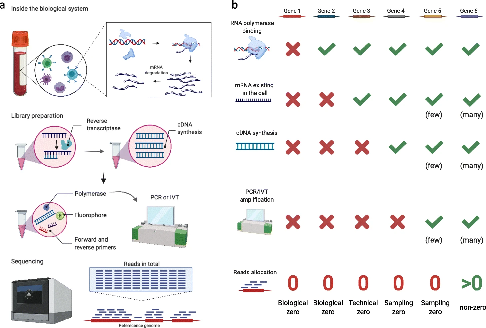

# Module 2.3: Sparsity and zero inflation

!!! info "Learning objectives" 

    By the end of this section, participants will be able to:  

    - Distinguish between biological, technical,sampling and analytical zeroes, and explain the mechanism that produces each
    - Identify which zero type is most likely given a platform, sequencing depth, and biological context 
    - Explain what goes wrong analytically when zeros are misclassified or treated uniformly

## TIME DURATION NOTE:: TO TO DELETED IN FINAL STAGE [Aimed for 10 mins; activities 5 min]

## Sparsity is normal but not all sparsity is the same

The first thing most people notice when they start exploring their omics datasets is how many zero values it contains. In bulk RNAseq 10-40% of gene sample entries are zeros, in single-cell RNAseq that number can be as high as 90%, and in microbiome data it typically ranges from 80–95%.

This is not a sign something has gone wrong. It is a direct consequence of trying to measure hundreds to millions of features (genes/proteins) simultaneously with a finite technical budget. Most features are not detectable in most samples under most conditions. The challenge in data analysis is not the presence of zeros, it’s understanding what they actually represent.

| Platform | Typical sparsity (zero or missing entries) | Primary cause | References |
|---|---|---|---|
| Bulk RNA-seq | ~10–40% zeros | Lowly expressed genes and genes genuinely not expressed in a sample | [Jiang et al. 2022](https://link.springer.com/article/10.1186/s13059-022-02601-5) |
| scRNA-seq | ~80–95% zeros (protocol dependent) | Limited transcript capture, shallow sequencing per cell, and biological heterogeneity; droplet-based protocols often exceed 90% and are generally sparser than plate based methods | [Jiang et al. 2022](https://link.springer.com/article/10.1186/s13059-022-02601-5), [Qiu 2020](https://www.nature.com/articles/s41467-020-14976-9) |
| 16S amplicon (microbiome) | ~80–95% zeros | True absence plus undersampling of rare taxa due to finite sequencing depth | [Abegaz et al. 2024](https://www.nature.com/articles/s41598-024-62437-w) |
| Shotgun metagenomics | Typically lower than 16S; highly dataset dependent | Greater feature recovery than 16S but still affected by rare taxa and sequencing depth | [Bars-Cortina et al. 2024](https://link.springer.com/article/10.1186/s12864-024-10621-7) |
| Proteomics (DDA) | ~10–50% missing values | Stochastic precursor selection and signals below the instrument detection limit | [Webel et al. 2024](https://www.nature.com/articles/s41467-024-48711-5), [Liu & Dongre 2021](https://academic.oup.com/bib/article-abstract/22/3/bbaa112/5855395) |
| Metabolomics (untargeted) | ~20–50% missing values | Detection limits, ion suppression, and variable ionisation efficiency | [Do et al. 2018](https://link.springer.com/article/10.1007/s11306-018-1420-2), [Krutkin et al. 2025](https://pmc.ncbi.nlm.nih.gov/articles/PMC11969646/) |

Note: proteomics and metabolomics entries generally represent missing values rather
than integer zeros, means they arise from a detection threshold rather than a
count of zero, and their statistical properties differ accordingly.

## Four types of zeros

A zero in any matrix arises from one of four distinct causes. In
every case the data looks the same: an empty cell in the matrix. The
correct analytical response is not the same. 

<!-- TODO make a diagram like this of our own 

Response by AT: I believe that this is well prepared figure by the original Author; we should just burrow and cite it; untill unless someone has better idea for improvement and would like to create a new one.
-->

{width=90%}

<small>Adapted from: [Jiang et al. *Genome Biology* 2022](https://link.springer.com/article/10.1186/s13059-022-02601-5){target="_blank"} (CC BY 4.0)</small> 

### 1. Biological zeros

These are the straightforward ones. The feature really is absent. 

- A gene is not expressed in a given cell type  
- A microbial taxon is not present in a sample  
- A protein is not synthesised under certain conditions  

These zeros carry biological meaning and should be preserved as they are. Replacing them with imputed values would be inventing biology that does not exist.  

### 2. Technical zeros

The molecule is present in the cell, but was lost before it could reach sequencer. In single-cell RNAseq, for example, only a fraction of transcripts are captured during library preparation. Capture efficiency can be as low as 10–15%, so most molecules are simply lost before sequencing. The remainder are lost
during extraction, reverse transcription, and amplification. A gene expressed at low levels may produce zero counts not because it is off but because none of its transcripts survived to be sequenced.

Technical zeros cannot be resolved by deeper sequencing. By the time sequencing begins, the molecule is already gone. Increasing read depth
samples the surviving library more thoroughly; it cannot recover molecules that were never captured.

### 3. Sampling zeros

These arise at the sequencing stage. By this point, the molecule has already been successfully extracted, converted, and amplified. It is in the library but the sequencer only reads a finite number of fragments. In complex samples containing tens of thousands to millions of sequences, low abundance molecules are less likely to be sampled by chance. 

!!! tip "Like eating jellybeans from a jar" 
    If you only pick out 20 jellybeans from a jar containing 10,000, you might miss any flavour thats only represented by less than 10 jellybeans. Not because the flavours don't exist, but because your sample size was too small to encounter them reliably. 

    Sequencing works in the same way. A gene expressed at low levels contributes only a tiny fraction of the fragments in the library. At 20 million reads, there may simply not be enough handfuls to guarantee a gene gets counted. Sequence the same library to 100 million reads and the same gene will appear more frequently.  

### 4. Analytical zeros 

The previous three types arise from the measurement process itself. Analytical zeros are different, they are created by decisions made after the data is generated. 

Pre-processing pipelines apply filters to convert raw data into an analysis ready format. These steps of the pipelines may filters features that fall outside the permitted range. In the outputs, they are indistinguishable from features that were never detected. 

Common examples include: 

- **Variant calling**: a variant detected at 8x coverage is removed by a minimum depth filter of 10x. The site does not appear in the VCF
- **Bulk RNA-seq**: a gene with counts in two out of six samples is removed by a minimum prevalence filter before differential expression testing 
- **Proteomics**: a low abundance protein detected in 40% of samples is excluded by a minimum 70% observation threshold and disappear from all results 

!!! warning "Filters are directional and may leave no trace"
    Analytical filters systematically remove low signal features like lowly expressed genes, small cell populations, low abundance proteins, rare variants, rare taxa. These are often exactly the features a study is most interested in detecting. Always report which filters were applied and how many features were removed, and check whether removed features cluster non randomly by condition or sample group.

!!! tip "Filtering is necessary, the problem is treating the output as complete"
    Filters reduce noise, improve statistical power, and make analyses more computationally tractable. The problem is not filtering itself but treating filtered output as if it represents the full biological picture. Two habits protect against this: report filter parameters alongside results, and examine what was removed before finalising any threshold.

## Same number, different meaning

All four zero types produce the same entry in the count matrix. There
is no flag to indicate whether a zero is biological, technical, a
sampling artefact, or a filtering decision.

Consider a gene measured across four single cells:

## A simple example

Consider a gene measured across four single cells:

| Cell 1 | Cell 2 | Cell 3 | Cell 4 |
|---|---|---|---|
| 0 | 0 | 3 | 0 |

It’s tempting to say the gene is “off” in most cells. But at a typical single-cell capture rate of 10-15%, it’s equally likely that the gene is expressed at low levels in all four cells, and only one happened to have a transcript captured. The three zeros may be biological,
technical, or sampling and the data alone cannot resolve that.

Context is what distinguishes them.

- If a gene known to be T-cell specific showing zeros across B cells is almost certainly a biological zero
- If the same gene shows patchy detection across T cells, that pattern is more consistent with sampling or technical zeros  
- That same gene showing zeros only in cells with uniformly low total UMI counts is a strong indicator of capture failure, suggesting an association between low UMI counts and zero expression.

Interpreting zeros requires combining knowledge of the platform, the
sequencing depth, what the feature is expected to do biologically, and
how its pattern compares across the full dataset. This is why zero
handling cannot be fully automated.

!!! tip "Activity"
    ***Head to webR page and check out the Zeros and Sparsity tab***

## What goes wrong when zeros are misclassified 

Treating all zeros as the same causes specific and predictable failure.

### Differential expression

If one condition has systematically lower sequencing depth, sampling zeros will cluster in that condition. Genes will appear downregulated not because they are biologically downregulated but because they were not sampled. 

If one condition has systematically lower sequencing depth, sampling zeros will cluster in that condition. Genes will appear downregulated
not because their biology changed but because there were too few reads to detect them reliably. This is a depth confound masquerading as
biology, and it is undetectable from the output alone without examining the relationship between depth and the differential expression
results across samples.

### Spurious Correlation analysis

In sparse matrices, genes with low expression show zeros across most
samples regardless of whether they share any biological relationship.
If two lowly expressed genes are both rarely detected, their patterns
will appear correlated, both absent in the same samples, not because
they are co-regulated, but because they share the same dropout probability. Network analyses built on sparse data can produce entire
modules of apparently co-expressed genes that reflect measurement noise rather than biology.

### Imputation

When missing values in proteomics or metabolomics data are imputed using methods that assume values are **missing at random (MAR)**, for example,
replacing them with the feature mean or a random draw from the observed distribution, the assumption often does not hold. In label-free mass spectrometry, proteins most likely to be absent from a sample are the least abundant ones: their signal fell below the instrument's detection
threshold, not by chance. This pattern is called **Missing Not At Random
(MNAR)**.

Applying MAR imputation to MNAR data assigns model-imposed values to features that are systematically absent in one condition. Downstream analyses (like differential expression) then compare real measurements in one group against imputed estimates in another, with no indication that the comparison is not equivalent, and a systematic bias in the direction of the low-abundance features.

## Questions to answer before handling zeros

Across all data generation platforms, the same reasoning process applies before any analytical decision about zeros or missing values:

**1. What platform generated the data?** 

Expected zero rates and the predominant zero type differ substantially by technology.

- **Bulk RNA-seq:** most zeros are biological, since expression is averaged across many cells.  
- **Droplet-based scRNA-seq (e.g. 10x):** many zeros come from limited capture and shallow depth.  
- **SMART-seq2:** higher sensitivity per cell, but amplification noise plays a larger role.  
- **Microbiome data:** zeros can reflect both true absence and undersampling of rare taxa.  
- **Proteomics/metabolomics:** missing values often mean “below detection limit,” not absence.  

**2. What is the most likely cause of zeros in this dataset?** 

Biological absence, capture failure, sampling change, detection threshold, or pipeline filter? Sequencing depth, platform, and the
biology of the features in question all inform this. A zero for a housekeeping gene in a low-depth cell is a different inference from a
zero for a tissue specific gene in an irrelevant cell type.

**3. Is the missingness random or structured?**

If zeros cluster by samples, conditions, feature types or any metadata variable, they are carrying information about the measurement process. Structured missingness is a technical signal, and should be investigated before any analytical decision is made, not treated as noise to be removed or imputed away.

**4. What do the applied analytical methods assume about zeros?**

Differential expression tools, imputation algorithms and correlation methods make different assumptions about where the zeros are coming from. Using a method with assumptions that do not match your data type will propagate the misclassification into your results. Check the assumption
before applying the method.

!!! info "Coming up in Section 4"
    There is a third structural property of omics data that follows directly from how counts are generated. A genuine biological change
    in one feature's abundance alters the apparent abundance of everything else measured simultaneously; even features whose true
    biology did not change. **Section 4** examines this compositional
    constraint, how it operates across platforms, and what it means for
    interpreting fold changes and correlations.

