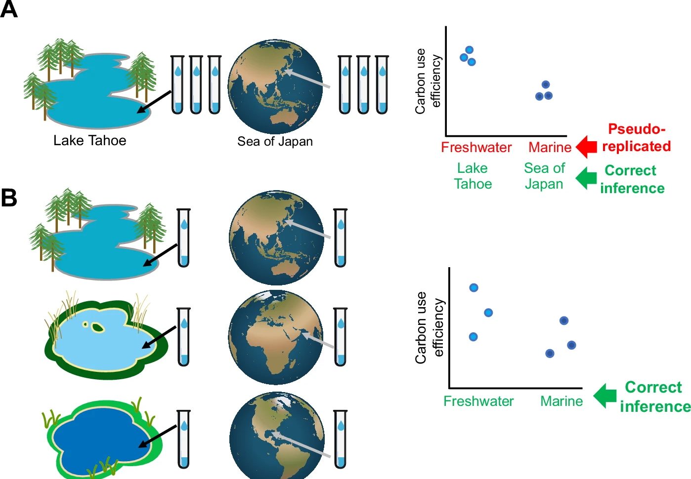

## Replication: What Actually Counts as n

!!! info "Learning objectives"
    By the end of this section, participants will be able to:  
             - Distinguish biological replicates from technical replicates, explain why the correct unit of replication differs by platform, and describe the pseudobulk principle as a design decision rather than a computational workaround.

The distinction between biological and technical replicates is one of the 
most frequently confused concepts in omics and one of the most 
consequential. Getting it wrong inflates apparent sample size, produces 
false positive results, and generates findings that do not replicate.

### The definition, stated precisely

A **biological replicate** is an independent biological sample drawn from 
the same population: a different patient, a different mouse, a different 
culture flask. Biological replicates capture natural variation within the 
population and are the unit of statistical inference. They drive the n 
in every power calculation and every statistical test.

A **technical replicate** is the same biological sample measured more than 
once. Technical replicates capture measurement variability, how 
consistently the platform quantifies the same input. They do not add 
independent biological information.

Treating technical replicates as biological replicates inflates the 
effective sample size, artificially narrows confidence intervals, and 
produces p-values that are lower than they should be. The result is false 
positives that appear statistically robust but vanish in independent 
datasets.

??? example "Terminology"
    **Biological unit (BU)**: The biological entity of interest about which conclusions are drawn in an omics study.
    Examples:
        A patient in RNA-seq or proteomics
        A mouse in an experiment
        A soil site in metagenomics   
    **Experimental unit (EU)**: The smallest unit that is independently subjected to a condition or treatment in the experiment.
    Examples:
        Each patient sample in bulk RNA-seq
        Each independently treated cell culture
        Each stool sample in a microbiome study  
    **Observational unit (OU)**: In standard statistical usage, the observational unit is the entity on which measurements are directly recorded. Example: In omics studies, sample taken from patient (e.g. tissue biopsy, blood draw) are observational unit, or the individual cell in single-cell assays.

### The platform determines whether technical replicates are useful at all

This is something most training materials tend to skip over. Technical replicates are not a default requirement, their value depends entirely on the platform, and more specifically on whether technical noise is large enough to matter relative to biological variability.

In **bulk RNA-seq**, technical variance from library preparation and 
sequencing is typically small compared to biological variance between 
samples. Including technical replicates occupies sequencing budget without 
providing meaningful additional information about measurement error, budget 
that would be better spent on additional biological samples. Technical 
replicates in bulk RNA-seq are rarely justified.

In **mass spectrometry-based proteomics**, the relationship is different. 
Run to run variation from ionisation differences, instrument drift, and 
sample injection variability can be comparable in magnitude to biological 
differences between groups. Here, technical replicates provide genuine 
information about measurement stability, and their inclusion; when done 
strategically, this can be used to quantify and correct the technical 
noise. The RUVIII approach in the further reading block below is one way this gets formalised into a more systematic correction strategy.

| Platform | Technical variance vs biological variance | Technical replicates useful? |
|---|---|---|
| **Bulk RNA-seq** | Technical << biological | Rarely for power; useful for QC and validation |
| **scRNA-seq** | Technical high at cell level; biological dominates at donor level | Donors drive power; technical replication less critical but batch aware design may need, if randamisation is a concern |
| **Proteomics (MS)** | Often comparable (esp. discovery) | Yes; if incorporated into statistical correction models [VARIFY WITH EXPERT; NOT SO SURE]|
| **Metabolomics (MS)** | Technical often ≈ biological |  Yes; pooled QC samples are standard [VARIFY WITH EXPERT; NOT SO SURE] |
| **16S / metagenomics** | Extraction and PCR variation substantial | Useful for contamination detection and technical bias detection |

### Pseudoreplication and what it means for design

When measurements are taken from the same biological unit multiple times 
and treated as independent, the result is pseudoreplication, a form of 
false inflation of n that was covered in detail in Module 1. Rather than 
revisiting the statistical consequences here, the design principle is 
simple:

**Identify the true biological unit before the experiment starts, and ensure 
your replication strategy matches it.**

The figure below, from Wagner & Kleiner (2025), shows four scenarios that 
clarify this principle. Panels A and B contrast pseudoreplicated vs valid 
designs for comparing freshwater and marine microbial communities: three 
vials from Lake Tahoe are not three independent observations of freshwater 
microbiomes; they are three observations of Lake Tahoe. Panel B shows the 
correct design: one vial from each of three independently selected 
freshwater bodies. 

{width=90%}

<small>Ref: Wagner & Kleiner. *Nature Communications* 16, 7263 (2025).
[doi:10.1038/s41467-025-62616-x](https://www.nature.com/articles/s41467-025-62616-x){target="_blank"}
(CC BY-NC-ND 4.0)</small>

??? info "Case Study: Pseudoreplication at Scale: 95% of HMA Microbiome Studies"

    A 2020 systematic review by Walter et al. examined 38 published studies 
    that used human microbiota associated (HMA) rodents to establish causal 
    links between gut microbiome alterations and human disease. These studies 
    transplant fecal microbiota from human donors (cases and controls) into 
    germ free rodents and compare pathological phenotypes in the recipients.

    The review found that 95% of studies (36/38) reported successful transfer 
    of disease associated phenotypes; a rate the authors describe as 
    biologically Unbelievable given the known limitations of cross species 
    microbiome transfer.

    A key driver of this inflation was pseudoreplication. Figure 1 of the 
    paper (below) maps the three level structure of these experiments: the 
    **Biological Unit (BU)** is the human donor, the entity about which 
    causal inferences are being made. The **Experimental Unit (EU)** is the 
    inoculum used to colonise the mice, which, when donors are pooled, 
    collapses to the number of pools rather than the number of donors. The 
    **Observational Unit (OU)** is the individual mouse, just a measurement 
    platform, not an independent replicate.

    {width=90%}

    <small>Ref: Walter J, Armet AM, Finlay BB, Shanahan F. Establishing or 
    Exaggerating Causality for the Gut Microbiome: Lessons from Human 
    Microbiota-Associated Rodents. *Cell* 180, 221–232 (2020).
    [doi:10.1016/j.cell.2019.12.025](https://doi.org/10.1016/j.cell.2019.12.025){target="_blank"}</small>

    Of the 38 studies reviewed, 84% used the individual animals as the unit 
    of statistical inference, even though animal numbers were far larger than 
    the number of human donors and the donors were the true experimental unit. 
    Many studies also pooled donor samples before inoculation, reducing the 
    effective n from the number of donors to the number of pools: sometimes 
    to n = 1 per condition.

    **The connection to Module 1:** The Koren et al. (2012) pregnancy 
    microbiome study used as the Module 1 design activity is one of the 
    studies cited in this systematic review. The Walter et al. Figure 1 
    provides the formal conceptual framework for why that design was 
    pseudoreplicated, and why 84% of similar studies made the same error.

    **The design fix:** use the number of human donors as n; do not pool 
    samples before inoculation; prevent microbial spread between cages from 
    different donors. These are design decisions, not analytical ones: they 
    cannot be applied retrospectively.

### The single cell case: donors, not cells, are the unit

Single cell RNA-seq needs a bit of extra care here, because it produces
a lot of data very quickly. It’s easy to end up with tens of thousands of
cells and feel like you have a very large sample size.

But those cells are not independent observations.

What matters for statistical inference is still the number of **donors**.
Cells tell you what is happening *within* a donor. Donors tell you what is
consistent *across* a population.

This isn’t just a theoretical point. In practice, increasing the number of
donors has a much larger impact on statistical power than increasing the
number of cells per donor. Going from 5 to 20 donors can completely change
what you’re able to detect. Going from 50 to 500 cells per donor usually
does not (Refer to next section).

This is where many analyses quietly go wrong. Treating each cell as an
independent replicate inflates the effective sample size and produces
overconfident results, small p-values that don’t hold up when tested on
new data.

The fix is straightforward, but it needs to match the design.

Rather than analysing cells individually, counts are first aggregated at
the donor level (typically within each cell type). This produces one
expression profile per donor per cell type. Differential expression is
then performed on those profiles using standard tools such as DESeq2,
edgeR, or limma.

This approach is commonly called **pseudobulk**, but it’s worth being clear
about what that means. It’s not a workaround for a limitation in the data.
It’s the analysis that matches the correct unit of replication.

If the experiment is designed around donors, the analysis should be too.

<small>Zimmerman KD, Espeland MA, Langefeld CD. A practical solution to 
pseudoreplication bias in single-cell studies. *Nature Communications* 
2021; 12: 738. 
[doi:10.1038/s41467-021-21038-1](https://www.nature.com/articles/s41467-021-21038-1){target="_blank"}</small>

??? abstract "Further reading · When technical replicates are an asset?"

    The standard advice is that technical replicates waste sequencing budget 
    that should go toward biological replication. This is correct in most 
    contexts, but there is an important exception that turns technical 
    replicates from a cost into a correction tool.

    **RUVIII (Remove Unwanted Variation, version III)** uses technical 
    replicates as *negative controls* to estimate and remove unwanted 
    variation. The logic: the same biological sample measured in two 
    different batches should produce identical expression profiles. Any 
    systematic disagreement between the two measurements reflects technical 
    noise, not biology. RUVIII learns the structure of this disagreement 
    across all technical replicate pairs and subtracts it from every sample 
    in the dataset.

    This approach was applied to a **NanoString cohort** of inflammatory bowel 
    disease samples where batch effects were large relative to the biological 
    signal. Including a small number of technical replicate samples, the 
    same RNA measured across multiple processing runs, enabled RUVIII to 
    estimate batch structure that could not have been estimated from the 
    biological samples alone.

    **The critical requirement:** technical replicates must be included *by 
    design*, before data collection begins. RUVIII cannot be applied 
    retrospectively if no true technical replicates exist. This is why it 
    belongs to study design, not data analysis.

    <small>
    Molania R, et al. A new normalization for Nanostring nCounter gene 
    expression data. *Nucleic Acids Research* 2019; 47(12): 6073–6083.
    [doi:10.1093/nar/gkz433](https://doi.org/10.1093/nar/gkz433){target="_blank"}

    Luijk R, et al. Normalisation of Illumina Infinium 450K and EPIC 
    methylation array data using RUV-III. *Nucleic Acids Research* 2022.
    [doi:10.1093/nar/gkab1117](https://doi.org/10.1093/nar/gkab1117){target="_blank"}
    </small>

---