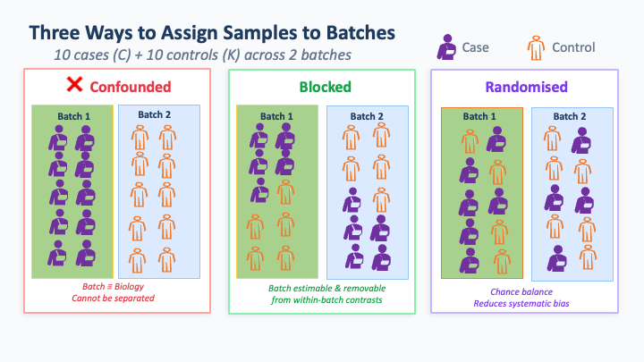
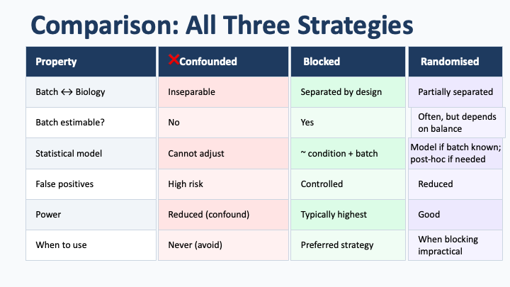
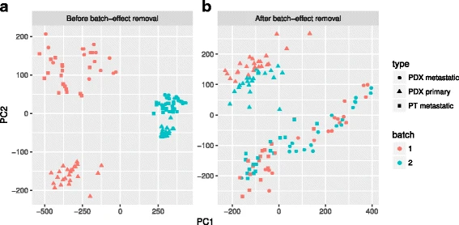

## Blocking: Designing Batch Effects Out

!!! info "Learning objectives"
    By the end of this section, participants will be able to:  
    - Explain blocking as a prospective design strategy and understand why 
      it is more reliable than post hoc batch correction, including when 
      correction is not possible.

Randomisation (Section 1) distributes unknown sources of variation across 
groups so they do not systematically bias comparisons. Blocking addresses a 
different problem: it deals with *known* sources of technical variation by 
ensuring that all biological groups are represented within each batch. In 
practice, both are needed. Randomisation protects against unknown bias; 
blocking controls what you already know will vary.

---

### What constitutes a batch

A **batch** is any set of samples processed under shared technical 
conditions. In omics workflows, this can arise at multiple stages:

- Samples extracted together on the same day or by the same operator  
- Libraries prepared in the same reaction or reagent lot  
- Samples run on the same sequencing lane, flow cell, or MS injection series  
- Samples stored and handled under identical conditions 

Batch effects are therefore unavoidable. The relevant question is not 
whether batches exist, but whether biological groups are **distributed 
across batches** or accidently **confounded with them**.

---

### The principle of blocking

Batch effects become problematic when they align with biological groups. If 
all cases are processed in one batch and all controls in another, any 
technical difference between batches is indistinguishable from the 
biological effect of interest. At that point, no downstream analysis can 
separate the two.

Blocking avoids this by design:  
**each biological group must be represented within every batch.**

---

### A minimal example

Consider 20 samples (10 cases, 10 controls) processed in two batches.

- **Confounded design:**  
  Batch 1 contains all cases; Batch 2 contains all controls.  
  Any batch effect is inseparable from the biological comparison.

- **Blocked design:**  
  Each batch contains 5 cases and 5 controls.  
  The batch effect can now be estimated from within batch contrasts and 
  adjusted for during analysis.

{style="width:90%; height:auto; min-height:300px"}

{style="width:90%; height:auto; min-height:300px"}
  

Importantly, the corrected design requires no additional cost or samples,
only that sample allocation is planned in advance.

---

### Reference samples as anchors

In platforms with substantial run to run variability (especially mass 
spectrometry), ?????it is common?? to include a **shared reference sample** in each 
batch?????. This is typically a pooled mixture derived from all study samples 
and measured repeatedly throughout the run [NOTE FOR MYSELF: VERFIY WITH SOME  ON MASS SPEC].

The reference serves two purposes:
- It provides a direct measure of technical drift across batches  
- It enables between batch normalisation using a common anchor

This is standard practice in metabolomics (pooled QC injections) and widely 
used in proteomics. As with blocking, it must be planned prospectively,
the reference material needs to be prepared and aliquoted at the start of 
the study.

---

### Why design matters more than correction

Batch correction methods (e.g. ComBat, RUV, Harmony) work 
well when batch effects are **orthogonal** to the biological comparison,
that is, when all groups are represented across batches. In this setting, 
the model can distinguish technical variation from biological signal.

When batch and biology are correlated, this separation is no longer 
possible. The model cannot determine whether a difference is technical or 
biological, and any correction risks removing real signal along with noise.

Prospective blocking avoids this problem entirely by ensuring that the two 
sources of variation are separable from the outset. No computational method 
can recover information that was lost at the design stage.

The plots below illustrate this distinction. In a balanced design, batch 
effects can be removed, revealing the underlying biological structure. In a 
confounded design, the same separation is not achievable.

{style="width:90%; height:auto; min-height:300px"}

<small>Ref: [Zhu, Xun, et al. "Granatum: a graphical single-cell RNA-Seq analysis pipeline for genomics scientists." Genome medicine 9.1 (2017): ](https://link.springer.com/article/10.1186/s13073-017-0492-3?utm_source=researchgate.net&utm_medium=article)</small>

---

!!! danger "Irreversible confounding"
    If biological groups are fully confounded with batch (e.g. all cases in 
    one batch, all controls in another), the effect cannot be corrected 
    computationally. The only solution is to redesign and repeat the 
    experiment.

---

!!! info "Coming up in Module 4"
    When batch effects are present but the design is balanced, computational 
    correction becomes appropriate. Methods for detecting and evaluating 
    batch effects (e.g. PCA, RLE plots) and selecting correction strategies 
    are covered in **Module 4: Bias Identification and Data Quality 
    Assessment**.