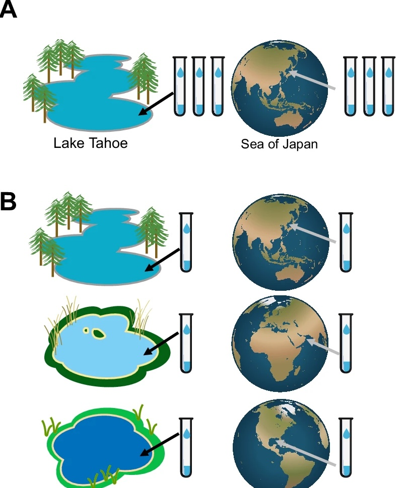

## Replication: biological vs technical, and when technical replicates help

Module 1 defined the terms, biological replicates, technical replicates, and
why treating non independent measurements as independent inflates *n*
(pseudoreplication, Pitfall 8). This section takes those as given and answers one
design question Module 1 did not: **should you spend part of your budget on
technical replicates at all?**

A quick reminder of the distinction, because the rest of the section turns on it:

- A **biological replicate** is an independent sample from the population, a
  different patient, mouse, or culture. Biological replicates are what your *n*
  is counted in.
- A **technical replicate** is the *same* sample measured more than once. It
  tells you how consistent the measurement is, not how variable the biology is.

Only biological replicates add to *n*. A technical replicate measured twice is
still one biological sample. So the question is never "do technical replicates
increase my sample size", they don't but "are they worth the budget for what
they *do* tell me?"

---

### Whether to include them is a platform decision

Technical replicates are not a default requirement. The principle is simple:

!!! tip "When technical replication earns its place"
    Technical replicates are worth it when measurement noise is large enough to
    affect your scientific question. When measurement noise is small next to the
    biological differences you care about, the same budget may buy more as another
    biological sample.

Platforms differ enormously on this. On **bulk RNA-seq**, technical variance from
library prep and sequencing is usually small compared with the biological
differences between samples, a technical replicate spends budget measuring
something that barely moves. In some **mass-spectrometry** applications, the situation can be different:
run-to-run variation from ionisation, instrument drift, and injection can rival
the biological effect, so technical replicates carry real information.

| Platform | Technical vs biological variance | When technical replication may be useful |
|---|---|---|
| **Bulk RNA-seq** | Technical ≪ biological | Rarely for power; useful for QC |
| **Proteomics (MS)** | Often comparable, especially in discovery | Often worthwhile |
| **Metabolomics (MS)** | Often comparable | Yes, pooled QC samples are standard practice |
| **16S / metagenomics** | Extraction and PCR variation substantial | Useful for spotting contamination and technical bias |

Read the table as examples of the principle, not fixed rules: the question is
always whether measurement noise is large enough to matter for what you are
trying to detect.

---

### The payoff: technical replicates can *remove* noise, not just measure it

There is a second reason to include technical replicates, and it is the one most
people miss. When built into the design, technical replicates can do more than measure technical noise: they can help estimate and, with appropriate methods, correct for systematic technical variation.

The idea is intuitive. If you measure the **same sample** twice, differences between the measurements cannot be attributed to biological differences between samples; they provide information about measurement variability.

{width=100%}

The clearest everyday version is a **shared reference sample**: one common
sample run repeatedly through every batch. In proteomics this is a bridge channel
carried through each TMT set; in metabolomics it is the pooled QC injection you
met in the mass-spec walk-through. Because it is the same material every time,
any variation in its measurements is drift, not biology and that variation can help identify and correct systematic differences between batches.

!!! example "A method that does this: RUV-III"
    **RUV-III** ("remove unwanted variation") uses technical replicates as the
    reference. The same sample measured in two batches *should* give the same
    profile, so any systematic disagreement is technical noise. RUV-III learns
    that noise from all the replicate pairs and removes it from every sample.

    Applied to a NanoString cohort where batch effects swamped the biological
    signal, a handful of technical replicates let RUV-III recover structure the
    biological samples alone could not have revealed.

    **The design lesson and the only part that matters here:** none of this
    works after the fact. The replicates (or the reference sample) have to be in
    the run from the start. You cannot decide at analysis that you wish you had
    them. This is why "should I include technical replicates" is a design
    question, not an analysis one.

---

### What to carry forward

- Technical replicates do **not** add to *n* only biological replicates do.
- Whether to include them depends on the platform and the question: technical replication is rarely needed for power in bulk RNA-seq, while it can be valuable for measuring and controlling technical variation in mass spectrometry.
- Included **by design**, technical replicates (or a shared reference sample)
  let you measure *and* remove technical drift. Left out, that option is gone
  it cannot be added retrospectively.

!!! question "Activity: is this design replicated, or pseudoreplicated?"

    **The study.** A team wants to know whether microbial communities differ
    between freshwater and marine environments. Two sampling designs are
    proposed. Both produce six samples and cost the same to sequence.

    {width=90%}

    **In your group, for panel A and then panel B:**

    1. What is the biological unit the study wants to draw a conclusion about?
    2. What is the real *n* per environment?
    3. Is this valid biological replication (vial as sample), or pseudoreplication?

    **Then:** one design gives an answer to the research question and the other
    does not. Which, and what exactly does the failing design measure instead?

    <small>Ref: Wagner & Kleiner. *Nature Communications* 16, 7263 (2025).
    [doi:10.1038/s41467-025-62616-x](https://www.nature.com/articles/s41467-025-62616-x){target="_blank"}
    (CC BY-NC-ND 4.0)</small>

<!--
            ??? success "Answers: reveal after group discussion"

        **Panel A pseudoreplication.**

        - *Biological unit:* the water body. The study wants to conclude about
          freshwater and marine environments as **categories**, so one lake is
          one observation of "freshwater."
        - *Real n:* **1 per environment**, not 3. The three vials are
          observational units nested inside a single biological unit.
        - Three vials from Lake Tahoe are three observations of *one lake*, not
          three observations of freshwater. Analysing them as n = 3 inflates the
          degrees of freedom and produces a p-value that describes a comparison
          the study never made.

        **Panel B valid replication.**

        - *Biological unit:* unchanged, the water body.
        - *Real n:* **3 per environment**, one vial from each of three
          independently chosen bodies.
        - Because the three lakes differ from each other, the variation between
          them is the variation the question is about. That is what makes the
          freshwater/marine contrast estimable.

        **Which design answers the question?**

        Only B. Panel A can detect a difference between Lake Tahoe and the Sea of
        Japan, but "freshwater versus marine" 

        Panel A is not measuring nothing, it estimates **within-body
        variability**, which is real information. It simply is not the quantity
        the research question asked for, and no analysis converts one into the
        other.

        **Note the mechanism.** This is *subsampling* (many observational units
        from one biological unit), not the *pooling* seen in the Koren study,
        where donor material was merged before measurement. Both collapse the
        real *n*; they do it at different points in the workflow, and
        subsampling is sometimes recoverable at analysis if the nesting was
        recorded. Pooling is not.
        -->