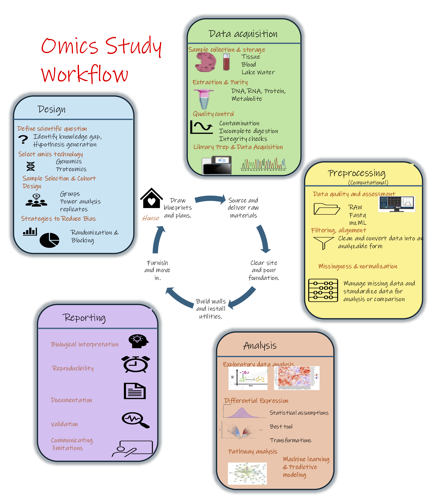

# Module 1.2: Understanding the factors that shape study success

!!! info "Learning objectives"
        Describe the major stages of an omics workflow and identify the key pitfalls at each stage. 

Despite rapid advances in 'omics technologies, successful studies depend on more than the technology itself. Careful experimental design, data analysis, and interpretation are critical at every stage of the study design. Understanding the factors that contribute to robust and reproducible studies is just as important as understanding the technologies themselves.

The figure below sets out the five stages of an omics study. **The sections that follow walk through each stage in turn and the pitfalls that arise there.**

{width=100%}

---

