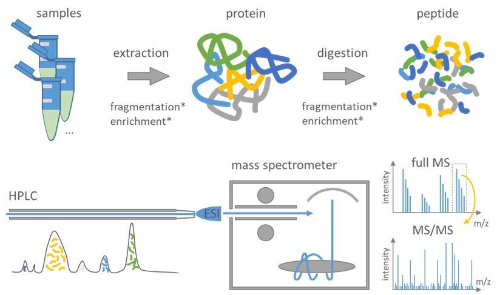

# 2.1 Choosing the right platform

!!! abstract "Design question: Are we measuring the biological feature we want to interpret?"
    **Mainly:** Accuracy and interpretability  
    **Also affects:** Power and cost · Generalisability

The first design decision in Module 2 is which platform to run at all,
because that choice fixes everything that follows. 

> This section is about measuring the wrong thing. The next two deal with the problems that remain once the platform is right.

The chain is short and it runs one way only:

> **research question → biological molecule → measurement platform → data type**

Each decision constrains the next. Once samples are collected on a particular
platform, you cannot move back up the chain without collecting new data.

---

## Start from the molecule

Different biological molecules require different measurement technologies. DNA
and RNA can be sequenced directly, whereas proteins and metabolites generally
cannot and are instead measured using approaches such as mass spectrometry or
affinity-based assays. The molecule determines which platforms are available;
the question decides between them.

The figure below maps each biological layer to the molecule it targets, the
current platforms available to measure it, examples of analyses each enables,
and in the final column when you would choose one platform over another within
the same layer.

{width=100%}

Read the figure left to right, but note that the rightmost column is where the
design decision sits. Every row poses the same choice: **discovery versus
targeted** (can the platform see things you didn't specify in advance?) or
**resolution versus average** (does it resolve individual cells or locations,
or only their pooled signal?).

!!! tip "The question chooses the layer; the layer chooses the platform"
    As in Module 1, the research question should decide which layer of biology
    you measure, not the other way around. A platform adopted because it is
    current, then pointed at a question it does not fit, is one of the
    common and expensive versions of this pitfall.

---

## Two families of platform

For this module it is useful to think about omics platforms in two broad
families, based on how the biological signal is acquired.

**Sequencing-based platforms** determine the nucleotide sequence of DNA or RNA
molecules, and typically yield **reads**, which are processed downstream into
the data types you will work with. RNA-seq, single-cell RNA-seq, ATAC-seq, and
microbiome sequencing all sit here.

**Signal-based platforms** measure a physical signal instead, such as
fluorescence or ion abundance, and typically yield **intensities**. Mass
spectrometry (proteomics, metabolomics), microarrays, and imaging-based assays
sit here.

The two families generate data in different ways. The next two sections walk
through each in turn, sequencing first, then mass spectrometry, so the kind of
number each produces makes sense before you rely on it.

!!! note "Discovery is a design choice, not a family"
    Sequencing platforms are often used for discovery, and many signal-based
    platforms measure predefined targets, but the two don't always line up.
    Untargeted mass spectrometry can also support broad discovery, while
    targeted sequencing panels interrogate only pre-selected regions. Whether an
    assay is discovery-driven or targeted is set during study design, not by
    whether it sequences.

!!! info "Spatial omics sits across both families"
    Spatial transcriptomics is a useful test of the framing above, because which
    family a platform belongs to determines the measurement it produces. Visium platform
    captures RNA by **sequencing barcoded spots** on a tissue section and
    produces count data. **Imaging-based platforms** such as Xenium and MERFISH
    detect fluorescently labelled RNA directly within intact tissue; although
    fluorescence intensities are measured during acquisition, the pipelines
    typically decode these into transcript counts per cell. The biology being
    measured is similar; the measurement process, and therefore the data type,
    is not.

---

## Sequencing: from sample to reads

Sequencing takes extracted DNA or RNA, prepares it into a form the instrument
can read, and reports the nucleotide sequence of millions of fragments. The
output is **reads**: the raw sequences coming off the machine, before any
analysis. By the time reads come off the machine, every decision that shaped them has already been made.

{width=100%}

<small>Library preparation and sequencing mentioned at First row stops at raw reads. Second row shows the downstream analysis: quality control, alignment or assembly, and the count
matrix or VCF. It is shown here only so you can see where the reads go
next.</small>

Two upstream decisions do most of the design work: what you capture in library
prep, and the read length the platform gives you.

### Library prep decides what you capture

Library prep turns extracted nucleic acid into barcoded, sequenceable
fragments. What you choose to enrich for at this stage sets the ceiling on what
the reads can contain. Sequencing total RNA, mRNA, or small RNA are different
libraries answering different questions; a library built for mRNA cannot be
made to report small RNAs later. As with platform choice, the question decides
the library.

Barcoding at this stage is **multiplexing, not pooling**: barcoded samples
share one sequencing run but stay computationally separable afterwards, unlike
biological pooling, which merges samples irreversibly (Module 1, Pitfall 8).

### Short-read sequencing vs long-read sequencing

**Short-read sequencing** (e.g. Illumina) reads fragments of roughly 50–300
bases. It is cheap, high-throughput, and highly accurate per base, which makes
it the default for quantifying known features such as gene expression across
many samples. Its limitation is structural: anything longer than a single
fragment has to be reconstructed computationally, and some things cannot be
reconstructed reliably at all.

**Long-read sequencing** (e.g. PacBio, Oxford Nanopore) produces single reads
spanning thousands of bases. Because a read can cover a whole molecule, long
reads resolve full-length isoforms, structural variants, and repetitive regions
directly, rather than inferring them. The trade-off is higher cost per base and
lower throughput; modern long-read platforms are now fairly accurate per read.

The decision follows from the question, not the budget: if you need to see
full-length molecules or structural features, no amount of short-read depth
substitutes for read length. If you are quantifying known features cheaply and
at scale, short reads are the better fit. This is a read-length limit, not a
coverage one, which is why it cannot be fixed after sequencing.

!!! danger "The unrecoverable rule"
    If the platform cannot capture the biological signal of interest, no
    analysis method can recover it. The choice has to be made before data
    collection, not revisited after. This is why platform and read-length choice
    sit in study design, alongside sample size and randomisation, not in
    analysis.

---

## Mass spectrometry: from sample to spectrum

Unlike DNA and RNA, proteins and metabolites are generally not sequenced as
polymers. In mass spectrometry they are measured by their mass-to-charge ratio
(m/z) and signal intensity; for proteins, fragmentation spectra can also provide
sequence information about peptides. The output is **intensities**: signal
measured as a function of m/z.

The chain runs one way, exactly as it did for sequencing, and it ends at the
spectrum:
> Proteomics
> **extract → prepare → separate (LC) → ionise → mass spectrometer → spectrum**

{width=100%}

<small>*Source: adapted from [csbiology.github.io Mass spectrometry-based proteomics](https://csbiology.github.io/BIO-BTE-06-L-7/NB02a_Mass_spectrometry_based_proteomics.html){target="_blank"}*</small>

Reading left to right: in the common bottom-up proteomics workflow, proteins are
extracted and digested into peptides. That digestion step is what makes this
workflow look different from sequencing. The peptides are separated over time by
liquid chromatography (LC) so they don't all hit the instrument at once, sprayed
into the mass spectrometer as charged ions, and measured according to their
m/z. What comes back is a spectrum: intensity on one axis, m/z on the other.

!!! note "Metabolomics takes a similar path, minus one step"
    Metabolites are small molecules and are measured directly, so there is no
    digestion step. For LC-MS metabolomics the downstream workflow is similar:
    separate, ionise, measure m/z, and record signal intensities.

Two further decisions matter particularly for interpreting the resulting data,
and neither is a step you can see in the figure. The first concerns how samples
are quantified and multiplexed; the second concerns how ions are sampled by the
instrument. Both are fixed before the run, and one of them cannot be undone
afterwards.

### Decision 1: label-free or labelled

Whether samples are acquired using a label-free or a labelling strategy is
decided before the run; the resulting data are then quantified and compared
computationally.

**Label-free** runs each sample separately and compares signal across runs. It
can be simpler because each sample does not require a labelling reagent or a
place in a multiplexing set, although each sample generally requires its own
measurement run.
But because samples are measured in different runs, run-to-run variation and a
greater potential for missing measurements across runs are important
considerations. **Injection order** matters here. Instrument signal drifts over a
run, so if samples are injected in an order that lines up with your biological
groups, the drift becomes a batch effect indistinguishable from biology. That is
Module 1, Pitfall 4, in a new guise. Randomise injection order, and plan
**pooled QC** injections to track the drift. Pooled QC samples need to be
prepared and included in the run; if they were never acquired, no later analysis
can reconstruct them (Module 1, Pitfall 6).

**Labelled** (e.g. TMT) chemically tags several samples so they can be combined
and measured in a single run. Run-to-run variation is reduced *within* a tagged
set because the samples are measured together, but the number of samples that
can be multiplexed in a set is limited by the labelling scheme. Each multiplexed
set is a separate analytical batch, so biological groups should be balanced
across sets wherever possible. Labelling buys within-set consistency at the cost
of throughput and a new layer of batch structure to design around.

!!! tip "This is a power and cost trade-off, on the bench"
    Label-free places no multiplexing limit on sample number, but each sample
    costs a run; labelled approaches reduce runs and improve consistency within
    a set, at a capped set size. Neither is better in principle: the right
    choice depends on whether your study is limited more by instrument time or
    by run-to-run noise.

### Decision 2: the acquisition mode you cannot revisit

Once ions are inside the instrument, the **acquisition mode** determines how
precursor ions are sampled and fragmented.

**DDA (data-dependent acquisition)** takes a survey scan and then selects and
fragments a subset of precursor ions, typically favouring the most abundant ions
it sees. This produces relatively less complex MS/MS spectra, but by
construction it spends its effort on what is already abundant. Low-abundance
peptides may be sampled sporadically or missed entirely, and which ones are
selected can shift from run to run.

**DIA (data-independent acquisition)** fragments ions within predefined m/z
windows, rather than selecting individual precursors by abundance. This
generally provides more consistent sampling across runs, at the cost of more
complex, multiplexed spectra.

!!! danger "The unrecoverable rule"
    If the relevant ion signal was never acquired, no downstream analysis can
    reconstruct that missing measurement from the raw data. Not detected is not
    the same as not present. This is the same principle Module 1 named for
    platform choice (Pitfall 2), now at the level of the instrument.

This also explains something flagged in Module 1. Missingness in mass
spectrometry is often informative rather than completely random. Low-abundance
molecules are more likely to fall below detection or acquisition thresholds, but
missingness can also arise from ionisation, chromatographic, matrix and
acquisition effects. DDA's tendency to favour abundant ions is one contributor
to this pattern. That is why, as Module 1, Pitfall 6 warned, blindly replacing
missing values with the sample mean can be misleading: it can turn a potentially
low-abundance observation into an average-abundance value and distort exactly
the low-abundance molecules a discovery study is trying to find. The decision
made here determines the pattern of missing values you will have to handle
later.

---

## Live mentimeter activity

***[Click here to join the activity](https://www.menti.com/aluadu62pnrb){target="_blank"}***
