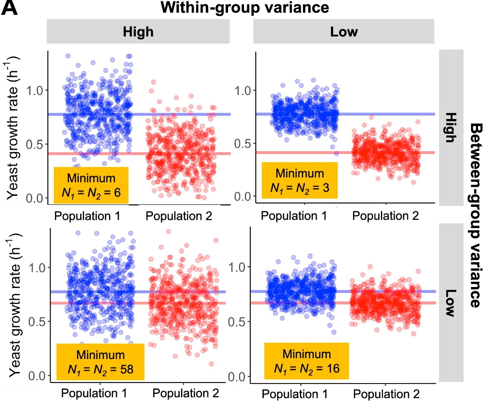

# 2.2.1 Sample size and statistical power

!!! info "Learning objectives"
    - Explain why statistical power is necessary to interpret analysis results
    - Identify design-stage strategies to ensure a study is well-powered (replication, platform-appropriate minimum sampling, detectable effect sizes)
    - Describe analysis-stage strategies for validating power
    - Explain why omics requires its own statistical methods, rather than classical power calculations

Sections 2.1.1 through 2.1.3 addressed whether a measurement can be trusted: whether the platform is appropriate, whether samples are allocated to avoid confounding, and whether measurements are consistent and documented. **This section addresses whether there are enough independent observations to detect the effect of interest**. A study can satisfy every criterion in Module 2.1 and still fail to replicate if the sample size was insufficient.

??? tip "Consideration 10: The unit of replication"
    Only biological replicates — independent samples from the population — contribute to *n*. Technical replicates, subsamples, and pooled material do not. The unit has to be identified before a sample size can be calculated, because the calculation is counting independent observations of that unit. A study that misidentifies the unit will produce an *n* that describes a different study.

??? tip "Consideration 11: The multiple-testing burden"
    Classical power calculations assume a single hypothesis. In omics studies, thousands to millions of features are tested simultaneously, and false discovery rate correction lowers the effective significance threshold for each one. A study powered for one well-characterised feature is not powered for the dataset. The multiple-testing burden is not a statistical technicality to manage at analysis — it is part of the sample size problem and has to be accounted for at design.

??? tip "Consideration 12: Effect size and variability must be estimated"
    Sample size calculations require an effect size and a variance estimate. Neither has a default value, and neither can be derived from the power calculation itself. They must come from domain knowledge, comparable published studies, or pilot data. Using assumed or generic values produces a sample size estimate that describes a study different from the one being designed. This is the step most often skipped, and it is why sample sizes set by budget or convention so often fall short.

---

## The unit of replication

A study's sample size is a count of independent biological units. It is the number of patients, animals, cultures, or environmental samples that contribute separate, non-overlapping observations to the analysis. Before that count means anything, the unit has to be identified.

Two failure modes collapse the effective count without changing the apparent one. 

1. **Subsampling** takes many measurements from one biological unit: thousands of cells from one donor, multiple vials from one water body. 
2. **Pooling** merges material from several biological units before measurement, so the pool represents an average rather than any individual. 

Subsampling is sometimes recoverable at analysis if the nesting was recorded; pooling happens before measurement and cannot be undone. Both are collection-stage decisions.

---

## Statistical power in omics

Sample size in omics is rarely determined by a power calculation. It is determined by budget, sample availability, or instrument capacity, and is often fixed before anyone has asked what it takes to detect the effect of interest. The result is a study that is well-executed at the bench but underpowered for its bioinformatic analyses. Underpowering does not appear during analysis — it appears when findings fail to replicate in an independent cohort or on a second platform.

Classical power calculations do not transfer directly to omics. Standard formulas assume a single hypothesis, an approximately known variance, and a 0.05 significance threshold. In omics, thousands to millions of features are tested at once, variance differs from feature to feature and is not known in advance, and false discovery rate correction lowers the effective significance threshold for every feature in proportion to the number tested. A study powered to detect a single well-characterised effect is not powered for the full dataset. The practical consequence is that analyses may recover a reasonable number of signals before correction and far fewer after it.

??? note "Multiple testing and false discovery rate correction"
    When a single hypothesis is tested at a 0.05 threshold, there is a 5% chance of a false positive. When 20,000 gene expression features are each tested at the same threshold, roughly 1,000 false positives are expected by chance alone, even if no true differences exist. Multiple testing correction addresses this by adjusting the significance threshold based on the number of tests performed.

    The most widely used method in omics is Benjamini-Hochberg false discovery rate (FDR) correction, which controls the expected proportion of false positives among the features called significant. A 5% FDR means that 5% of reported findings are expected to be false positives. With more features tested and the same sample size, detecting true positives after correction requires larger effects or more samples. This is why a sample size adequate for a single-feature experiment is rarely adequate for an omics dataset.

---

## Estimating the sample size

A power calculation is a formula that **estimates the sample size needed to detect an effect of a given magnitude, with a given probability, at a given significance threshold**. It requires three inputs:

1. **Effect size**: how large a difference is being detected
2. **Biological variability**: how much samples differ from each other for reasons unrelated to the effect
3. **Multiple-testing burden**: how many features are being tested and corrected simultaneously

None of these has a default value, and none can be derived from the calculation itself. They must be estimated before the calculation is run. In omics, where variance is feature-specific and rarely known in advance, sample size is best estimated empirically rather than calculated from assumed values.

The figure below illustrates how these two inputs interact. Each panel shows two populations being compared; the minimum sample size required to detect the difference changes substantially depending on how variable the measurements are within each group and how large the difference between groups is. High within-group variance or a small between-group difference both require more samples — and when both conditions hold simultaneously, the required *n* rises sharply.

{width=90%}

<small>Wagner & Kleiner. *Nature Communications* 16, 7263 (2025). [doi:10.1038/s41467-025-62616-x](https://www.nature.com/articles/s41467-025-62616-x){target="_blank"} (CC BY-NC-ND 4.0)</small>

Because the assumptions behind classical formulas rarely hold in omics, sample size is best estimated empirically from one or more of the following sources. Most studies should draw on more than one.

!!! info "Three sources for effect size and variability estimates"
    **Domain knowledge.** What counts as a biologically meaningful difference is a scientific judgement before it is a statistical one. A twofold change may be routine in one system and implausible in another. Someone with working knowledge of the tissue, organism, or condition can usually bound the range of plausible effect sizes before any data are collected.

    **Comparable published studies.** Work using the same platform, tissue, and comparison provides observed effect sizes and dispersion estimates from experiments already done. A published dataset that can be downloaded and measured directly is more informative than a reported summary statistic. Variability can differ substantially between tissues and platforms, so matching on both improves the estimate.

    **Pilot data.** A small pilot dataset can be used to estimate variability directly, and the full analysis can then be simulated across a range of sample sizes. This carries realistic measurement noise into the estimate rather than assuming a variance that has not been observed.

    Large benchmarking studies provide independent evidence of how sample size affects detection and reproducibility. Several have shown that *n* = 3 per group misses a substantial fraction of true differential signal. Any empirical estimate is more informative than a formula applied to a variance that was assumed.

---