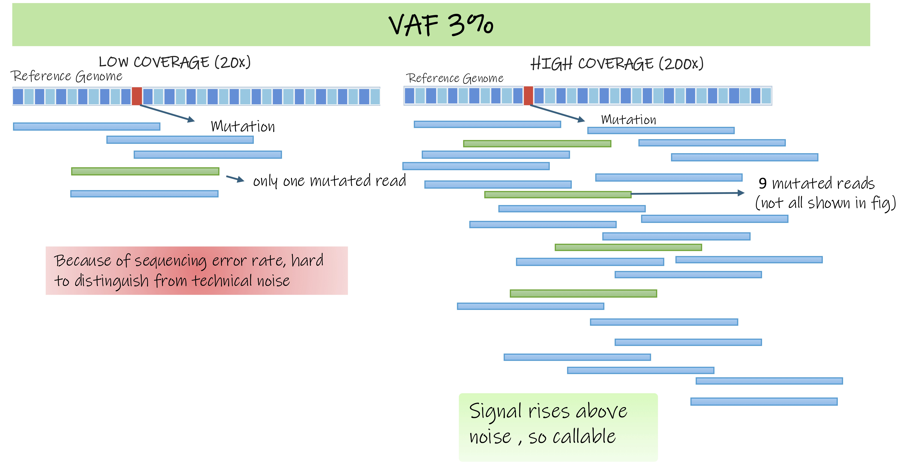

# 2.2.2 Design decision costs

!!! info "Learning objectives"
    - Explain why depth and replication serve different analytical functions and cannot substitute for each other
    - Describe why returns on additional depth diminish once the detection floor is met
    - Identify how multi-omics designs compound budget constraints
    - Apply a decision sequence for allocating a finite budget across sequencing depth, replication, and platform scope

Every omics study requires two resource allocation decisions made from the same budget: how many biological samples to collect, and how extensively each sample is measured. These decisions compete with one another and both have direct consequences for what the study can detect and what it can conclude. A third decision, platform scope, determines which molecular layers are interrogated and multiplies the cost of both. Budget is the constraint that connects all of them.

Per-sample cost in omics is not fixed. All platforms share a common cost structure: some costs are fixed per acquisition run (e.g. instrument time, setup, and QC samples) while reagent and consumable costs scale with sample number. At low sample volumes, fixed costs distribute across fewer samples and cost per sample is high. As throughput increases, fixed costs amortise and per-sample cost falls. Studies designed at low sample numbers routinely underestimate total cost because catalogue prices reflect higher-volume runs.

| Layer | Platform | Per-run fixed costs | Per-sample variable costs |
|---|---|---|---|
| Genome, transcriptome, epigenome | Short-read sequencing | Flow cell, instrument time | Library prep reagents, indexing |
| Transcriptome | scRNA-seq | GEM chip, flow cell | Capture reagents, library prep |
| Epigenome | Methylation array | Array chip, scanner time | Bisulfite conversion, labelling |
| Proteome | LC-MS/MS | Instrument session, column runs, QC injections | Digestion, cleanup, per-sample injection time |
| Metabolome | LC-MS, GC-MS | Instrument session, blank and QC pool runs | Extraction, derivatisation, per-sample injection time |

??? tip "Consideration 2: Platform selection"
    Platform choice determines per-sample cost, throughput capacity, and what can be measured at all. The same question addressed by targeted versus whole-genome sequencing, or DDA versus DIA proteomics, carries a different per-sample price and different depth requirement. Platform selection and budget planning are not separable.

??? tip "Consideration 4: Batch effects"
    How samples are distributed across acquisition runs affects both per-sample cost and batch structure. Grouping samples to fill runs efficiently can reduce cost but risks confounding batch with biology. Both pressures must be planned for together before any sample is processed.

??? tip "Consideration 5: Experimental controls"
    Controls — extraction blanks, pooled QC samples, spike-ins, shared reference samples — consume sample slots and instrument time. They must be counted and costed before the biological sample number is set. A study that sets its biological sample number and then adds controls has either fewer biological replicates than planned or an unplanned cost overrun.

---

## Decision: sample number

The number of biological samples per group is set by statistical power requirements, which were established in [module 2.2.1](module2-2-1.md). The inputs include effect size, biological variability, and the multiple-testing burden. The minimum sample number is not a default; it depends on the biological question and must be estimated before a budget is set.

In practice, sample number in omics experiments is frequently determined by budget rather than by power. This is a legitimate constraint, but it has consequences that must be acknowledged: a study designed at a sample number below what the question requires will have limited power to detect real effects, and findings may not replicate. The honest response is to scope the question to what the available sample number can support, not to proceed as though the study were fully powered.

Two factors reduce the effective sample number below the number of samples processed:

- **Controls** take up sequencing or acquisition capacity. QC pools, blanks, and reference samples run alongside biological samples and must be counted in the total before the biological number is determined.
- **Sample attrition** — failed extractions, poor QC metrics, insufficient input material — routinely reduces the number of samples that reach analysis. Designing to a minimum sample number without accounting for expected attrition produces a study that is underpowered before analysis begins.

---

## Decision: measurement depth

Measurement depth refers to how extensively each sample is interrogated. Every platform subsamples the molecules in a sample; what is detected, and how reliably, depends on how large that subsample is relative to the abundance of the features of interest. Depth sets a detection floor: features below it are missed entirely or detected inconsistently across samples.

The adequate depth for a study is not a default value. It is determined by the least-abundant feature the biological question depends on. A study targeting highly expressed genes or abundant proteins operates above a lower floor than one targeting rare isoforms, low-frequency variants, or trace metabolites.

What depth means in practice differs by platform:

| Platform | What depth means | Key decisions |
|---|---|---|
| Short-read sequencing (genome, epigenome, transcriptome) | Number of reads generated per sample | Target read depth. Set by the least-abundant feature the question depends on, not a convention |
| scRNA-seq | Reads per cell and cells per donor | Reads per cell set transcript detection within each cell; cells per donor set within-donor resolution. Donors are the biological replicates. More donors improve power, more cells per donor do not. |
| Proteomics (LC-MS/MS) | Number of peptides sampled per acquisition | Acquisition mode (DDA samples abundant ions; DIA covers the full mass range); gradient length; offline fractionation; enrichment or depletion of target proteins |
| Metabolomics (LC-MS, GC-MS) | Number of metabolites sampled per acquisition | Targeted (pre-specified features, high precision) vs untargeted (broad coverage); gradient length; scan range; ion mode |

Each decision affects per-sample cost and what the study can measure. They are made before data collection and cannot be corrected afterwards.

{width=90%}

Zimmerman K, et al. *Nature Communications* (2021)
[doi:10.1038/s41467-021-21038-1](https://www.nature.com/articles/s41467-021-21038-1){target="_blank"}

---

## The trade-off under a fixed budget

Sample number and measurement depth compete for the same budget. Spending more on measuring each sample deeply leaves less for collecting additional samples; increasing sample number reduces what can be spent on each. The decision follows a principle: establish the measurement floor the question requires, then direct remaining budget toward sample number.

Above the floor, additional depth produces diminishing returns, the features the question depends on are already being measured reliably, and further reads or acquisition time primarily samples features at abundances too low to be biologically interpretable. The same resources spent on additional biological samples continue to improve statistical power.

This means the detection floor — not a default or conventional depth — should be the first thing estimated. Depth above the floor is cost without proportionate analytical return.

!!! note "Depth as a confounding variable"
    If biological groups are consistently measured at different depths — one condition sequenced shallower, or one batch run with a shorter gradient — those differences can appear as biological signal. This is a confounding problem (Consideration 4), not a detection one. Depth should be matched across comparison groups.

---

## When the measurement approach has to change

The principle above applies to studies asking whether features differ between groups. There are cases where the question is not about a difference but about whether a specific feature can be detected at all. More biological samples do not help; the measurement has to change.

**Low-frequency somatic variants (genome).** A mutation present in a small fraction of tumour cells is sampled less frequently at any given sequencing depth. Higher coverage is required to call it reliably. More patients does not make the variant detectable within each tumour.

{width=90%}

**Low-abundance transcripts and isoforms (transcriptome).** Transcripts present at very low levels may not be consistently sampled at standard depth. Deeper sequencing increases the probability of sampling them; more biological replicates at the same shallow depth does not.

**Poorly detected proteins (proteome).** Proteins that ionise poorly, are present at low abundance, or co-elute with more abundant species may not be sampled during standard acquisition. Switching acquisition mode, extending gradient length, adding fractionation, or enriching for the target class directly addresses this. More biological samples does not.

**Trace metabolites (metabolome).** Metabolites near the instrument's detection limit require sufficient signal accumulation to be distinguished from background noise. Targeted acquisition with optimised parameters, or enrichment strategies, directly increases sensitivity for specific features.

In each case the problem is observability. Statistical power over a feature that is not being measured is not meaningful.

---

## One budget across several platforms

Multi-omics studies measure the same biological samples across more than one molecular layer. Because the samples are shared, the sample number must be acceptable for every platform, and the budget must cover per-sample costs on all platforms simultaneously.

The design is set by the most demanding platform. A sample number adequate for transcriptomics may be insufficient for proteomics; the total cost is each platform's per-sample cost multiplied by the sample number that satisfies the most demanding one.

The figure below illustrates this across a real multi-omics study spanning six platforms. The required sample number — 16 per group — was set by the most demanding platform, not the average.

{width=90%}

<small>
Tarazona S, et al. *Nature Communications* 2020; 11: 3092.
[doi:10.1038/s41467-020-16937-8](https://www.nature.com/articles/s41467-020-16937-8){target="_blank"}
</small>

When platform scope exceeds what the budget can support at an adequate sample number, reducing the number of platforms is preferable to reducing sample number below what any single platform requires. An adequately powered single-platform study is more analytically defensible than an underpowered multi-platform one.

---

!!! question "Activity PLACEHOLDER"

!!! info "Module 2.2.2 takeaways"
    - Every omics study requires two competing resource allocation decisions: sample number and measurement depth. Both are made from the same budget.
    - Sample number is set by power requirements. Attrition and controls reduce the effective number below the number processed; both must be accounted for before the biological sample number is fixed.
    - Measurement depth means different things across platforms: read depth for sequencing; acquisition mode, gradient length, fractionation, and enrichment for mass spectrometry. What constitutes adequate depth is determined by the least-abundant feature the question depends on, not by convention.
    - Above the detection floor, additional depth yields diminishing returns. Remaining budget is better directed at sample number.
    - When the problem is detecting a specific low-abundance feature — a rare variant, a low-abundance transcript, a poorly detected protein, a trace metabolite — more biological samples will not help. The measurement approach must change.
    - In multi-omics, one sample set serves every platform. The minimum sample number is set by the most demanding platform.
