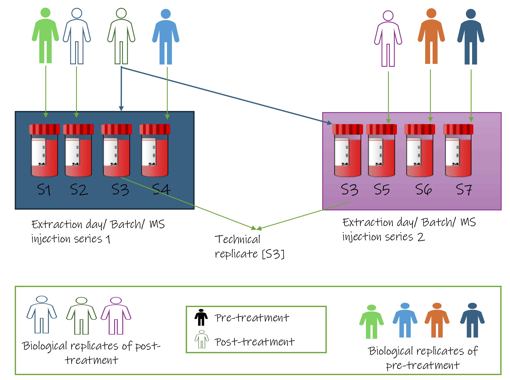

# 2.3 Measurement reliability and metadata

!!! abstract "Can we trust the measurement, and do we know how it was produced?"
    **Mainly:** Accuracy and interpretability  
    **Also affects:** Power and cost · Generalisability

Section 2.1 dealt with what you measure and 2.2 with how samples are allocated.
This section covers two things that decide whether the resulting numbers can be
interpreted: whether you can separate measurement noise from biology, and
whether you recorded enough to explain what you see.

> By this point the platform fits and the groups are balanced. What remains is knowing what moved the measurement.

They look like different problems, and they share one property. Both only work
prospectively. A reference sample that was never run and a variable that was
never recorded are equally unrecoverable, and in both cases the only trace is an
unexplained pattern in the data that nobody can resolve.

---

## Technical replication: measuring the measurement

Module 1 (Pitfall 8) defined the terms. A **biological replicate** is an
independent sample from the population, a different patient, mouse, or culture.
A **technical replicate** is the *same* sample measured more than once: it tells
you how consistent the measurement is, not how variable the biology is.

Only biological replicates add to *n*, and what that means for sample size is
covered in 2.4. The design question here is different: **should you spend part
of your budget on technical replicates at all?**

### Whether to include them is a platform decision

Technical replicates are not a default requirement. The principle is simple.

!!! tip "When technical replication earns its place"
    Technical replicates are worth it when measurement noise is large enough to
    affect your scientific question. When measurement noise is small next to the
    biological differences you care about, the same budget may be better spent
    on another biological sample.

Platforms differ enormously on this. On **bulk RNA-seq**, technical variance
from library prep and sequencing is usually small compared with the biological
differences between samples, so a technical replicate spends budget measuring
something that barely moves. In some **mass-spectrometry** applications the
situation can be different: run-to-run variation from ionisation, instrument
drift, and injection can rival the biological effect, so technical replicates
carry real information.

| Platform | Technical vs biological variance | When technical replication may be useful |
|---|---|---|
| **Bulk RNA-seq** | Technical ≪ biological | Rarely for power; useful for QC |
| **Proteomics (MS)** | Often comparable, especially in discovery | Often worthwhile |
| **Metabolomics (MS)** | Often comparable | Yes, pooled QC samples are standard practice |
| **16S / metagenomics** | Extraction and PCR variation substantial | Useful for spotting contamination and technical bias |

Read the table as examples of the principle, not fixed rules: the question is
always whether measurement noise is large enough to matter for what you are
trying to detect.

### The payoff: technical replicates can *remove* noise, not just measure it

There is a second reason to include technical replicates, and it is the one most
people miss. When built into the design, technical replicates can do more than
measure technical noise. They can help estimate and, with appropriate methods,
correct for systematic technical variation.

The idea is intuitive. If you measure the **same sample** twice, differences
between the measurements cannot be attributed to biological differences between
samples; they provide information about measurement variability.

{width=100%}

The clearest everyday version is a **shared reference sample**: one common
sample run repeatedly through every batch. In proteomics this is a bridge
channel carried through each TMT set; in metabolomics it is the pooled QC
injection you met in the mass-spec walk-through. Because it is the same material
every time, any variation in its measurements is drift rather than biology, and
that variation can help identify and correct systematic differences between
batches.

!!! example "A method that does this: RUV-III"
    **RUV-III** ("remove unwanted variation") uses technical replicates as the
    reference. The same sample measured in two batches *should* give the same
    profile, so any systematic disagreement is technical noise. RUV-III learns
    that noise from all the replicate pairs and removes it from every sample.

    Applied to a NanoString cohort where batch effects swamped the biological
    signal, a handful of technical replicates let RUV-III recover structure the
    biological samples alone could not have revealed.

    **The design lesson, and the only part that matters here:** none of this
    works after the fact. The replicates (or the reference sample) have to be in
    the run from the start. You cannot decide at analysis that you wish you had
    them. This is why "should I include technical replicates" is a design
    question, not an analysis one.

### Reference samples as anchors

On platforms with substantial run-to-run variability, particularly mass
spectrometry, a **shared reference sample** is included in each batch: typically
a pooled mixture derived from all study samples, measured repeatedly through the
run. It does two things. It gives a direct measure of technical drift across
batches, and it provides a common anchor for between-batch normalisation. This
is standard practice in metabolomics (pooled QC injections) and widely used in
proteomics.

Like blocking, it only works prospectively. The reference material has to be
prepared and aliquoted at the start of the study.

---

## Metadata: putting data in context

High-quality omics data is only as useful as the metadata needed to ***interpret*** it. Metadata is a structured record of the biological and technical variables
attached to each sample, and it is what allows bias to be investigated rather
than merely suspected.

### Why unrecorded variables can become permanent confounders

Module 1 (Pitfall 9) established the rule: a variable not recorded at the time of
collection cannot be recovered afterwards. A processing date not logged cannot be
reconstructed; a reagent lot number not noted cannot be read back off the samples.

What follows from that rule is an asymmetry worth designing around. Recording a
variable that later proves irrelevant costs almost nothing. Failing to record one
that turns out to be a confounder is permanent. That asymmetry is the argument
for the checklist below.

### When the confounder is the reason for the treatment

Treatments are chosen because of a patient's condition. If sicker patients tend
to receive Drug A and less sick patients Drug B, any difference in the omics
measurements may reflect severity as much as drug, and the two cannot be
separated if severity was never recorded.

This is the confounding structure from 2.2, with one difference that matters
here: it is invisible in the omics data. Nothing in the measurements flags it. It
is especially common in retrospective cohorts, where samples and records were
assembled for another purpose, and recognising it requires clinical context
rather than analysis.

### A minimal metadata checklist

The following checklist is organised into three classes by the type of the
variable, where not every item applies to every study. Deciding not to record a
variable should be intentional and documented.

---

**Class 1: Biological variables**

These describe the biological characteristics of the sample and determine the primary and secondary analyses.

| Variable | Why it matters |
|---|---|
| Age | Varies systematically with gene expression, metabolite levels and microbiome composition; matters whenever it differs between comparison groups |
| Sex | Systematic expression differences across thousands of genes; regulatory elements are sex specific |
| Diagnosis / condition | The primary biological grouping |
| Disease severity / stage | Determines whether comparison groups are biologically comparable |
| Treatment history | Current and recent medications alter expression, metabolite profiles, and microbiome |
| Collection site | Captures site-specific clinical, environmental and processing variation in multi-site studies |
| Collection time of day | Circadian variation in metabolites and some transcripts |
| Fasting status | Critical for metabolomics; affects circulating metabolites substantially |
| Tissue type / anatomical location | Expression profiles differ across regions of the same organ |

---

**Class 2: Technical variables**

These describe the handling of the sample from collection through sequencing and are essential for batch effect identification and correction.

| Variable | Why it matters |
|---|---|
| Collection date | Tracks when samples entered the workflow; can reveal temporal and collection-site effects |
| Sample preservation method | FFPE, fresh frozen, snap frozen, stabilisation reagent |
| Sample extraction batch | Groups samples that share extraction conditions |
| Operator ID | Operator-specific technique variation is real and systematic |
| Extraction date | Day level batch tracking; reagent and equipment state |
| Library preparation batch | Identifies which samples share a library prep reaction |
| Sequencing run / flow cell ID | Identifies which samples share a sequencing run |
| Instrument ID | Systematic differences exist between instrument units of the same model |
| Sequencing lane | Lane level variation within a flow cell |
| RNA/DNA quality metrics | RIN for RNA, DIN for DNA, 260/280 where applicable; baseline quality for each sample |
| Input quantity | Amount of material used for library preparation |

---

**Class 3: Contextual variables (study specific)**

These apply to specific sample types, platforms, or study designs. The decision to record them should be made during study design, not after the first PCA plot reveals unexpected variation.

| Variable | Applies to |
|---|---|
| Ischaemia time (delay from collection to preservation) | Tissue biopsies, surgical and post mortem samples |
| Freeze thaw cycle count | Any frozen sample; protein and RNA integrity degrade with each cycle |
| Shipping conditions and duration | Samples transported between sites |
| Reagent lot number | Lot-to-lot variation in antibodies, extraction kits and library-prep reagents is documented across platforms |
| Cell passage number (the number of times a cell line has been subcultured) | Cell line experiments |
| Growth conditions / media batch | In vitro experiments |
| BMI / body composition | Metabolomics, immune profiling |
| Genetic ancestry / population structure | GWAS, pharmacogenomics; record self-identified ethnicity separately if used, since it captures social and environmental exposure that ancestry does not |
| Time from symptom onset | Infectious disease, acute injury studies |

<small>Time from symptom onset means the elapsed time between when a patient
first noticed symptoms relevant to the study condition and when the sample was
collected.</small>

---

!!! success "Practical recommendation"
    Assign someone to maintain the metadata sheet at the bench or during the
    clinical visit. Responsibility matters. Do not rely on retrospective
    reconstruction from lab notebooks or electronic health records. Partial
    recovery is possible but generally incomplete, and the variables most likely
    to be lost are the technical ones that are most useful for batch-effect
    investigation.

---

## What to carry forward

- Technical replicates do **not** add to *n*. Only biological replicates do.
- Whether to include them depends on the platform and the question. Technical
  replication is rarely needed for power in bulk RNA-seq, while it can be
  valuable for measuring and controlling technical variation in mass
  spectrometry.
- Included **by design**, technical replicates or a shared reference sample let
  you measure *and* remove technical drift. Left out, that option is gone and
  cannot be added retrospectively.
- Recording a variable that turns out to be irrelevant costs almost nothing.
  Failing to record one that turns out to be a confounder is permanent.
- Decide who fills the metadata sheet, and when, before collection starts.
